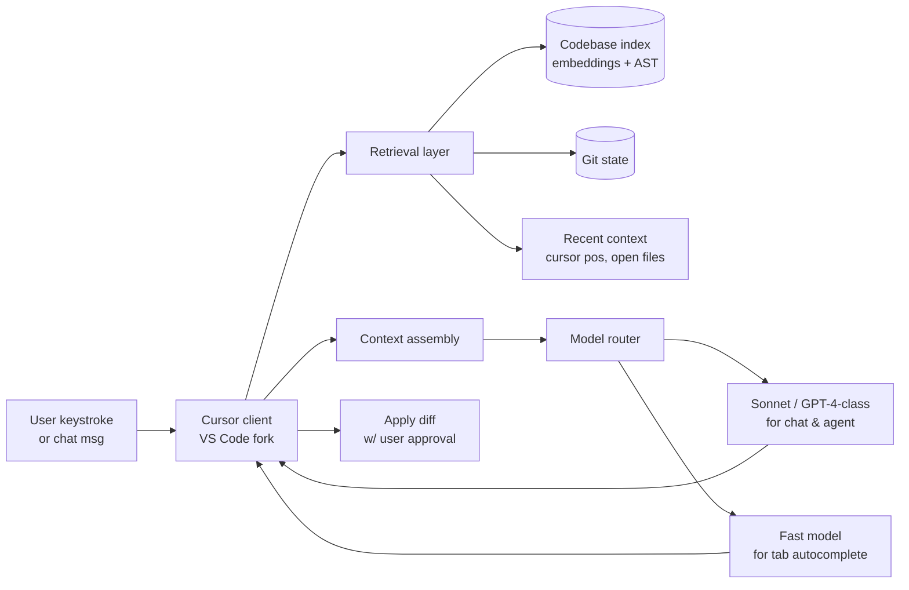

# Case study: Cursor

> **In one line:** Cursor is a VS Code fork with three tightly-coupled AI surfaces — predictive autocomplete (Cursor Tab), chat with codebase context (Cmd-K / Cmd-L), and agent mode (Composer) — and the engineering interesting bit is how it retrieves the *right* code into context within a tight latency budget across all three surfaces.

## The product

A code editor with AI deeply integrated, not bolted on. Three primary AI features:

- **Tab autocomplete** — model predicts your next edit (could be multi-line, multi-cursor) as you type.
- **Chat with the codebase** — ask a question with `@-mentions` of files/folders/symbols; model answers using retrieved context.
- **Agent / Composer** — multi-file edits across the project, run-and-verify loop.

The company's wedge was making AI *fast enough* and *integrated enough* that engineers don't context-switch out of the editor.

## Architecture

Five layers: client (the fork), retrieval, context assembly, model routing, diff application. Each surface (Tab, Chat, Composer) uses all five with different latency budgets.

## Key engineering decisions

### 1. Three model tiers for three surfaces

- **Tab autocomplete** uses a custom-trained fast model (sub-200ms response). Cursor has talked publicly about training their own for this — the latency budget can't fit a frontier model call.
- **Chat (Cmd-L)** uses frontier models — Claude Sonnet, GPT-4-class — via direct provider APIs.
- **Agent / Composer** uses the same frontier models but in a multi-step loop with apply-diff verification.

The split matters because trying to use a frontier model for autocomplete would feel slow and wreck the UX. Trying to use a fast model for agent work would produce bad multi-file edits. Three surfaces, three model tiers, one cohesive product.

### 2. Codebase indexing happens locally + remote

Cursor builds an index of your repo combining:

- **Embeddings of chunks** — for semantic retrieval ("where is auth handled?").
- **Symbol/AST data** — for precise lookups ("definition of `parseToken`").
- **File metadata** — paths, git status, recency.

The trade-off they've discussed: shipping the index *to their servers* (for the strongest model and cheapest indexing) vs. *keeping it local* (for privacy / enterprise compliance). Their solution is a hybrid — opt-in for higher-quality retrieval, with a privacy mode that keeps embeddings local.

### 3. Apply-diff with anchor verification

When the model proposes an edit, Cursor doesn't blindly overwrite — it shows a diff for user review. Under the hood, the diff is anchored by surrounding context lines, and if those lines have drifted (because you typed something else), the apply step asks the model to re-emit the edit with current context.

This is the unsexy engineering that makes "the AI edits your code" not become "the AI corrupts your code."

## Stack snapshot (2026)

- **Models:** Anthropic Claude Sonnet 4.6, OpenAI GPT-5-class for chat/agent; custom fast model for Tab.
- **Editor:** VS Code fork (forked, not extension — gives deep control over rendering and shortcuts).
- **Indexing:** internal — embeddings + Merkle tree of repo state for incremental updates.
- **Inference:** primarily direct from model providers; some self-hosted for the fast model.
- **Observability / evals:** internal tooling (publicly discussed but not branded).

## What to copy

- **Latency-tier your models by surface.** If you have a feature that needs &lt;300ms and a feature that can wait 5s, they don't use the same model.
- **Index the repo as multiple representations.** Embeddings alone miss exact-symbol lookups; AST/symbol alone misses semantic queries. Combine.
- **Apply diffs, don't write files.** Show the user a diff for approval, anchor by context, re-emit if anchors drift.
- **Local-first when the user cares.** Enterprise contracts often hinge on whether you can run without sending code to a third party.

## What to avoid

- **Trying to use one model for everything.** Tab and Composer have incompatible requirements.
- **Embedding-only retrieval.** Symbol search by grep / LSP catches what embeddings miss.
- **Writing your own editor from scratch.** The VS Code fork strategy works; "make an editor with AI in it" has killed many startups. Build on shoulders.
- **Skipping the index-staleness problem.** A stale index produces confidently wrong answers. Hash the repo state into your retrieval cache key.

## Sources

- Cursor's engineering blog: cursor.com/blog (Tab autocomplete training, indexing strategy posts).
- AI Engineer Summit talks by Cursor founders (2024–2026).
- Founder interviews on Lex Fridman, Lenny's Podcast, Latent Space.
- Public discussion in Cursor's Discord / forum about retrieval and apply-diff.

---

→ Next: [Claude Code](./claude-code.md)
