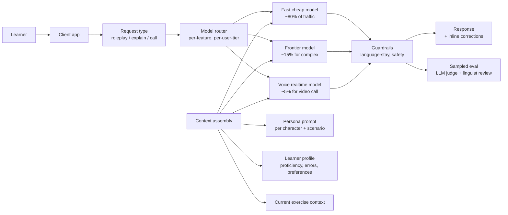

# Case study: Duolingo Max

> **In one line:** Duolingo Max is the AI tier of Duolingo — "Roleplay" (practice conversations with characters) and "Explain My Answer" (when you get something wrong, the AI tells you why) — and the engineering interesting bits are how a consumer product runs LLM features at hundreds of millions of users without ruinous costs, how it designs personas that don't feel like ChatGPT-with-a-hat, and how it evaluates language-learning quality at scale.

:::tip[In plain English]
Duolingo Max adds AI features to a language-learning app used by hundreds of millions of people — you can practice conversations with the app's characters or get a patient explanation of why your answer was wrong. At that scale the defining constraint is cost per conversation turn, so the architecture is built around cheap models for most traffic, aggressive caching, and strict limits on how much the AI says. Study this page because it's the best public example of consumer-scale AI economics, plus two ideas that transfer everywhere: personas specific enough to test, and evals that measure what the product actually teaches.
:::

## The product

A premium tier of Duolingo that adds AI-powered features on top of the gamified language-learning core:

- **Roleplay** — practice a real-world scenario (ordering coffee in Paris, checking into a hotel) with an AI character. The character stays in scene, in language, in the user's proficiency band.
- **Explain My Answer** — after you get an exercise wrong, the AI explains in your native language why the right answer is right, with patience for back-and-forth follow-ups.
- **Video Call** (later expansion) — practice with Lily (a Duolingo character) in voice.

Used at consumer scale — hundreds of millions of total users, tens of millions of MAUs on the Max tier.

## Architecture

Every call is shaped by **persona + scenario + learner profile**. The same "ordering coffee" roleplay feels different at level A1 vs. B2 because the learner profile changes what vocabulary and structures the AI uses.

## Key engineering decisions

### 1. Cost-per-turn is the constraint

A consumer subscription is something like $14/month. If a single roleplay conversation costs $0.50 of LLM calls, the unit economics collapse.

Duolingo's engineering has been public about extensive work on:

- **Aggressive model tiering.** Cheap models (Haiku-class) for the vast majority of turns. Frontier models only when needed.
- **Short, structured contexts.** Each turn re-uses cached context (Anthropic prompt caching, OpenAI cached prefixes); only the new turn is uncached.
- **Strict output length controls.** A character doesn't soliloquize. Token caps are real.
- **Server-side enforcement of session length and turn count caps** for free-tier abuse protection.

Without this discipline the feature would be priced out at scale.

### 2. Personas are characters, not generic assistants

The AI characters (Lily, Duo, Vikram, Bea, etc.) are real Duolingo characters with established personalities. The prompt for each character encodes:

- Voice and vocabulary register.
- Backstory and current life context.
- How they react to learner mistakes.
- Refusal behavior in-character (Lily ghosts you if you're rude rather than producing "I'm sorry, I can't help with that").

This isn't just decoration. A specific character with specific behavior is *more eval-able* than "a friendly AI." You can test "did Lily stay in voice?" in a way you can't test "was the response good?"

### 3. Stay-in-language as a hard guardrail

For roleplay, the AI must respond in the target language, in the proficiency band. Falling back to English would let the learner cheese the exercise.

Enforcement:

- The persona prompt heavily emphasizes target-language-only.
- Output is post-validated — language detection on the response confirms it's in the right language.
- If the validation fails, the response is regenerated or filtered.

The exception is Explain My Answer (which intentionally uses the learner's native language to explain).

### 4. Evals that measure *language pedagogy*, not just response quality

Most LLM evals measure helpfulness, factuality, or task completion. Duolingo's evals measure things like:

- Is the AI's language at the right proficiency band? (Too hard → discouraging; too easy → not learning.)
- Are the corrections pedagogically useful? (Identifies the actual error vs. just "wrong, here's the answer.")
- Does the conversation stay in scene? (Roleplay quality.)
- Does explanation actually clarify the rule, or does it just restate the answer?

These require domain-specific evaluators — sometimes LLM-as-judge with linguistically informed rubrics, sometimes human linguist review. The eval pipeline is itself an investment.

### 5. The free / Max segmentation as a product + cost lever

Free-tier users get a small subset of AI features. Max users get the full suite. This isn't just price discrimination — it's *cost discrimination*. The free tier's AI features are routed to the cheapest models with the strictest caps. The Max tier's features get more headroom.

This shape lets Duolingo expose AI to the entire user base (acquisition signal) without burning money on the long tail of users who'll never pay.

## Stack snapshot (2026)

- **Models:** OpenAI GPT-class models heavily; reported use of fine-tuned variants for specific language-learning tasks; Anthropic for some flows.
- **Voice (Video Call):** OpenAI Realtime or equivalent with significant custom voice work.
- **Cache:** aggressive prompt caching across personas and scenarios.
- **Infrastructure:** AWS / GCP for the application; provider-side inference.
- **Eval:** internal pipeline + linguist review for high-stakes language pedagogy decisions.

## What to copy

- **Cost-per-turn discipline.** For consumer-scale AI, model tier + caching + output caps are existential.
- **Personas with explicit behavior, not "be helpful."** Specific is more eval-able and more product-distinctive than generic.
- **Domain-specific evals.** Generic helpfulness benchmarks don't capture what *your* product needs to be good at.
- **Tier features by cost AND by value.** Free can see the *taste*; paid gets the full thing. Aligns acquisition with margins.
- **Hard output validators where it matters.** Language detection on a language-learning product isn't optional.

## What to avoid

- **Frontier model for every turn at consumer scale.** Bankruptcy.
- **Generic AI persona ("I am your assistant").** Indistinguishable from ChatGPT; no product advantage.
- **Letting the AI drop out of the exercise frame.** A language-learning AI that switches to English breaks the product.
- **Evaling AI-product quality with generic LLM benchmarks.** Your evals must measure what your users actually care about.

:::caution[What people get wrong when copying this]
- **Prototyping on a frontier model and assuming costs will work out later.** At consumer scale, model tiering, prompt caching, and token caps *are* the architecture — not optimizations to bolt on after launch.
- **Shipping a generic friendly assistant instead of a specific character.** Vague personas are both indistinguishable from ChatGPT and nearly impossible to write evals for; "did Lily stay in voice?" is testable, "was the response good?" isn't.
- **Trusting the prompt to enforce hard rules like stay-in-language.** Load-bearing guardrails need post-generation validation (here, language detection) with regenerate-or-filter on failure — instructions alone drift.
- **Reusing generic helpfulness benchmarks when the product's quality bar is domain-specific.** Duolingo's bar is pedagogy; yours will be something else, but the gap between generic and domain evals exists in every vertical.
:::

## Sources

- Duolingo's blog (`blog.duolingo.com`) on AI features and engineering.
- Engineering team talks at AI Engineer Summit and language-tech conferences.
- Luis von Ahn (CEO) interviews on product strategy.
- Public discussions of Duolingo's eval and persona-design approach.

<Quiz id="case-duolingo-max-quick-check" variant="micro" title="Quick check">

<Question
  prompt="Why is cost-per-turn the central engineering constraint for Duolingo Max?"
  options={[
    { text: "A consumer subscription is around 14 dollars a month, so expensive LLM calls per conversation would collapse the unit economics" },
    { text: "App stores cap how much compute a mobile app may consume" },
    { text: "Language models charge more for non-English output tokens" },
    { text: "Investors require AI features to be profitable from day one" }
  ]}
  correct={0}
  explanation="At hundreds of millions of users on a cheap subscription, a 50-cent conversation is fatal. The response is architectural: aggressive model tiering, cached context so only the new turn is uncached, strict output length caps, and server-side session limits. Cost discipline is the design, not an afterthought."
/>

<Question
  prompt="Beyond branding, why are Duolingo's AI personas specific characters like Lily rather than a generic helpful assistant?"
  options={[
    { text: "Specific characters require less prompt text, saving tokens" },
    { text: "A specific character with defined behavior is more evaluable - you can test whether Lily stayed in voice in a way you cannot test whether a response was good" },
    { text: "Licensing rules prevent using a generic assistant persona" },
    { text: "Characters let the app avoid safety guardrails entirely" }
  ]}
  correct={1}
  explanation="Encoding voice, backstory, reactions to mistakes, and in-character refusals makes quality concrete and testable. Specific personas are both more product-distinctive and more eval-able than 'be helpful' - a lesson that applies to any AI product persona."
/>

<Question
  prompt="How does Duolingo enforce that Roleplay responses stay in the target language?"
  options={[
    { text: "The model is fine-tuned to be incapable of producing English" },
    { text: "Human moderators review conversations before delivery" },
    { text: "The prompt emphasizes target-language-only, and a language-detection check validates each output, regenerating or filtering failures" },
    { text: "The app blocks the user from typing in their native language" }
  ]}
  correct={2}
  explanation="The prompt sets the expectation, but the hard guarantee comes from post-generation validation: language detection on the response, with regeneration when it fails. Hard guardrails that matter to the product need output validators, not just instructions."
/>

</Quiz>

---

→ Back to: [Case studies overview](./index.md) · Optional next: [Cutting Edge & What's Next](../17-cutting-edge/index.md)
