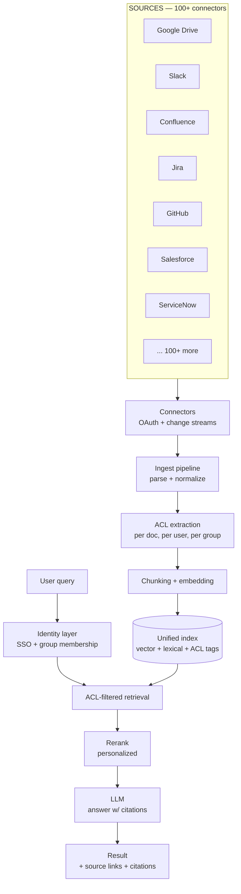

# Case study: Glean

> **In one line:** Glean indexes everything across an enterprise's SaaS stack — Google Drive, Slack, Confluence, Jira, GitHub, Salesforce, ServiceNow, dozens more — and lets every employee search and chat with all of it through one interface, with **per-user ACL enforcement** so each person only sees what they're allowed to see.

:::tip[In plain English]
Glean connects to all the apps a company uses — Slack, Google Drive, Jira, Salesforce, a hundred more — and lets every employee search or chat across all of it from one box. The make-or-break engineering is permissions: every chunk in the index carries a record of who is allowed to see it, and every query is filtered so you only ever see what you could already see in the source app. Study this page because it's the canonical example of why enterprise AI search is mostly a connectors-and-permissions problem, not a model problem.
:::

## The product

A "work AI platform" for enterprises. Three primary surfaces:

- **Search** — universal search across every connected app, with personalized ranking.
- **Assistant (chat)** — RAG over the unified index; ask questions, get cited answers.
- **Agents and workflows** — automation that uses the unified knowledge as context.

Used by companies like Pinterest, Confluent, Sony, Citi, Box. The wedge is "no one has to remember which tool a piece of information is in."

## Architecture

The piece that separates Glean from a generic enterprise search vendor: **ACL enforcement runs at query time**, per-user, against the data the connectors brought with each document.

## Key engineering decisions

### 1. ACL enforcement is the product

In an enterprise, "search everything" is a security disaster unless filtered. The CEO's compensation discussions in Slack can't surface to a new hire. The legal team's draft contracts can't surface to engineering.

Glean's approach:

- Every document is ingested *with its ACL information* from the source — who can see it in the source app.
- Every chunk in the index is tagged with those ACL identifiers.
- At query time, the user's identity (from SSO) is resolved to their group memberships across all source apps.
- The retrieval query filters chunks to only those the user's identities can access.

This sounds simple. It's not. Source apps have wildly different ACL models — Google Drive's sharing settings vs. Slack channel membership vs. Jira project permissions vs. Salesforce object-level security. Glean has to unify all of these into a single model that's still correct enough to enforce.

### 2. Connector quality is the moat

Glean's market position comes from having reliable connectors for 100+ apps. Each connector handles:

- **Initial bulk index** of historical data.
- **Incremental sync** via webhooks or polling.
- **Deletion semantics** — when a doc is removed at the source, it's removed from the index.
- **ACL change propagation** — when sharing changes, the index reflects that.
- **Authentication** — typically OAuth per-user or per-tenant service accounts.

The non-glamorous engineering is enormous. New connectors take quarter-scale projects to ship.

### 3. Personalized ranking on top of standard retrieval

A query like "Q3 OKRs" should return different results for the sales VP than for an engineer. Glean's ranker uses signals like:

- Which docs / people you interact with frequently.
- Which teams and projects you're on.
- Recency of your interaction with similar content.

This is search-engine craft applied to enterprise data. It's why a generic vector-search-over-all-data product doesn't replace Glean.

### 4. Chat as a thin layer over retrieval

Glean Assistant (the chat product) is largely RAG over the same unified index. The chat model gets:

- The user's question.
- ACL-filtered, reranked, personalized retrieval results.
- Conversation history.

It generates an answer with citations linking back to the source documents. The user can click through to the actual Slack message or Confluence page.

The chat is *not* magic — it's the same retrieval, with a friendlier output surface.

### 5. Enterprise deployment with strong audit posture

Customers include regulated industries (banks, defense, healthcare). The deployment story:

- **Per-customer infrastructure** for those who require it.
- **Comprehensive audit logs** — every search, every retrieval, every chat traceable.
- **Data residency** options for international customers.
- **No-training-on-customer-data** as a fundamental commitment.

These aren't features so much as table-stakes for the enterprise tier.

## Stack snapshot (2026)

- **Models:** mix of providers — OpenAI / Anthropic for chat / agent; embedding models from multiple sources.
- **Indexing:** internal — purpose-built unified index supporting vector + lexical + ACL filtering at scale.
- **Connectors:** internal — 100+ purpose-built integrations.
- **Infrastructure:** primarily GCP; per-customer deployment options for high-security customers.

## What to copy

- **ACL at chunk granularity.** If your search spans data with mixed permissions, encode ACLs on each chunk and filter at query time.
- **Connectors handle deletion and ACL change.** Most teams build "ingest once and forget." Real production needs deletion + permission updates.
- **Unify source-app permission models.** Each app has its own; build an abstraction that maps to a common ACL primitive.
- **Personalized ranking on top of standard retrieval.** Same data, different ranking per user, is a real quality lever in enterprise search.
- **Chat as the icing, retrieval as the cake.** A chat product without strong retrieval is a stochastic search engine. Get retrieval right first.

## What to avoid

- **A single "AI search" implementation across all sources.** Each connector is hard. You can't shortcut them.
- **Trusting source-side filtering only.** Some source apps' APIs don't filter by the requesting user. You have to verify ACLs yourself.
- **Skipping the "what was deleted" pass.** Stale data in the index is a permission-leak waiting to happen.
- **Multi-tenant indexing without strict per-customer isolation.** Even with ACL filtering, the tenant boundary is sacred.

:::caution[What people get wrong when copying this]
- **Treating ACL filtering as a post-processing step instead of a query-time index constraint.** One leaked chunk surfacing in a chat answer is a security incident, not a quality bug — filter in the retrieval query itself.
- **Budgeting connectors as a sprint each.** Real connectors must handle deletion semantics, permission-change propagation, and incremental sync; that unglamorous work is the bulk of the system and the moat.
- **Skipping personalized ranking and shipping raw vector search**, then wondering why results feel worse than the per-app search tools being replaced.
- **Building the chat surface before the retrieval foundation.** The chat is a thin layer over the same index — it inherits every weakness underneath it.
:::

:::tip[→ Going deeper]
Glean's per-user ACL enforcement is a security-boundary problem, not a retrieval one — [Chapter 6: Responsible & Safe AI](/docs/safety) covers the principle (the model is never the boundary) and the [guardrails](/docs/safety/safety-guardrails) that enforce it.
:::

## Sources

- Glean's engineering blog posts on connectors and unified search.
- Public CEO interviews (Arvind Jain — Decoder, AI Engineer Summit).
- Customer case studies on Glean's site.
- Conference talks on enterprise search architecture (2024–2026).

<Quiz id="case-glean-quick-check" variant="micro" title="Quick check">

<Question
  prompt="How does Glean make sure an employee never sees search results they are not allowed to see?"
  options={[
    { text: "Sensitive documents are excluded from the index entirely" },
    { text: "Every chunk is tagged with ACL identifiers at ingest, and at query time the user's resolved group memberships filter retrieval to only accessible chunks" },
    { text: "An LLM reviews each result and removes anything that looks confidential" },
    { text: "Each department gets its own separate search index" }
  ]}
  correct={1}
  explanation="ACLs are extracted from each source app at ingest, attached at chunk granularity, and enforced at query time against the user's SSO-resolved identities. The hard part is unifying wildly different permission models - Drive sharing, Slack channels, Jira projects - into one enforceable abstraction. The model is never the boundary."
/>

<Question
  prompt="Beyond initial indexing, what must each Glean connector handle to keep the index safe and correct over time?"
  options={[
    { text: "Translating documents into a common language for embedding" },
    { text: "Compressing historical data to keep storage costs flat" },
    { text: "Incremental sync, deletion semantics when source docs are removed, and propagation of ACL changes when sharing settings change" },
    { text: "Caching popular queries to reduce load on source apps" }
  ]}
  correct={2}
  explanation="Most teams build 'ingest once and forget'. Production needs deletion handling and permission-change propagation - stale indexed data is a permission leak waiting to happen. This non-glamorous connector engineering is why new connectors take quarter-scale projects and why connector quality is the moat."
/>

<Question
  prompt="What is the architectural relationship between Glean's chat assistant and its search product?"
  options={[
    { text: "Chat is largely RAG over the same unified index - the same ACL-filtered, reranked retrieval with a friendlier answer surface" },
    { text: "Chat uses a separate fine-tuned model trained on each customer's documents" },
    { text: "Chat bypasses the index and queries the source apps live for freshness" },
    { text: "Chat and search are independent products with separate data pipelines" }
  ]}
  correct={0}
  explanation="The chat is not magic - it gets the user's question, ACL-filtered personalized retrieval results, and conversation history, then answers with citations back to sources. Chat is the icing, retrieval is the cake: a chat product without strong retrieval is a stochastic search engine."
/>

</Quiz>

---

→ Next: [Notion AI](./notion-ai.md)
