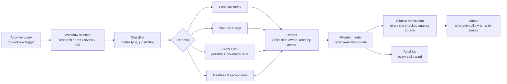

# Case study: Harvey

> **In one line:** Harvey is an AI assistant for law firms — drafting, research, contract review, due diligence — and the architecture interesting bits are how they handle *citation-grade* retrieval (one wrong citation can sink a brief), how they shape products around lawyer workflows rather than chat, and how they isolate per-firm data with very serious enterprise security.

:::tip[In plain English]
Harvey is an AI assistant for lawyers — it drafts contracts, researches case law, and reviews documents, at firms where citing a made-up case can end a career. Everything in the architecture flows from that stake: every citation is checked against a real retrieved source, results are filtered by jurisdiction, and the lawyer always makes the final call. Study this page because it shows how to build AI for a high-stakes domain — verification as a hard gate, structured workflows instead of open chat, and data isolation treated as existential.
:::

## The product

A suite of AI tools for attorneys at major law firms (Allen & Overy, A&O Shearman, PwC Legal, and a long list of AmLaw 100 firms). Workflows include:

- **Legal research** over case law, statutes, regulations, treatises.
- **Document drafting** for contracts, briefs, memos.
- **Contract review** with red-line proposals and risk extraction.
- **Due diligence** — analyzing dozens to thousands of docs in an M&A workflow.
- **Document Q&A** over the firm's own DMS (document management system).

Distinct from a generic LLM: every output is auditable, citations are checked, and the assistant operates inside lawyer workflows rather than expecting lawyers to learn a chat paradigm.

## Architecture

Workflow-shaped: the top of the funnel decides *what kind of task* this is, and the retrieval, model, and output rendering all change accordingly.

## Key engineering decisions

### 1. Citation-grade retrieval

In law, citing a fictional case is malpractice. (Famously, several attorneys have been sanctioned for citing hallucinated cases from generic LLMs.) Harvey treats citation correctness as the load-bearing quality dimension.

Their approach: every citation the model emits is checked against the retrieved set. Citations that don't anchor to a retrieved chunk are rejected. Citations that anchor but whose claim isn't supported by the chunk are flagged. The output the lawyer sees has been verified, not just generated.

This is the [Perplexity-style citation pattern](./perplexity.md), at higher stakes and with stricter enforcement.

### 2. Jurisdiction-aware retrieval

A New York attorney researching a contract dispute doesn't want California cases as the primary results — they're not binding precedent. Retrieval is filtered and reranked by jurisdiction extracted from the query and from the matter metadata.

This kind of domain-specific filtering is what separates "RAG over case law" from "RAG that *actually* helps a lawyer." Generic embedding similarity doesn't capture jurisdiction-as-relevance the way a domain-aware reranker can.

### 3. Workflows over chat

Harvey's product surface is not a chatbot. It's a series of *workflows*: "draft a non-disclosure agreement," "extract change-of-control clauses from these 200 agreements," "summarize the regulatory risk in this 10-K."

Each workflow is a structured agent loop with:

- A defined input shape (matter type, jurisdiction, parties, etc.).
- A defined output shape (red-lined document, structured summary, citation list).
- Quality gates appropriate to the workflow.

Generic chat is available but is *not* the primary interaction model — because lawyers' work is structured, and the AI tools fit into that structure rather than asking lawyers to translate.

### 4. Enterprise-grade per-firm isolation

The data is staggeringly sensitive: client matters, draft transactions, privileged communications. Harvey's deployment shape:

- **Per-firm tenancy** with strict isolation — no cross-firm retrieval, ever.
- **Per-matter ACL** within a firm — partner X can see the M&A matter but not the litigation matter.
- **VPC / private deployment options** for firms that won't accept multi-tenant SaaS.
- **Audit logs** of every model call, every retrieved doc, every output — discoverable for compliance.
- **No training on customer data** as a published commitment.

The technical complexity is significant; the contractual complexity is more so. Enterprise legal sales are won on these points before the model quality is ever evaluated.

### 5. Human-in-the-loop is the design, not a fallback

For drafting and review workflows, the lawyer is always the final authority. The AI proposes; the lawyer disposes. The product is designed around lawyer review — diff views, change tracking, comment threads — rather than around fully autonomous output.

This is correct for the domain. A coding agent that commits to main is one risk class; a legal agent that files a brief is another.

## Stack snapshot (2026)

- **Models:** OpenAI (frontier-tier reasoning models) and Anthropic Claude for various workflows; reportedly fine-tuned variants for specific tasks (citation, contract clause extraction).
- **Retrieval:** dedicated case-law and statute indexes (Lexis / Westlaw partnerships); per-firm DMS connectors with ACL enforcement.
- **Hosting:** dedicated infrastructure for VPC customers; multi-tenant SaaS for the rest.
- **Workflow runtime:** internal — workflow definitions, agent loops, eval pipelines.

## What to copy

- **Citation verification as a hard gate, not a hope.** In any domain where wrong citations have real consequences (medical, legal, financial), build the verifier first.
- **Domain-aware reranking.** Jurisdiction, recency, document type, source authority — these are real reranker features in vertical AI.
- **Workflow surfaces over generic chat.** If your users have structured work, build for that structure.
- **Per-tenant + per-matter ACL.** Multi-tenant RAG with naive filtering will leak; bake row-level isolation in from day one.
- **Audit-grade logging.** Every model call traceable, every retrieved doc logged, every output reproducible.

## What to avoid

- **Generic-LLM-with-prompt for high-stakes domains.** A "you are a lawyer" prompt is not a legal AI product.
- **Trusting the model to cite correctly.** It won't, often. Verify every cite.
- **Multi-tenant indexing without strict filtering.** A single data-leak incident is existential.
- **"AI files the brief" autonomy.** Wrong risk class. Humans in the loop.

:::caution[What people get wrong when copying this]
- **Assuming a strong model plus a "you are an expert lawyer" prompt approximates this.** The product is the verification, workflow, and isolation machinery *around* the model — the model is the most replaceable part.
- **Building chat first and workflows later.** When the users' work is structured, the workflow surfaces are the actual product; generic chat retrofitted with structure rarely gets there.
- **Bolting per-tenant filtering onto a shared index late.** Harvey-grade isolation (per-firm tenancy plus per-matter ACL) has to be designed in from the first schema, not patched in after a near-miss.
- **Copying citation pills without the rejection step.** In a high-stakes domain, a displayed-but-unverified citation is a liability dressed up as a feature.
:::

:::tip[→ Going deeper]
Harvey's two hardest problems map to two new chapters: citation-grade faithfulness is the heart of [Chapter 5: Evaluation & Measurement](/docs/evaluation), and audit-grade, leak-proof handling of privileged documents is [Chapter 6: Responsible & Safe AI](/docs/safety) — see [guardrails](/docs/safety/safety-guardrails).
:::

## Sources

- Harvey's website and engineering blog posts.
- Harvey AI's published research (some collaborations with Stanford, others).
- Conference talks by Harvey engineers (AI Engineer Summit, legal-tech conferences).
- Public discussions of citation-verification approaches in legal AI.
- News coverage of customer deployments at major firms.

<Quiz id="case-harvey-quick-check" variant="micro" title="Quick check">

<Question
  prompt="How does Harvey handle citations in model output, given that citing a fictional case is malpractice?"
  options={[
    { text: "The model is fine-tuned until it stops hallucinating citations" },
    { text: "Lawyers are warned to double-check every citation themselves" },
    { text: "Every citation is checked against the retrieved set - cites that do not anchor to a retrieved chunk are rejected, and unsupported claims are flagged" },
    { text: "Citations are limited to a pre-approved whitelist of famous cases" }
  ]}
  correct={2}
  explanation="Citation correctness is treated as the load-bearing quality dimension and enforced as a hard gate: outputs the lawyer sees have been verified, not just generated. In any domain where wrong citations have real consequences, build the verifier first."
/>

<Question
  prompt="Why is jurisdiction-aware reranking necessary instead of relying on generic embedding similarity?"
  options={[
    { text: "Embedding models cannot process legal vocabulary accurately" },
    { text: "Embedding similarity does not capture jurisdiction-as-relevance - a New York attorney needs binding New York precedent, not semantically similar California cases" },
    { text: "Each jurisdiction requires a separately licensed index" },
    { text: "Reranking is mainly a cost optimization to retrieve fewer documents" }
  ]}
  correct={1}
  explanation="Semantic similarity treats a similar case from the wrong jurisdiction as a great match, but it is not binding precedent. Domain-aware reranking features - jurisdiction, recency, document type, source authority - are what separate 'RAG over case law' from a tool that actually helps a lawyer."
/>

<Question
  prompt="Why is Harvey's primary product surface a set of workflows rather than a chatbot?"
  options={[
    { text: "Chat interfaces are too expensive to run at law-firm scale" },
    { text: "Bar associations prohibit open-ended legal chatbots" },
    { text: "Early users found chat confusing and asked for menus instead" },
    { text: "Lawyers' work is structured, so each workflow has a defined input shape, output shape, and quality gates - the AI fits the work instead of asking lawyers to translate" }
  ]}
  correct={3}
  explanation="Workflows like 'draft an NDA' or 'extract change-of-control clauses' are structured agent loops with defined inputs, outputs, and gates. Generic chat exists but is not the primary model. The lesson: if your users have structured work, build for that structure."
/>

</Quiz>

---

→ Next: [Glean](./glean.md)
