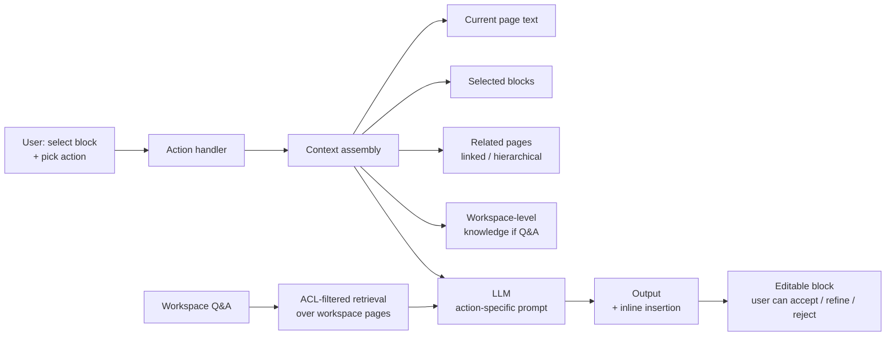

# Case study: Notion AI

> **In one line:** Notion AI is the contrast case to "everything is a chatbot" — instead of one big chat surface, AI shows up as *contextual actions* attached to blocks and pages (summarize, translate, rewrite, generate, ask), each with the surrounding document as automatic context, and that design is why it feels less novel but works in more places.

:::tip[In plain English]
Notion AI is the counter-example to 'every AI product is a chatbot' — instead of a chat window, AI shows up as small actions attached to whatever you're editing: summarize this, translate that, fill in this table column. Because Notion documents are built from structured blocks, the AI always knows what kind of content it's acting on and what surrounds it, with no copy-pasting of context. Study this page because embedded AI actions — single model calls woven into an existing workflow — are often the right design, and this is the cleanest public example of it.
:::

## The product

AI features layered onto Notion's existing block-based document/database system:

- **Inline AI actions** — select text, choose "summarize," "translate," "make longer," "improve writing," etc.
- **AI blocks** — embed an AI-generated block in a doc that auto-updates when context changes.
- **Q&A** — ask questions about your workspace; answers cite the source pages.
- **AI autofill** in databases — generate column values from row context.
- **AI templates** — pre-built workflows for meeting notes, project plans, etc.

The architecture pattern: AI is **embedded**, not a separate surface. You're never "in chat" — you're editing a doc, and AI is a tool in that workflow.

## Architecture

Every action carries the surrounding document automatically. The user doesn't paste context; the editor knows what's in scope.

## Key engineering decisions

### 1. Block-aware context is the unfair advantage

Notion's pre-AI architecture is built on blocks — every paragraph, heading, table, list item is a structured atom with type metadata. When AI acts on something, the action knows *what kind of thing* it's acting on.

"Summarize this page" pulls the block tree. "Make this list longer" knows it's a list block, not a paragraph. "Translate this table" preserves the table structure rather than flattening to text.

This gives Notion AI a structured-context advantage over generic AI that just sees flat strings. The lesson: if your product has structured content, exploit the structure.

### 2. Per-block actions over chat-first

Most AI products bolted onto existing tools default to a chat sidebar. Notion's design philosophy is the opposite — actions are *attached to content*, in the existing editing flow.

The win: users don't have to learn a chat paradigm. They click "summarize" the way they used to click "format as heading." The cognitive overhead is near zero.

The trade-off: less open-ended exploration. A user who wants to brainstorm with an AI uses ChatGPT, not Notion AI's actions. Notion accepts this trade.

### 3. Q&A as the workspace search layer

The separate "Q&A" feature is the chat-style surface — ask a question about your workspace, get a cited answer. Architecturally this is RAG over the workspace's pages with per-page ACL filtering (similar shape to [Glean](./glean.md) but scoped to a single workspace).

Q&A is positioned as a search alternative, not as a chat product. The chat happens because the user wanted to *find* something they couldn't remember the location of.

### 4. AI blocks as live computations

The AI block is a Notion-native primitive that holds an AI computation as a first-class piece of content. The block remembers its prompt and its inputs; when the inputs change, the block re-runs.

This is closer to a spreadsheet formula than to a chat message. The metaphor matters — users understand "this cell auto-updates" and the AI block fits the same mental model.

### 5. The lightweight stack — most actions, one model call

Each action — translate, summarize, rewrite — is a single model call with a templated prompt. No agent loops, no multi-step orchestration for the basic cases.

This is correct for the workload. The vast majority of Notion AI usage is "I selected text and clicked an action" — one user input, one model call, one output back to the cursor. Heavy agent orchestration is reserved for the few features that need it.

The lesson: not everything needs to be an agent. Most editor-embedded AI is a single shot.

## Stack snapshot (2026)

- **Models:** mix of OpenAI and Anthropic; specific model per action (cheap fast model for "improve writing," frontier model for Q&A).
- **Workspace search:** internal — vector + lexical over each workspace's pages, with ACL filtering on workspace membership and page-level permissions.
- **Infrastructure:** primarily AWS; some custom inference for high-volume cheap actions.
- **Frontend:** integrated into Notion's existing block editor — no separate UI layer.

## What to copy

- **Embed AI in the existing flow, not in a sidebar.** Chat is the default; embedded actions are often better for users with structured work.
- **Exploit your product's structured data.** If your content has structure (blocks, fields, sections), feed that structure to the model instead of flattening.
- **Single-shot for editor actions, agents only when needed.** Don't over-engineer; most editor AI is one call.
- **Q&A as workspace search.** If your product has a body of content, "ask a question about it" is the most reliable AI feature you can ship.
- **Live AI blocks for computed content.** When the data changes, the AI recomputes — like a spreadsheet formula.

## What to avoid

- **Defaulting to a chat sidebar.** Sometimes right, often wrong. Match the surface to the workflow.
- **Treating all content as flat strings.** Throws away your most valuable signal.
- **Multi-step agent orchestration for simple actions.** Over-engineering kills the latency and the simplicity that make embedded AI feel good.
- **Ignoring ACL on workspace Q&A.** Pages have permissions; respect them.

:::caution[What people get wrong when copying this]
- **Copying the embedded-actions pattern into a product with no structured content model.** The block structure is what makes context assembly automatic; without an equivalent, you're just hiding a chatbot behind buttons.
- **Over-engineering simple actions into agent loops.** Most editor actions are one templated model call — adding orchestration adds latency and failure modes to interactions that should feel instant.
- **Skipping permission checks on workspace Q&A because the inline actions didn't need them.** The retrieval surface has a completely different security profile from acting on the user's own selection.
- **Assuming embedded actions replace chat entirely.** Notion consciously cedes open-ended exploration to other tools; copying the pattern means accepting that trade, not pretending it doesn't exist.
:::

## Sources

- Notion's product blog and engineering posts.
- AI Engineer Summit talks by Notion's AI team.
- Public design discussions of "AI in the editor" patterns.
- Customer interviews and use-case write-ups in product newsletters (Lenny's, etc.).

<Quiz id="case-notion-ai-quick-check" variant="micro" title="Quick check">

<Question
  prompt="What structural advantage does Notion's pre-AI block architecture give its AI features?"
  options={[
    { text: "Blocks make documents smaller, so more content fits in the context window" },
    { text: "Blocks let the AI run locally on the user's device" },
    { text: "Every piece of content is a typed structured atom, so an action knows what kind of thing it is acting on and can preserve structure like tables and lists" },
    { text: "Blocks allow multiple models to edit the same page simultaneously" }
  ]}
  correct={2}
  explanation="Because every paragraph, list, and table is a block with type metadata, 'translate this table' can preserve table structure instead of flattening to text. The transferable lesson: if your product has structured content, feed the structure to the model rather than flat strings."
/>

<Question
  prompt="How are most Notion AI actions like summarize, translate, and rewrite implemented under the hood?"
  options={[
    { text: "A multi-agent system that plans, drafts, and reviews each output" },
    { text: "As a single model call with a templated prompt - no agent loops or multi-step orchestration" },
    { text: "A fine-tuned model per action trained on user documents" },
    { text: "A retrieval pipeline that searches the workspace before every action" }
  ]}
  correct={1}
  explanation="The vast majority of usage is one user input, one model call, one output back to the cursor. Heavy orchestration is reserved for the few features that need it. Not everything needs to be an agent - over-engineering kills the latency and simplicity that make embedded AI feel good."
/>

<Question
  prompt="What trade-off does Notion accept by choosing per-block actions over a chat-first design?"
  options={[
    { text: "Higher per-request costs in exchange for better answers" },
    { text: "Slower feature development because each action needs its own UI" },
    { text: "Weaker data privacy because actions see the whole document" },
    { text: "Less open-ended exploration - users who want to brainstorm freely go to a general chatbot instead" }
  ]}
  correct={3}
  explanation="Attaching actions to content gives near-zero cognitive overhead - users click 'summarize' like they click 'format as heading' - but gives up the open-ended exploration a chat surface offers. Notion accepts that trade deliberately; the lesson is to match the AI surface to the workflow."
/>

</Quiz>

---

→ Next: [Duolingo Max](./duolingo-max.md)
