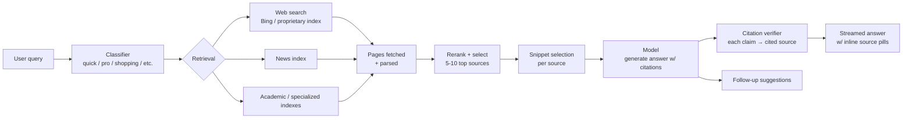

# Case study: Perplexity

> **In one line:** Perplexity is an "answer engine" — you ask a question, it searches the live web, retrieves a handful of pages, and answers using only those pages with inline citations — and the architecture is essentially a productized RAG pipeline tuned for freshness, citation faithfulness, and follow-up coherence.

## The product

A search engine where the result is an *answer*, not a list of links. Three main modes:

- **Quick search** — single-pass answer to a typical query.
- **Pro search** — multi-step research: clarify, decompose, retrieve, synthesize.
- **Deep research** — multi-minute background job producing a long structured report.

Distinct from Google: the result is synthesized; distinct from ChatGPT: the answer is grounded in retrievable, currently-live sources.

## Architecture

The whole pipeline runs in seconds for quick search, tens of seconds for Pro, minutes for Deep Research.

## Key engineering decisions

### 1. Owned retrieval, not just API'd Bing

Early Perplexity used Bing's search API; later they built proprietary indexes on top, plus dedicated indexes for specific domains (news, scholarly, finance). The reason: search-quality is the primary lever on answer quality. They couldn't afford to be downstream of someone else's ranking.

This is the "your moat is the retrieval, not the model" lesson — true for every RAG product, and *very* true here.

### 2. Citation enforcement at the model layer

The model is instructed (and likely fine-tuned) to emit citations inline: `[1]`, `[2]`, with a structured mapping back to retrieved sources. The render layer turns those into clickable source pills.

The non-obvious engineering: the model can't just *claim* a citation. There's a verification step that checks each claim against the cited source. Claims with weak grounding can be flagged or the answer can be retried.

This is the cardinal RAG quality lever. See [RAG basics](../01-foundations/rag-basics.md) and [Safety & privacy](../10-patterns/11-safety-privacy.md).

### 3. Multiple model tiers per query type

Quick search uses a fast model (latency budget: &lt;3s end-to-end including retrieval). Pro and Deep Research use frontier-tier reasoning models. The router decides which.

For Deep Research specifically, the agent loop runs for minutes — decomposing the query, retrieving across multiple sub-queries, building an outline, drafting, refining. This is closer to a long-running agent than a chat call.

### 4. Source diversity and trust tiers

Not every web page is equal. Internal classifiers tier sources (high-trust: established publishers, scholarly, primary sources; low-trust: spam, content farms, AI-generated SEO sludge). The retrieval ranker weights these.

This is downstream of the second-order problem: as the web fills with AI-generated content, generic web retrieval gets noisier. Tiered source quality is a defense.

### 5. Follow-up coherence

The follow-up suggestions ("ask about X next") and the multi-turn conversation flow are designed so the user can drill down without losing context. The conversation state carries enough context that "What about Q2?" works after a question about Q1 earnings.

## Stack snapshot (2026)

- **Models:** mix of OpenAI, Anthropic, and open-source models (Llama-family) fine-tuned for citation behavior; Perplexity has trained their own ("Sonar") for some queries.
- **Retrieval:** proprietary web index + Bing API + specialty indexes (news, academic).
- **Infrastructure:** AWS-heavy historically; significant inference cost optimization (custom serving for Sonar models).
- **Frontend:** Next.js + custom rendering of the source-pill format.

## What to copy

- **Citation pills + verifier.** The single biggest UX win in a RAG product. Users *see* the grounding; they trust the answer.
- **Tier your queries.** Not every question deserves Deep Research; not every question can be answered in a one-shot. Route by intent.
- **Owned retrieval where you can.** If your domain is narrow enough, building your own index beats using a generic API.
- **Source quality tiers.** "We trust this site more" is a real signal worth encoding.
- **Multi-turn coherence as a deliberate design.** Most chat products fail on the third turn. Test follow-ups explicitly.

## What to avoid

- **One model for all query types.** Quick search and Deep Research have wildly different requirements.
- **Letting the model cite without verification.** Models will cite confidently and wrongly. Always verify.
- **Generic web retrieval in a content-farm world.** Filter or your answers degrade as the open web gets noisier.
- **Ignoring the "is this a question we should answer at all" filter.** Some queries (medical, legal, financial advice) need different handling than "what's the population of Lisbon."

## Sources

- Perplexity engineering blog posts on Sonar models and retrieval.
- Aravind Srinivas (CEO) interviews on Lex Fridman, Lenny's Podcast.
- AI Engineer Summit talks by Perplexity engineers.
- Public discussions of citation-enforcement and reranking.

---

→ Next: [Sierra](./sierra.md)
