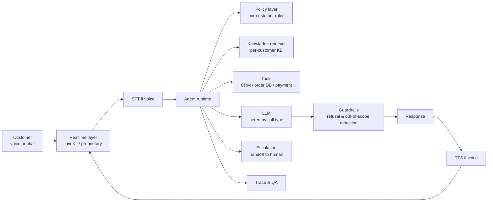

# Case study: Sierra

> **In one line:** Sierra builds AI customer-support agents that handle voice and chat for enterprise customers — and the engineering interesting bits are how they blend realtime voice with pipeline-style control, how they encode per-customer business rules without fine-tuning, and how they enforce *what the agent is not allowed to say*.

## The product

A platform for deploying AI agents that handle customer conversations at scale. Used by ADT, SiriusXM, WeightWatchers, Casper, OluKai, and a growing roster of enterprise brands.

Three modes the agents operate in:

- **Chat** — web widget or in-app chat.
- **Voice** — phone-based agents handling inbound and outbound calls.
- **Email** — async handling of customer inquiries.

The agent is configured per-customer with policies, knowledge bases, escalation paths, and brand voice — not by training a custom model, but by composing primitives.

## Architecture

Two layers above the LLM that matter: the **policy layer** (what this customer's agent is allowed to do) and the **guardrails layer** (what no agent is allowed to do).

## Key engineering decisions

### 1. Policies as code, not as prompts

A customer like an airline has thousands of business rules: refund policy, status-based exceptions, regulatory requirements per jurisdiction. Cramming these all into a system prompt produces unreliable results.

Sierra's design moves enforcement into structured **policies** that the agent runtime checks deterministically. The prompt teaches the agent to *consult* the policy, not to *memorize* it. When the agent wants to issue a refund, it looks up the policy via a tool call, gets a structured "allowed: yes/no, conditions: [...]" response, and acts accordingly.

This is the "don't let the LLM be the policy enforcer" pattern at scale. The LLM is the natural-language interface; the policy engine is the boundary.

### 2. Knowledge retrieval per customer, scoped + audited

Each customer brings their own knowledge base (FAQs, manuals, policy docs). Sierra ingests, indexes, and retrieves *only for that customer*. Critical for tenancy isolation and for keeping agents on-brand.

Retrieval is heavily reranked. Citation enforcement is built in — agents say "according to our return policy [policy_doc_v3.pdf, section 4.2]…" rather than freelancing.

### 3. Voice + pipeline blend

For voice, Sierra uses a hybrid:

- **Realtime LLM** (OpenAI Realtime or equivalent) handles the conversational flow — turn-taking, interruption, natural prosody.
- **Pipeline LLM** handles the *thinking* steps — when the agent needs to check policy, look up an order, decide whether to escalate. The voice model says "let me check that for you" while the pipeline model runs the tool call.

Pure realtime doesn't have enough control for enterprise; pure pipeline (STT → LLM → TTS) is too high-latency. The blend handles both constraints.

See [Realtime voice — the engineering details](../04-stack/realtime-voice-engineering.md).

### 4. Escalation as a first-class outcome

Sierra agents are designed to *gracefully fail*. When the agent detects:

- Out-of-scope query.
- Customer frustration (sentiment).
- Repeated attempts at the same task that aren't working.
- Anything matching customer-defined escalation triggers.

…it hands off to a human agent with a structured summary of the conversation so far. "We tried to handle this; here's what we know; here's what they want."

This is why customers buy: not because the agent handles 100% of cases, but because it handles 70% well, escalates 30% cleanly, and never leaves the customer stranded mid-call.

### 5. Per-customer eval and QA

Every deployed agent has an eval suite specific to that customer — common scenarios, brand-voice tests, policy-corner-cases. Sierra's deployment process refuses to ship a customer-facing agent until the eval suite passes at a defined bar.

After deployment, sampled real conversations are reviewed (LLM-as-judge + human spot-check), feeding back into both the eval set and the policy layer.

## Stack snapshot (2026)

- **Models:** mix of OpenAI (chat + Realtime), Anthropic Claude (chat + agent loops), with proprietary fine-tunes for specific tasks.
- **Voice:** OpenAI Realtime for in-call; LiveKit for media infrastructure on phone-bridged flows; Twilio / Vonage for telephony.
- **Orchestration:** internal agent runtime, MCP-like protocol for customer tool integrations.
- **Knowledge base:** vector + lexical hybrid retrieval per customer.
- **Eval:** internal platform, integrated into the deployment pipeline.

## What to copy

- **Policy engine separate from prompt.** Whenever a business rule is load-bearing, encode it deterministically and let the LLM consult it.
- **Per-tenant KB isolation as a first-class boundary.** Never accidentally retrieve another customer's content. Filter at the query layer, not at the prompt layer.
- **Realtime + pipeline blend for voice.** Pure realtime is too fragile for enterprise; pure pipeline is too slow.
- **Escalation as a primary feature.** "How does this fail?" should answer "with a clean handoff."
- **Per-customer eval suite as a deployment gate.** Don't ship to a new customer without their own regression set.

## What to avoid

- **Trying to encode business rules in the prompt.** Doesn't scale past 50 rules; doesn't pass audits.
- **Single shared knowledge base across customers.** Tenancy leaks are existential bugs in this space.
- **Treating voice as just "text with a TTS wrapper."** Interruption, latency, turn-taking are first-class concerns.
- **"The AI handled it" without graceful escalation.** Unhappy customers escalated badly is worse than unhappy customers escalated cleanly.

## Sources

- Bret Taylor (CEO) interviews and conference keynotes (No Priors, AI Engineer Summit).
- Sierra engineering blog posts on agent design and policy enforcement.
- Public discussions about deployment process and per-customer customization.
- AI Engineer Summit talks (2024–2026) on voice agent architecture.

---

→ Next: [Harvey](./harvey.md)
