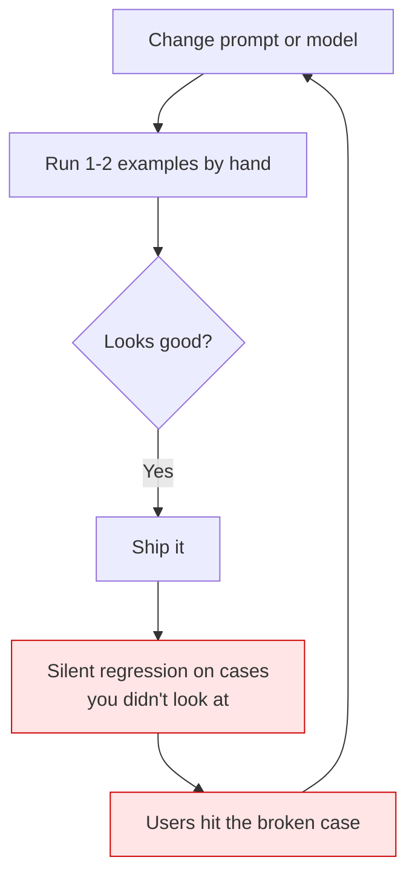
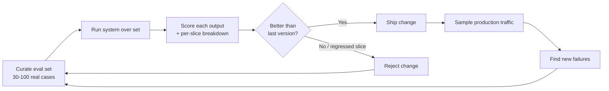

# Why evals are the whole game

> **In one line:** A model output is a guess; an eval is the only thing that turns "I think this is better" into "I know this is better."

:::tip[In plain English]
When you write normal software, you can read the code and reason about what it does. AI systems aren't like that — the same prompt can give different answers, and a one-word change to a prompt can silently break a thousand cases while fixing the one you were staring at. So you can't reason your way to "is it good?" You have to **test** it, the way a factory tests every part coming off the line. Evaluation is that testing line. The teams that build one ship fast and sleep at night. The teams that don't are gambling on every change.
:::

## The problem: outputs are non-deterministic and judgment is fuzzy

In a normal program, `add(2, 2)` returns `4` every time, and `4` is unambiguously correct. AI breaks both halves of that:

1. **Non-determinism.** Ask a model the same question twice and you can get two different answers. Even at `temperature=0`, a prompt tweak, a model version bump, or a retrieval change can shift outputs.
2. **Fuzzy correctness.** "Summarize this ticket" has no single right answer. Two good summaries can look completely different. There's no `== expected` you can write.

These two properties are why you can't QA an AI feature by hand the way you'd click through a form. You need a *measurement system* that gives you a comparable number across versions, even when "correct" is a spectrum.

## Why "vibes" don't scale

Almost everyone starts with **vibe-checking**: change a prompt, run one or two examples in the playground, decide "yeah, better," and ship. This feels productive and falls apart fast.



Here's why vibes collapse:

- **You only look at what you remember to look at.** You fixed case A; you never re-checked cases B through Z, and your "fix" broke three of them.
- **You can't compare two versions fairly.** Yesterday's playground session and today's are different cherry-picked examples. There's no apples-to-apples number.
- **You can't delegate.** "It seems better to me" can't be reviewed, can't gate a deploy, can't onboard a new teammate.
- **Confirmation bias.** You *want* your change to be good, so you unconsciously pick the examples where it shines.
- **It doesn't survive scale.** At ten cases a human can squint. At ten thousand daily requests, squinting is not a strategy.

> **The blunt version:** "It looks good in the playground" is not a measurement. It's a feeling. Feelings don't catch regressions, don't block bad deploys, and don't compound into a system that gets reliably better.

## The eval-driven loop

The alternative is to make evaluation the *spine* of your development loop. Every change runs through a graded test set; the score decides whether the change is real.



This is the same shape as **test-driven development** in regular software, adapted for stochastic systems. The differences:

- Tests are graded on a 0–1 scale, not pass/fail (because correctness is fuzzy).
- The "test suite" grows continuously from production failures.
- Some graders are themselves models (LLM-as-judge), so you must validate the grader too.

A minimal version of the loop in code:

```python
# eval_loop.py — the smallest thing that counts as an eval
import json

def run_eval(system, cases):
    """Run the system over every case, score it, return aggregate + slices."""
    results = []
    for case in cases:
        output = system(case["input"])
        score = score_case(case, output)        # 0.0 - 1.0
        results.append({"id": case["id"], "score": score,
                        "slice": case.get("category", "all")})

    overall = sum(r["score"] for r in results) / len(results)
    slices = {}
    for r in results:
        slices.setdefault(r["slice"], []).append(r["score"])
    by_slice = {k: sum(v) / len(v) for k, v in slices.items()}
    return {"overall": overall, "by_slice": by_slice, "results": results}

if __name__ == "__main__":
    cases = json.load(open("eval_set.json"))
    report = run_eval(my_system, cases)
    print(f"Overall: {report['overall']:.3f}")
    for slice_name, score in report["by_slice"].items():
        print(f"  {slice_name}: {score:.3f}")
```

```typescript
// eval_loop.ts — the same loop in TypeScript
type Case = { id: string; input: unknown; category?: string };

export async function runEval(
  system: (input: unknown) => Promise<unknown>,
  cases: Case[],
  scoreCase: (c: Case, output: unknown) => Promise<number>,
) {
  const results = [];
  for (const c of cases) {
    const output = await system(c.input);
    const score = await scoreCase(c, output); // 0..1
    results.push({ id: c.id, score, slice: c.category ?? "all" });
  }
  const overall = results.reduce((s, r) => s + r.score, 0) / results.length;
  const bySlice: Record<string, number[]> = {};
  for (const r of results) (bySlice[r.slice] ??= []).push(r.score);
  const sliceAvg = Object.fromEntries(
    Object.entries(bySlice).map(([k, v]) => [k, v.reduce((a, b) => a + b, 0) / v.length]),
  );
  return { overall, bySlice: sliceAvg, results };
}
```

That's ~30 lines. You do not need a platform to start — you need a JSON file of cases and a scoring function. (Tooling matters once you have eval-set sprawl; see the [eval tools page](/docs/stack/eval-tools).)

## Why this is *the* core AI-engineering discipline

Strip away the frameworks and the model names, and the durable skill of an AI engineer is this loop:

> **define what "good" means → measure it → change the system → measure again → keep the change only if the number went up.**

Everything else is in service of it. Prompt engineering is just "search the prompt space for higher eval scores." Choosing a model is "which model scores higher on *my* eval set, not on a public leaderboard." RAG tuning, fine-tuning, agent design — all of it is hill-climbing on an eval score. Without the score, you're not engineering; you're decorating.

This is also why public benchmarks (MMLU, etc.) are a trap for product work. They measure generic capability, not *your* task. A model that tops a leaderboard can lose to a "worse" model on your support tickets. The only benchmark that decides your product is the one you built from your data.

:::note[The compounding effect]
Eval-driven teams report iterating roughly 3–5x faster than vibe-driven teams, and the gap widens over time. The reason is compounding: each shipped change is verified, so the system only ratchets upward. Vibe-driven systems drift sideways — every "improvement" risks an invisible regression, so progress is two steps forward, one step back, forever.
:::

## What "good" even means (define it before you measure it)

Before you can score anything, you must answer: *good at what?* This sounds obvious and is the step most people skip. Write down, in plain language, the qualities that matter for your task, then turn each into something measurable.

| Quality you care about | How you'd measure it |
|---|---|
| Factually correct | Exact match / LLM-judge against a reference |
| Cites real sources | Citation IDs are a subset of retrieved docs (deterministic) |
| Right tone | LLM-judge against a tone rubric |
| Doesn't refuse valid requests | "must_not_contain: 'I cannot help'" |
| Retrieves the right context | recall@k on the retriever |
| Fast enough | p95 latency under N ms |
| Cheap enough | tokens / cost per request |

Notice that one product has *many* qualities, each with its own metric. A real eval suite is a basket of these, not a single number. (We cover the metric families in depth in [Metrics](./05-metrics.md).)

## Common pitfalls

:::caution[Where people trip up]
- **"We'll add evals after we ship."** You won't, and once you ship you can't tell whether changes help — you've baked in the blindness from day one.
- **Treating the playground as an eval.** A cherry-picked, unrepeatable, two-example look is a vibe, not a measurement.
- **Chasing public benchmarks instead of your own.** MMLU doesn't know your customers. Build the eval from your data.
- **One aggregate number, no slices.** "+3% overall" can hide "−10% on your hardest, highest-value cases." Always break the score down.
- **Optimizing the eval set so hard you overfit it.** If eval scores climb but real users don't get happier, your eval set has drifted from reality — refresh it from production.
- **Confusing "ran an eval once" with "have an eval discipline."** The value is in running it on *every* change, automatically.
:::

<Quiz id="eval-why-quick-check" variant="micro" title="Quick check">

<Question
  prompt="You tweak a prompt, run the two examples you were debugging in the playground, both look great, and you ship. According to this page, what is the most likely failure mode?"
  options={[
    { text: "The model provider will reject the new prompt as invalid" },
    { text: "Latency will increase because the prompt is longer" },
    { text: "Cases you never re-checked silently regress, and users hit them in production" },
    { text: "The playground results will not reproduce because of rate limits" }
  ]}
  correct={2}
  explanation="Vibe-checking only inspects the cases you remember to look at — fixing case A can break cases B through Z invisibly, which is exactly the silent-regression loop in the diagram. Latency or rate limits might be real concerns sometimes, but they are not the structural problem with vibes: the structural problem is unmeasured coverage."
/>

<Question
  prompt="A new model just topped MMLU and several public leaderboards. What does this page say should decide whether you switch your product to it?"
  options={[
    { text: "How the model scores on your own eval set built from your data" },
    { text: "The leaderboard ranking, since it aggregates many tasks" },
    { text: "Whether the model is newer than your current one" },
    { text: "Community sentiment from early adopters" }
  ]}
  correct={0}
  explanation="Public benchmarks measure generic capability, not your task — a leaderboard-topping model can lose to a 'worse' model on your actual support tickets. The leaderboard answer is tempting because rankings feel objective, but the only benchmark that decides your product is the one built from your own data."
/>

<Question
  prompt="Your eval reports '+3% overall' after a change. Why does this page insist on also checking per-slice breakdowns before shipping?"
  options={[
    { text: "Slices make the report look more thorough to stakeholders" },
    { text: "The overall number is statistically invalid without slices" },
    { text: "Slices are needed to compute the overall average correctly" },
    { text: "An aggregate gain can hide a large regression on your hardest, highest-value cases" }
  ]}
  correct={3}
  explanation="A +3% overall can coexist with −10% on the cases that matter most — easy cases improving can mask hard cases collapsing. The aggregate is not 'statistically invalid'; it is just incomplete, which is why the page says to always break the score down rather than ship on one number."
/>

</Quiz>

---

→ Next: [Types of evaluation](./03-eval-types.md)
