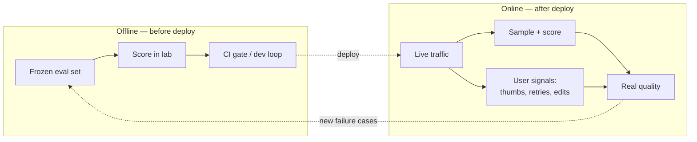
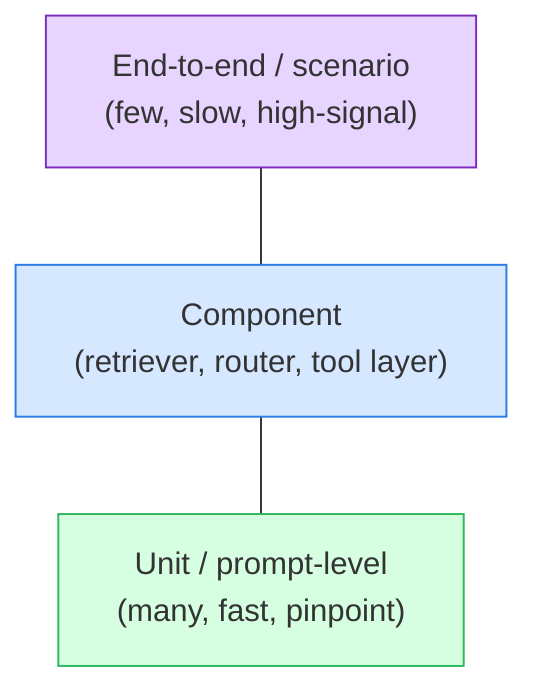
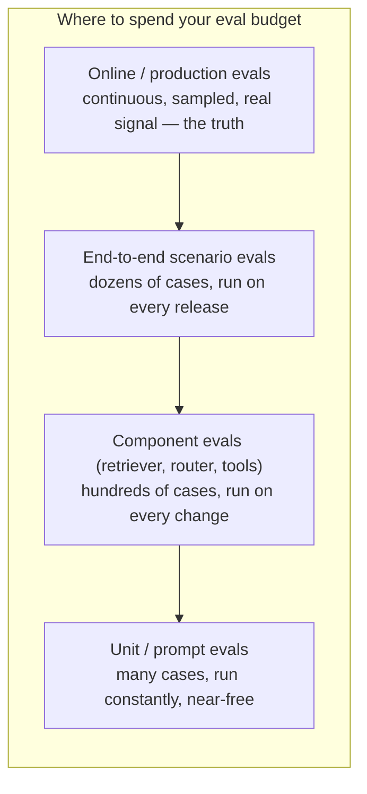

# Types of evaluation

> **In one line:** "Eval" isn't one thing — it's a small grid of choices (when, what scope, with or without a reference answer), and knowing the grid lets you pick the right test for each job.

:::tip[In plain English]
Testing a car has many forms: you test a single spark plug on a bench (cheap, fast, narrow), you test the assembled engine on a dyno, and you also watch real cars on real roads (slow, expensive, but the truth). AI evaluation has the exact same layers. This page gives you the vocabulary — offline vs online, unit vs end-to-end, with-an-answer-key vs without — so that when someone says "we need a reference-free online eval," you know precisely what they mean and when to reach for it.
:::

## Axis 1: Offline vs online

This is the biggest split: *are you testing on a frozen dataset, or on live traffic?*

**Offline evaluation** runs your system over a fixed set of saved cases, before anything reaches users. It's repeatable, controlled, and fast. This is what powers your dev loop and your CI gate. Think "lab conditions."

**Online evaluation** measures quality on *real production traffic* — either by sampling live requests and scoring them, or by watching real-world signals (did the user accept the answer? thumbs-up? did they retry?). It's the truth, but it's noisy, delayed, and can't be re-run.



| | Offline | Online |
|---|---|---|
| Runs on | Frozen saved cases | Live production traffic |
| Speed | Seconds to minutes | Continuous / delayed |
| Repeatable? | Yes — same input, comparable score | No — traffic never repeats |
| Catches | Regressions before they ship | Real-world failures, drift, edge cases you never imagined |
| Risk | Eval set drifts from reality | Noisy, harder to attribute cause |

You need both. Offline tells you whether a change is safe to ship; online tells you whether your offline set still reflects reality. The arrow from online back to offline (new failures becoming new test cases) is the **data flywheel** — covered in [Production evaluation](./09-production-evals.md).

## Axis 2: Scope — unit, component, end-to-end

How much of the system does one eval exercise? This mirrors the software testing pyramid.

- **Unit / prompt-level** — one prompt, one isolated behavior. "Given this ticket, does the classifier output the `billing` label?" Fast, cheap, pinpoints exactly what broke. You can run hundreds in seconds.
- **Component** — one subsystem in isolation. The classic example is **evaluating the retriever separately from the generator** in a RAG app: "for this query, did we retrieve the document that contains the answer?" This is huge in practice — most "the LLM hallucinated" bugs are actually "the retriever fetched the wrong context."
- **End-to-end / scenario** — the whole system, possibly multi-turn. "Given this conversation, does the support bot eventually cite the refund policy, call the refund tool, and escalate when asked?" Slow, expensive, but the only thing that tells you the *product* works.



A concrete component eval — testing the retriever alone, which is where most RAG quality is won or lost:

```python
# Component eval: is the right doc in the top-k? (no LLM involved)
def eval_retriever(retriever, cases, k=5):
    hits = 0
    for case in cases:
        retrieved_ids = [d.id for d in retriever.search(case["query"], k=k)]
        if case["gold_doc_id"] in retrieved_ids:
            hits += 1
    return hits / len(cases)  # this is recall@k — see the Metrics page
```

If `recall@5` is 0.6, no prompt in the world will get you above 60% on answer quality — the right context simply isn't there 40% of the time. Component evals localize the failure so you fix the right layer.

## Axis 3: Reference-based vs reference-free

How does the grader decide if an output is good? Two families:

**Reference-based** ("answer-key") graders compare the output to a known-correct reference. Exact match, F1 against a gold answer, embedding similarity to a reference summary, "did it cite doc #42." Precise and cheap, but requires you to have written down the right answer — which is impossible for open-ended tasks.

**Reference-free** ("criteria") graders judge the output against *criteria*, with no gold answer. "Is this summary faithful to the source?" "Is the tone professional?" "Does the answer actually address the question?" These are usually scored by an LLM-as-judge or a human. Essential for open-ended generation, but you must validate the grader itself.

```python
# Reference-based: there's a known correct answer
def grade_reference_based(output, gold):
    return 1.0 if output.strip().lower() == gold.strip().lower() else 0.0

# Reference-free: judge against a criterion, no gold answer needed
def grade_reference_free(question, answer, source):
    prompt = f"""Is the ANSWER fully supported by the SOURCE (no invented facts)?
SOURCE: {source}
QUESTION: {question}
ANSWER: {answer}
Reply with only a number 0.0-1.0 for faithfulness."""
    return float(judge_model.generate(prompt))
```

| | Reference-based | Reference-free |
|---|---|---|
| Needs a gold answer? | Yes | No |
| Good for | Classification, extraction, closed QA, math | Summaries, chat, open-ended generation |
| Grader | Deterministic code (usually) | LLM-judge or human |
| Cost | Near-zero | Per-judgment LLM cost |
| Failure mode | Brittle on phrasing | Grader has biases (see [LLM-as-judge](./06-llm-as-judge.md)) |

These axes are independent. A unit eval can be offline + reference-based (classify a label, check exact match). An end-to-end eval is often offline + reference-free (judge a multi-turn conversation against a rubric). Online evals are usually reference-free (you don't have gold answers for live traffic). Mix and match.

## The eval pyramid

Put the scope axis together with cost/speed and you get the **eval pyramid** — the recommended distribution of your eval effort.



Read it bottom-up:

- **Many fast unit & component evals** at the base. They're cheap, deterministic where possible, and run on every commit. This is where you catch most regressions.
- **Fewer end-to-end scenario evals** in the middle. Expensive (often LLM-judged, multi-turn), so you run a curated couple-dozen on each release candidate.
- **Online evals at the top** — continuous sampling of live traffic. Few in count but highest-signal, because it's reality, not a proxy.

The anti-pattern is an **inverted pyramid**: only slow, expensive, end-to-end LLM-judged evals, run rarely. They're so costly that people skip them, regressions slip through, and when something breaks you can't tell *which layer* broke. Push tests down the pyramid: prefer a cheap deterministic component check over an expensive end-to-end judge whenever the behavior allows it.

## Putting the grid together

A mature suite for, say, a RAG support bot looks like:

| Eval | Scope | When | Reference? | Grader |
|---|---|---|---|---|
| Intent classifier accuracy | Unit | Every commit | Reference | Exact match |
| Retriever recall@5 | Component | Every commit | Reference | Set membership |
| Answer faithfulness | E2E | Every release | Reference-free | LLM-judge |
| Tone / helpfulness | E2E | Every release | Reference-free | LLM-judge |
| Escalation scenarios | E2E | Every release | Reference | Tool-call check |
| Live thumbs-down rate | Online | Continuous | Reference-free | User signal |

One product, six evals, four positions on the grid. That's normal and correct.

## Common pitfalls

:::caution[Where people trip up]
- **Only running end-to-end evals.** They're slow and don't localize failures. You'll know "quality dropped" but not *which component*. Build component evals so you can point at the broken layer.
- **Confusing offline with online.** A great offline score on a stale set means nothing if production traffic has shifted. Refresh the set from real data.
- **Forcing reference-based grading on open-ended tasks.** "The summary must equal this exact string" fails every good summary that's phrased differently. Use reference-free grading there.
- **Skipping component evals for RAG.** Most "hallucination" complaints are retrieval failures in disguise. Eval the retriever separately or you'll tune the wrong knob.
- **Inverted pyramid.** Expensive evals you run rarely give you slow, coarse, late feedback. Push checks down to fast unit/component level wherever you can.
:::

<Quiz id="eval-types-quick-check" variant="micro" title="Quick check">

<Question
  prompt="Your RAG bot's retriever scores recall@5 = 0.6, and users complain about wrong answers. The team wants to spend a sprint rewriting the answer prompt. What does this page predict?"
  options={[
    { text: "Prompt work will fix it, since generation is the last step and controls output quality" },
    { text: "No prompt can lift answer quality past ~60%, because the right context is missing 40% of the time — fix the retriever first" },
    { text: "The recall@5 number is irrelevant because retrieval and generation are evaluated together" },
    { text: "The team should switch to a larger model before touching either component" }
  ]}
  correct={1}
  explanation="A component eval localizes the failure: if the gold document is absent from the top-5 results 40% of the time, the generator literally cannot answer correctly in those cases, no matter the prompt. The prompt-rewrite answer is tempting because the symptom shows up in the generated answer, but the broken layer is retrieval."
/>

<Question
  prompt="You need to grade open-ended chat summaries where two good answers can be worded completely differently. Which grading family fits?"
  options={[
    { text: "Exact match against a gold summary string" },
    { text: "Set membership against gold document IDs" },
    { text: "Accuracy over a fixed label set" },
    { text: "Reference-free grading against criteria, typically via LLM-judge or human" }
  ]}
  correct={3}
  explanation="Open-ended generation has no single right answer to compare against, so you judge against criteria (faithfulness, tone, relevance) without a gold answer. Exact match is the tempting wrong choice because it is precise and cheap — but it fails every good summary that happens to be phrased differently from the reference."
/>

<Question
  prompt="A team's only evals are a handful of expensive, multi-turn, LLM-judged end-to-end scenarios run before each release. What does this page call this, and what goes wrong?"
  options={[
    { text: "An inverted pyramid — feedback is slow and coarse, and when quality drops you can't tell which layer broke" },
    { text: "A healthy setup, since end-to-end evals are the only ones that test the real product" },
    { text: "An offline-only gap that should be fixed by removing the end-to-end evals entirely" },
    { text: "A reference-based bias that makes the scores too strict" }
  ]}
  correct={0}
  explanation="The eval pyramid says cheap unit and component evals should form the base; relying only on slow, costly end-to-end judges means tests run rarely, regressions slip through, and failures can't be localized. 'End-to-end tests the real product' is the tempting trap — they are valuable, but only as the thin top of the pyramid, not the whole thing."
/>

</Quiz>

---

→ Next: [Building eval datasets](./04-datasets.md)
