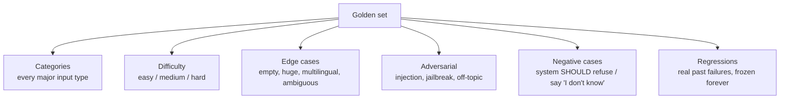

# Building eval datasets

> **In one line:** Your eval is only as good as the cases in it — a thoughtfully curated set of 50 real cases beats 5,000 random ones every time.

:::tip[In plain English]
An eval needs something to run on: a list of example inputs, ideally with a note about what a good answer looks like. That list is your **eval dataset**. The whole art is choosing *which* examples go in it. If your examples are all easy, your system will ace the test and still fail real users. If they cover the messy, weird, high-stakes cases your users actually send, your score finally means something. This page is about building that list deliberately — like a teacher writing an exam that genuinely separates students who understand from students who guessed.
:::

## What an eval case looks like

A case is a single test: an input, plus whatever the grader needs to judge the output. The richer the `expected` block, the more precise your grading.

```python
{
  "id": "billing-refund-001",
  "input": {
    "ticket": "I was charged twice for June. Please refund the extra charge.",
    "user_tier": "pro",
  },
  "expected": {
    "must_cite": ["billing-refund-policy-v3"],     # citation IDs (deterministic)
    "must_contain": ["double-charge", "5 business days"],
    "must_not_contain": ["I cannot help", "I'm just an AI"],
    "must_call_tool": "create_refund_request",
    "tone": "apologetic, action-oriented",          # judged by LLM
  },
  "category": "billing/refund",   # slice label
  "difficulty": "medium",          # slice label
  "source": "production-log-2026-04-17",
  "weight": 1.0,
}
```

Note the `expected` block is **structured, not a single string**. You rarely want "output must equal this exact paragraph" — you want "must do these specific things." This makes grading robust to harmless wording differences while still catching real failures. (We cover the grading side in [Metrics](./05-metrics.md) and [LLM-as-judge](./06-llm-as-judge.md).)

## The golden set

Your **golden set** is the curated, trusted, version-controlled collection of cases that defines "good" for your product. Properties of a good golden set:

- **Human-verified.** Someone who understands the domain confirmed each case's expected behavior. This is the source of truth.
- **Stable.** It changes deliberately, in reviewed commits — not silently. A drifting golden set makes scores incomparable across time.
- **Representative.** It mirrors the distribution of real inputs (plus deliberate edge cases).
- **Owned.** Someone is responsible for its quality and growth, the same way someone owns the prompt.

The golden set is the most valuable artifact your team builds. Models change, frameworks churn, prompts get rewritten — but a great golden set keeps paying off across all of them. Treat it like a crown jewel.

## Coverage: what must be in the set

A test that only contains easy cases is a participation trophy. Deliberately cover:



- **Every major category** of input your product handles (billing, technical, account, …). Map them first, then make sure each has cases.
- **A difficulty spread.** Include the genuinely hard cases — long, ambiguous, multi-step. If everything is easy you'll hit 95% and ship something broken.
- **Edge cases.** Empty input, enormous input, another language, ambiguous phrasing, conflicting instructions.
- **Adversarial cases.** Prompt injection, jailbreak attempts, off-topic requests. (Deep dive in the [safety chapter](/docs/safety).)
- **Negative cases.** Inputs where the *correct* behavior is to refuse, escalate, or say "I don't know." Systems that never get tested on "should decline" learn to confidently answer everything.
- **Regression cases.** Every real production failure becomes a frozen case so it can never silently return. This pile grows forever and is your most valuable coverage.

## Slices: the reason a single number lies

A **slice** is a subset of your set defined by a label (category, difficulty, language, user tier, length). You computed slice averages in the [eval loop](./02-why-evals.md) — here's *why* they're non-negotiable.

A change can move the overall score up while wrecking the cases that matter most:

| Slice | v1 score | v2 score | Verdict |
|---|---|---|---|
| easy | 0.92 | 0.98 | up |
| medium | 0.80 | 0.81 | flat |
| **hard (high-value)** | 0.65 | **0.51** | **regressed!** |
| **Overall** | 0.82 | 0.84 | "improved" — a lie |

v2 looks like a +2% win and is actually a disaster on your hardest, highest-value cases. **Never ship on the aggregate alone.** Gate on "overall up AND no important slice down more than ~5%." Tag every case with slice labels at creation time so this analysis is free later.

## Where cases come from

Four sources, in rough order of value:

1. **Production logs (highest value).** Real inputs your users actually sent. Once you're live, this is the gold mine — sample real traffic, find failures, and turn them into cases. This is the data flywheel ([production evals](./09-production-evals.md)).
2. **Domain experts.** Before you have traffic, the person who does the job today (the support lead, the lawyer, the doctor) can write the cases that matter and the expected answers. An engineer alone will miss the cases that bite.
3. **Synthetic generation.** Use an LLM to *expand* coverage — generate variations, edge cases, adversarial inputs. Great for bulking up thin slices. Caveat: synthetic cases need human review, and a set that's *only* synthetic tends to test what the generator imagines, not what users actually do.
4. **Public datasets / benchmarks.** Useful as a starting smoke-test or for standard sub-tasks, but they don't know your product. Never your primary set.

```python
# Synthetic expansion: bulk up a thin slice, then HUMAN-REVIEW the output
def expand_cases(seed_case, n=5):
    prompt = f"""Here is a real support ticket and its category.
Generate {n} realistic VARIATIONS that a different user might send for the
same underlying problem. Vary phrasing, tone, and detail. Return JSON list.

Ticket: {seed_case['input']['ticket']}
Category: {seed_case['category']}"""
    variations = json.loads(generator.generate(prompt))
    # IMPORTANT: a human reviews these before they enter the golden set
    return [{"input": {"ticket": v}, "category": seed_case["category"],
             "source": "synthetic-needs-review"} for v in variations]
```

## Sizing: how big should the set be?

Bigger isn't automatically better — a small, well-curated, well-sliced set beats a giant noisy one. Rough guidance:

| Stage | Set size | Notes |
|---|---|---|
| First eval / v0 launch | 30–100 cases | Cover your top ~5 categories. Enough to ship responsibly. |
| Growing product | 200–500 cases | Filled-in slices, regressions piling up. |
| Mature / year 1+ | 500–2,000+ cases | Rich slices; you may *sample* a fast subset for CI and run the full set nightly. |

Two sizing principles:

- **Per-slice size matters more than total size.** A slice with 3 cases gives a score that swings wildly (one flip = 33%). Aim for ~20+ cases per slice you actually want to trust. The "right" total is whatever gives each important slice enough cases to be stable.
- **Statistical reality.** With 30 cases, a single flip moves the score ~3.3%. So a "1% improvement" on a 100-case set is noise, not signal. The smaller your set, the larger a change has to be before you believe it. When in doubt, add cases to the slice you're trying to judge.

## Versioning

Your eval set is code. Treat it like code.

- **Commit it to git** alongside the prompt and retriever it tests. When a prompt change *requires* an eval-set change, they belong in the same reviewed PR.
- **Version the set explicitly** (`eval_set_v7`) so a reported score always names the set it ran on. A score with no set version is uninterpretable.
- **Never edit a case in place to make a failure pass.** That's cheating the test. If a case's expected behavior genuinely changed, change it in a reviewed commit with a reason in the message.
- **Track set lineage.** Note where each case came from (prod log date, expert, synthetic) so you can audit and refresh.

```bash
evals/
  cases/
    billing.jsonl        # one case per line, easy to diff in git
    technical.jsonl
    adversarial.jsonl
    regressions.jsonl    # grows forever — frozen prod failures
  eval_set.version       # "v7 — added 40 multilingual cases 2026-05"
  runner.py
```

Storing cases as **JSONL** (one JSON object per line) makes git diffs readable — adding a case is a one-line diff, so reviewers can actually see what changed.

## Common pitfalls

:::caution[Where people trip up]
- **A set of only easy cases.** You'll score 95% and ship something that fails your hard, high-value users. Deliberately include the painful cases.
- **No slice labels.** Untagged cases mean you can only ever see the (lying) aggregate. Tag category/difficulty/source at creation time.
- **Editing cases to make tests green.** Moving the goalposts to pass is self-deception. Change expected behavior only deliberately and in review.
- **All-synthetic sets.** They test what the generator imagined, not what users send. Always anchor on real and expert-written cases; use synthetic to expand, not to replace.
- **Never adding production failures.** A frozen, never-growing set goes stale and stops catching the failures that actually happen. Wire the flywheel.
- **One giant set, tiny slices.** 2,000 cases but only 4 in your "refund" slice means your refund score is pure noise. Balance the slices that matter.
- **Not versioning.** A score you can't tie to a specific, committed set version can't be compared to last week's. Version everything.
:::

<Quiz id="eval-datasets-quick-check" variant="micro" title="Quick check">

<Question
  prompt="After a change, your eval goes from 0.82 to 0.84 overall, but the 'hard (high-value)' slice drops from 0.65 to 0.51. What does this page say you should do?"
  options={[
    { text: "Ship it — the overall number is the agreed metric and it went up" },
    { text: "Ship it, but add more easy cases to stabilize the hard slice" },
    { text: "Reject the change — gate on 'overall up AND no important slice down', because the aggregate is lying" },
    { text: "Remove the hard slice from the set since it is dragging down the average" }
  ]}
  correct={2}
  explanation="A +2% aggregate that hides a 14-point collapse on your hardest, highest-value cases is a disaster dressed up as a win — the page's rule is to never ship on the aggregate alone. 'Ship it, the metric went up' is exactly the trap slices exist to catch; and deleting inconvenient slices is moving the goalposts."
/>

<Question
  prompt="A regression case keeps failing after a prompt change, so an engineer edits the case's expected output until it passes. Why does this page forbid that?"
  options={[
    { text: "It's cheating the test — expected behavior should only change deliberately, in a reviewed commit with a reason" },
    { text: "Eval cases are stored in a database and can't be edited directly" },
    { text: "Editing cases invalidates the embedding index used by the grader" },
    { text: "Regression cases must always be deleted, never edited" }
  ]}
  correct={0}
  explanation="Editing a case to make a failure pass is moving the goalposts — the case stops protecting you from the exact failure it was created to catch. The tempting rationalization is 'the expected answer was just outdated', and sometimes it genuinely is — but then the fix is a reviewed, explained commit, not a silent in-place edit."
/>

<Question
  prompt="Your 'refund' slice has 3 cases and its score jumped from 0.67 to 1.0 after a change. How should you read that?"
  options={[
    { text: "A 33-point gain is huge — the change clearly improved refund handling" },
    { text: "It's mostly noise — with 3 cases, one flipped result moves the slice 33%, so the slice needs ~20+ cases before you can trust it" },
    { text: "The slice should be merged into 'billing' to make the number meaningful" },
    { text: "Per-slice scores are unreliable in general, so only the overall score matters" }
  ]}
  correct={1}
  explanation="Per-slice size matters more than total size: a 3-case slice swings wildly because each case is worth 33 points, so the 'improvement' may be a single lucky flip. The big-number-must-be-real instinct is the trap — the page's guidance is to add cases to slices you actually want to judge, not to abandon slicing."
/>

</Quiz>

---

→ Next: [Metrics](./05-metrics.md)
