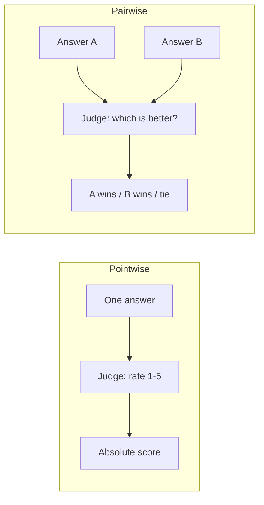
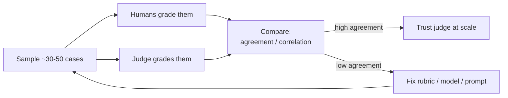

# LLM-as-judge

> **In one line:** When correctness is too fuzzy for code and too expensive for humans, you let a model grade the model — but only after you've proven the judge agrees with people.

:::tip[In plain English]
Some answers can't be graded by a simple rule. "Is this support reply empathetic and helpful?" has no answer key. Hiring a human to read every output is slow and expensive. So we use a clever trick: ask *another* AI to read the output and score it against clear instructions, like a teaching assistant grading essays from a rubric. It's fast, cheap, and surprisingly good — but it has quirks (it likes longer answers, it favors whatever it sees first, it's biased toward its own writing). This page teaches you to build a judge *and* to catch it when it's wrong, because an unchecked judge will confidently lead you astray.
:::

## Why use an LLM to judge

Deterministic metrics (exact match, F1) only work when there's a clear right answer. Humans work for everything but are slow (minutes per case) and expensive (dollars per case). An LLM-judge sits in between: it can grade open-ended qualities — helpfulness, tone, faithfulness, coherence — in **seconds** for **fractions of a cent**, and it does it *consistently* (the same input gets roughly the same score, which humans famously don't).

The trade: an LLM-judge is a model, so it has biases and blind spots. The discipline is to **treat the judge as a system you also have to evaluate** — calibrate it against humans, then trust it within known limits.

## The judge prompt

A judge is just a careful prompt. The quality of your eval is the quality of this prompt. Good judge prompts share five ingredients:

1. **A clear role and task.** "You are an impartial grader."
2. **An explicit, concrete rubric.** Define each score level so two runs agree.
3. **The inputs** — the question, the answer, and (if reference-based) the gold answer or source.
4. **A forced structured output** — a number or label plus a reason, so you can parse and audit it.
5. **A request for reasoning *before* the score** (chain-of-thought) — judges grade more accurately when they explain first.

```python
JUDGE_PROMPT = """You are an impartial grader. Score the ANSWER on faithfulness:
how well it is supported by the SOURCE, with no invented facts.

Use this rubric:
5 = Every claim is directly supported by the source.
4 = All major claims supported; a minor detail is unsupported but harmless.
3 = Mostly supported, but contains one unsupported claim.
2 = Several unsupported claims.
1 = Largely fabricated or contradicts the source.

SOURCE:
{source}

ANSWER:
{answer}

First, list each factual claim and whether the source supports it.
Then give your verdict as JSON: {{"reasoning": "...", "score": <1-5>}}"""
```

```typescript
// Parse the judge's structured verdict, never just a raw number
async function judge(source: string, answer: string): Promise<number> {
  const raw = await model.generate(
    JUDGE_PROMPT.replace("{source}", source).replace("{answer}", answer),
  );
  const { score } = JSON.parse(raw) as { reasoning: string; score: number };
  return score;
}
```

> **Reasoning-before-score is not optional.** A judge asked for "just the number" guesses; a judge asked to reason first and *then* score is markedly more accurate and gives you an audit trail when you disagree with it.

## Pointwise vs pairwise

Two ways to ask the judge a question:

**Pointwise** — score one output on an absolute scale ("rate this 1–5"). Simple, gives you a comparable number per case, scales to large sets. The weakness: models are bad at absolute scales — "is this a 3 or a 4?" is genuinely hard and drifts between runs.

**Pairwise** — show the judge *two* outputs (e.g., from prompt A and prompt B) and ask which is better. Models are far more reliable at **relative** judgments ("B is better than A") than absolute ones. This is the gold standard for comparing two versions and is what powers most preference data and arena-style rankings.



| | Pointwise | Pairwise |
|---|---|---|
| Question | "Score this 1–5" | "Which is better, A or B?" |
| Reliability | Lower (absolute scales drift) | Higher (relative is easier) |
| Best for | Tracking a score over time, CI gates | Comparing two prompt/model versions |
| Cost | 1 judgment per case | 1 judgment per pair |
| Output | A number | A winner (→ win-rate over the set) |

**When to use which:** pointwise when you need an absolute number to gate CI or track a metric over time; pairwise when you're choosing between two candidates ("does prompt v2 beat v1?") — report it as a **win rate** ("v2 wins 63% of head-to-heads").

## The biases that wreck judges

LLM-judges have systematic, well-documented biases. If you don't defend against them, your eval is measuring the bias, not the quality.

- **Position bias.** In pairwise, judges favor whichever answer is shown *first* (or sometimes second) regardless of quality. **Defense:** run each pair *both ways* (A-then-B and B-then-A) and only count a win if the judge picks the same answer in both orders; otherwise call it a tie.
- **Verbosity bias.** Judges reward *longer*, more detailed answers even when the extra length adds nothing — or is wrong. **Defense:** explicitly instruct "do not reward length; a concise correct answer beats a long padded one," and watch for length correlating with score.
- **Self-preference (self-enhancement) bias.** A judge tends to rate text written by *its own model family* higher. **Defense:** use a *different* model to judge than the one that generated, especially when comparing models from different providers.
- **Sycophancy / leniency.** Judges drift toward generous scores and agree with confident-sounding answers. **Defense:** a strict, concrete rubric with explicit failure conditions; calibrate against humans (next section).
- **Formatting / authority bias.** Markdown, bullet points, and confident phrasing inflate scores. **Defense:** rubric language that grades substance, not polish.

```python
# Defending against position bias in pairwise judging
def pairwise_robust(judge, question, answer_a, answer_b) -> str:
    v1 = judge(question, first=answer_a, second=answer_b)   # A then B
    v2 = judge(question, first=answer_b, second=answer_a)   # B then A
    if v1 == "first" and v2 == "second":
        return "A"          # A won regardless of position -> real win
    if v1 == "second" and v2 == "first":
        return "B"          # B won regardless of position -> real win
    return "tie"            # judge flipped with position -> not a real win
```

> **The meta-point:** these biases mean a judge is *not* a neutral oracle. A naive pointwise judge will happily tell you the longer, more confident, self-written answer is better — and you'll ship a worse system thinking you improved it. Defending against bias is the difference between a judge that helps and a judge that misleads.

## Calibration: prove the judge agrees with humans

This is the step that separates a real eval from cargo-culting. **Before you trust a judge, measure how well it agrees with human graders on the same cases.**



The procedure:

1. Take ~30–50 representative cases.
2. Have humans grade them (your eventual ground truth — see [human eval](./07-human-eval.md)).
3. Have the judge grade the same cases.
4. Measure agreement: for labels, use **Cohen's kappa** (agreement beyond chance); for 1–5 scores, use correlation (Spearman) or mean absolute error.
5. If agreement is high (e.g., kappa > ~0.6, the same bar you'd want between two humans), trust the judge to run at scale. If it's low, fix the rubric or swap the judge model, then re-measure.

```python
def cohens_kappa(human_labels: list, judge_labels: list) -> float:
    n = len(human_labels)
    observed = sum(h == j for h, j in zip(human_labels, judge_labels)) / n
    labels = set(human_labels) | set(judge_labels)
    expected = sum(
        (human_labels.count(l)/n) * (judge_labels.count(l)/n) for l in labels
    )
    return (observed - expected) / (1 - expected)   # 1.0 = perfect, 0 = chance
```

Re-run calibration whenever you change the judge model or rubric. A judge that agreed with humans at kappa 0.7 last quarter can quietly drop after a model upgrade. **An uncalibrated judge is just a vibe with extra steps.**

## A practical setup

For most products in 2026:

- Use a **strong but not flagship** model as the judge (the judging task is simpler than the generation task; a mid-tier model is usually plenty and far cheaper).
- Use a **different model family** than the one you're grading, to dodge self-preference.
- **Pairwise** for "did v2 beat v1?" decisions; **pointwise with a concrete rubric** for CI score-tracking.
- **Calibrate on ~30 human-graded cases** before trusting it, and re-calibrate on any judge change.
- Frameworks like **Promptfoo**, **DeepEval**, **Ragas**, and platforms like **Braintrust** / **Langfuse** ship LLM-judge primitives so you don't hand-roll the plumbing (see [eval tools](/docs/stack/eval-tools)).

## Common pitfalls

:::caution[Where people trip up]
- **Using the judge without calibrating it.** You have no idea if its scores mean anything. Always check agreement with humans first.
- **Judging with the same model you're testing.** Self-preference bias inflates scores. Use a different model family.
- **Naive pairwise without position-swapping.** You're partly measuring which slot the answer sat in. Always run both orders.
- **Vague rubrics ("rate 1–10 for quality").** Produces noisy, drifting scores. Define each level concretely.
- **Asking for a bare number.** Force reasoning-before-score; it's more accurate and auditable.
- **Forgetting verbosity bias.** Your "better" version may just be longer. Instruct against it and check the length-vs-score correlation.
- **Never re-calibrating.** Model upgrades silently shift judge behavior. Re-check agreement after any change.
:::

<Quiz id="eval-llm-as-judge-quick-check" variant="micro" title="Quick check">

<Question
  prompt="In a pairwise comparison, your judge picks answer A when A is shown first, but picks answer B when B is shown first. Per this page, how should you score this pair?"
  options={[
    { text: "Count it for A, since the first run is the canonical ordering" },
    { text: "Call it a tie — the judge flipped with position, so neither answer really won" },
    { text: "Average the two runs into a half-win for each answer" },
    { text: "Re-run with a higher temperature until the judge settles" }
  ]}
  correct={1}
  explanation="This is position bias: the judge is partly grading the slot, not the answer. The defense is to run both orders and only count a win when the verdict survives the swap — a flip means tie. Trusting the first run is the tempting shortcut, but it bakes the bias directly into your win rates."
/>

<Question
  prompt="You want to grade your GPT-based product's outputs, so you use the same GPT model as the judge to keep things simple. What risk does this page flag?"
  options={[
    { text: "Self-preference bias — a judge rates text from its own model family higher, inflating your scores" },
    { text: "Rate limiting, since judge and generator share a quota" },
    { text: "The judge will refuse to grade outputs it generated" },
    { text: "Nothing — using the same model improves consistency" }
  ]}
  correct={0}
  explanation="Judges systematically favor their own model family's writing, so same-family judging inflates scores and can make a worse system look better. 'Same model for consistency' sounds reasonable, but consistency with a biased grader just means consistently biased numbers — use a different model family to judge."
/>

<Question
  prompt="A team builds a careful judge prompt with a rubric, deploys it at scale, and gates releases on its scores — but never compares its grades to human grades. What does this page call that?"
  options={[
    { text: "A reasonable trade-off, since a concrete rubric guarantees alignment with humans" },
    { text: "Pointwise judging, which is fine for CI gates" },
    { text: "An uncalibrated judge — 'just a vibe with extra steps' — because you have no idea if its scores mean anything" },
    { text: "Pairwise judging without position-swapping" }
  ]}
  correct={2}
  explanation="Calibration — grading ~30-50 cases with both humans and the judge and measuring agreement (e.g. Cohen's kappa) — is the step that separates a real eval from cargo-culting. A good rubric helps, but it does not guarantee the judge agrees with people; only measuring agreement does, and it must be re-checked after any judge change."
/>

</Quiz>

---

→ Next: [Human evaluation](./07-human-eval.md)
