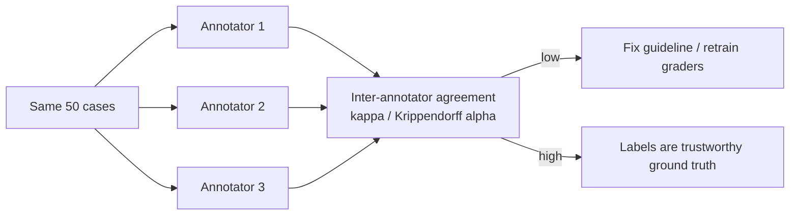

# Human evaluation

> **In one line:** Humans are the ground truth that every automated metric is ultimately trying to approximate — use them deliberately, because they're slow and expensive, but never pretend you can skip them entirely.

:::tip[In plain English]
Automated metrics and LLM-judges are *stand-ins* for human judgment — we use them because asking people to read every output doesn't scale. But the whole reason those stand-ins are trustworthy is that we checked them against real humans. So humans never fully leave the picture. The skill here is using human evaluation where it counts: writing instructions clear enough that two different people grade the same answer the same way, measuring whether they actually agree, and knowing the handful of situations where a human grade is non-negotiable. Think of humans as the master ruler in the vault that every other ruler is calibrated against.
:::

## Why humans are still the gold standard

Every automated metric is an approximation of "would a knowledgeable human consider this good?" Exact match approximates it crudely; an LLM-judge approximates it well — *but only as well as you proved it does against humans*. That proof requires humans. So human evaluation plays two roles:

1. **Ground truth for calibration.** The human grades are what you measure your LLM-judge and metrics against ([calibration](./06-llm-as-judge.md)). Without them, you can't know if your cheap automated eval is trustworthy.
2. **The grader of last resort.** For the highest-stakes or most-nuanced judgments, the human grade *is* the eval, full stop.

## When humans are required (not optional)

Reach for humans — don't substitute an LLM-judge — when:

- **High stakes / regulated.** Medical, legal, financial, safety-critical outputs. A wrong grade here has real consequences, and you often need an accountable human in the loop for compliance.
- **Calibrating any automated grader.** You can't validate an LLM-judge with another LLM-judge — that's circular. The anchor must be human.
- **Nuance the model shares blind spots on.** Subtle cultural appropriateness, humor, brand voice, "is this subtly condescending?" — qualities where the judge model has the same gaps as the generator.
- **Defining "good" for a brand-new task.** Before you can write a rubric or build a judge, humans have to look at outputs and articulate what good *means*. Human review *creates* the rubric.
- **Adversarial / safety red-teaming.** Deciding whether a borderline output actually crossed a line frequently needs human judgment (more in the [safety chapter](/docs/safety)).

For everything high-volume and well-defined, automate — and use humans to *audit* the automation periodically.

## Annotation guidelines

The single biggest lever on human-eval quality is the **annotation guideline**: the document that tells graders exactly how to score. Without it, three graders give three different answers and your "ground truth" is noise.

A good guideline contains:

- **The exact question** the grader answers ("Is this answer faithful to the source?"), not a vague "is it good?"
- **A concrete scale with anchors** — what *each* score means, with the boundary cases spelled out.
- **Worked examples** for every score level, including the tricky in-between ones.
- **Tie-breaking and edge-case rules** — what to do with empty answers, refusals, partially-correct answers, off-topic-but-polite answers.
- **What to ignore** — e.g., "ignore minor grammar; grade substance."

```markdown
# Annotation Guideline: Answer Faithfulness (v3)

Question: Does the ANSWER make only claims supported by the SOURCE?

Scale:
  5 — Every claim traceable to the source. (Example: ...)
  3 — Mostly grounded, exactly one unsupported claim. (Example: ...)
  1 — Contains fabricated facts or contradicts the source. (Example: ...)

Edge cases:
  - Answer says "I don't know" and source lacks the info → score 5 (correct refusal).
  - Answer is correct but cites the wrong source ID → score 2 (faithfulness failure).
  - Grammar errors → IGNORE; grade only factual grounding.
```

> **The test of a guideline:** hand it to a new grader with zero context. If they grade a batch the same way your experienced graders did, it's good. If not, the guideline — not the grader — is the problem.

## Inter-annotator agreement (IAA)

If you can't measure whether your graders agree, you can't trust their grades. **Inter-annotator agreement** is the metric for "do humans grade this consistently?" Have multiple humans grade the *same* cases and measure how often they match.



The standard measures:

- **Cohen's kappa** — agreement between *two* annotators, corrected for chance agreement. (You can't just use raw % match: if 90% of cases are "good," two graders agree 90% of the time by guessing.)
- **Fleiss' kappa / Krippendorff's alpha** — generalize to *more than two* annotators and to ordinal scales.

Rough reading of kappa: < 0.2 poor, 0.2–0.4 fair, 0.4–0.6 moderate, 0.6–0.8 substantial, > 0.8 near-perfect. **If kappa is low, fix the guideline before doing anything else** — low agreement means your task definition is ambiguous, and *no* grader (human or LLM) can score an ambiguous task consistently.

```python
def cohens_kappa(a: list, b: list) -> float:
    n = len(a)
    po = sum(x == y for x, y in zip(a, b)) / n          # observed agreement
    labels = set(a) | set(b)
    pe = sum((a.count(l)/n) * (b.count(l)/n) for l in labels)  # chance agreement
    return (po - pe) / (1 - pe)
```

A subtle but important point: **IAA caps your achievable automated-eval quality.** If two humans only agree at kappa 0.5, you literally cannot build an LLM-judge that agrees with "the humans" better than the humans agree with each other — there's no consistent target to hit. Low human agreement is a signal to clarify the task, not to push harder on the grader.

## Cost

Human evaluation is the expensive option, and the numbers are why we automate everything we can.

| | LLM-judge | Human grader |
|---|---|---|
| Time per case | ~1–5 seconds | ~1–10 minutes |
| Cost per case | fractions of a cent | $0.50 – $5+ (more for experts) |
| Consistency | high (same input → same score) | varies (needs IAA to verify) |
| Scales to | millions | dozens–hundreds per day per person |
| Domain expertise | limited to training | a real lawyer/doctor/native speaker |

The economic reality drives the standard pattern: **automate the bulk, sample for humans.** You don't human-grade 10,000 outputs — you human-grade a random sample of, say, 50, use them to confirm your automated grader is still calibrated, and trust the automation for the other 9,950. When the automated and human samples diverge, that's your signal to re-calibrate or refresh the rubric.

```python
# The standard hybrid: automate everything, human-audit a sample
def hybrid_eval(outputs, llm_judge, sample_size=50):
    auto_scores = [llm_judge(o) for o in outputs]          # cheap, all of them
    sample = random.sample(list(enumerate(outputs)), sample_size)
    human_scores = {i: human_grade(o) for i, o in sample}  # expensive, a few
    # Compare on the overlap to confirm the judge is still trustworthy
    agreement = cohens_kappa(
        [auto_scores[i] for i in human_scores],
        list(human_scores.values()),
    )
    return auto_scores, agreement   # alert if agreement drops
```

## Common pitfalls

:::caution[Where people trip up]
- **No written guideline.** "Just grade if it's good" gives you three opinions and no ground truth. Write the guideline first.
- **Never measuring IAA.** If you don't know whether your humans agree, your "gold" labels may be coin-flips. Always have overlapping cases and compute kappa.
- **One annotator = ground truth.** A single grader's biases become your "truth." Use multiple on at least a sample.
- **Using % agreement instead of kappa.** Raw agreement looks great on imbalanced label sets even when graders are guessing. Correct for chance.
- **Human-grading everything.** It doesn't scale and burns money and goodwill. Automate the bulk, human-audit a sample.
- **Treating low IAA as a grader problem.** It's almost always an ambiguous *task* problem — fix the guideline, not the people.
- **Letting calibration go stale.** Models drift, products change. Re-sample for human grading periodically, not once.
:::

<Quiz id="eval-human-quick-check" variant="micro" title="Quick check">

<Question
  prompt="Your two annotators only agree at kappa 0.45 on a faithfulness task. The manager wants to fire one annotator and hire a 'better' one. What does this page say is almost always the real problem?"
  options={[
    { text: "The annotators are underqualified and need domain training" },
    { text: "Kappa is the wrong statistic for two annotators" },
    { text: "The sample of overlapping cases is too small to compute kappa" },
    { text: "The task definition is ambiguous — fix the annotation guideline, not the people" }
  ]}
  correct={3}
  explanation="Low inter-annotator agreement is almost always a guideline problem: an ambiguous task can't be scored consistently by anyone, human or LLM. Blaming the grader is the intuitive move, but the page's test is to hand the guideline to a fresh grader — if they diverge, the guideline is what's broken."
/>

<Question
  prompt="Two human graders agree with each other at only kappa 0.5. What does this imply for the LLM-judge you're trying to calibrate against them?"
  options={[
    { text: "You cannot build a judge that agrees with 'the humans' better than they agree with each other — there's no consistent target to hit" },
    { text: "The judge just needs a stronger model to exceed human agreement" },
    { text: "You should average the two humans' scores and calibrate to that, which removes the ambiguity" },
    { text: "Kappa 0.5 is near-perfect agreement, so calibration can proceed normally" }
  ]}
  correct={0}
  explanation="IAA caps achievable automated-eval quality: if humans disagree, the 'ground truth' itself is inconsistent, so no grader can match it reliably. The stronger-model answer is tempting because more capability usually helps — but the bottleneck here is the ambiguous task, and the fix is clarifying the guideline first."
/>

<Question
  prompt="You have 10,000 production outputs to evaluate weekly. What is the standard pattern this page recommends?"
  options={[
    { text: "Human-grade all 10,000 — humans are the gold standard, so anything less is untrustworthy" },
    { text: "LLM-judge everything, human-grade a random sample (~50), and use their agreement to confirm the judge is still calibrated" },
    { text: "Skip humans entirely once the LLM-judge has been calibrated a single time" },
    { text: "Use raw percent agreement instead of kappa to keep the comparison simple" }
  ]}
  correct={1}
  explanation="The economics (minutes and dollars per human-graded case vs seconds and fractions of a cent for a judge) drive the hybrid: automate the bulk, human-audit a sample, and re-calibrate when they diverge. 'Calibrate once and forget' is the tempting trap — models and products drift, so the human sample must recur."
/>

</Quiz>

---

→ Next: [Evals in CI/CD](./08-evals-in-cicd.md)
