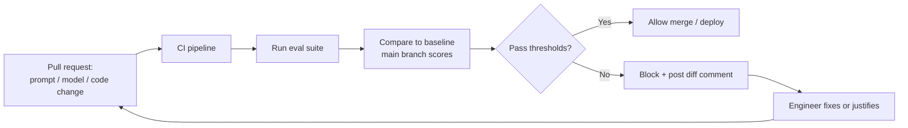
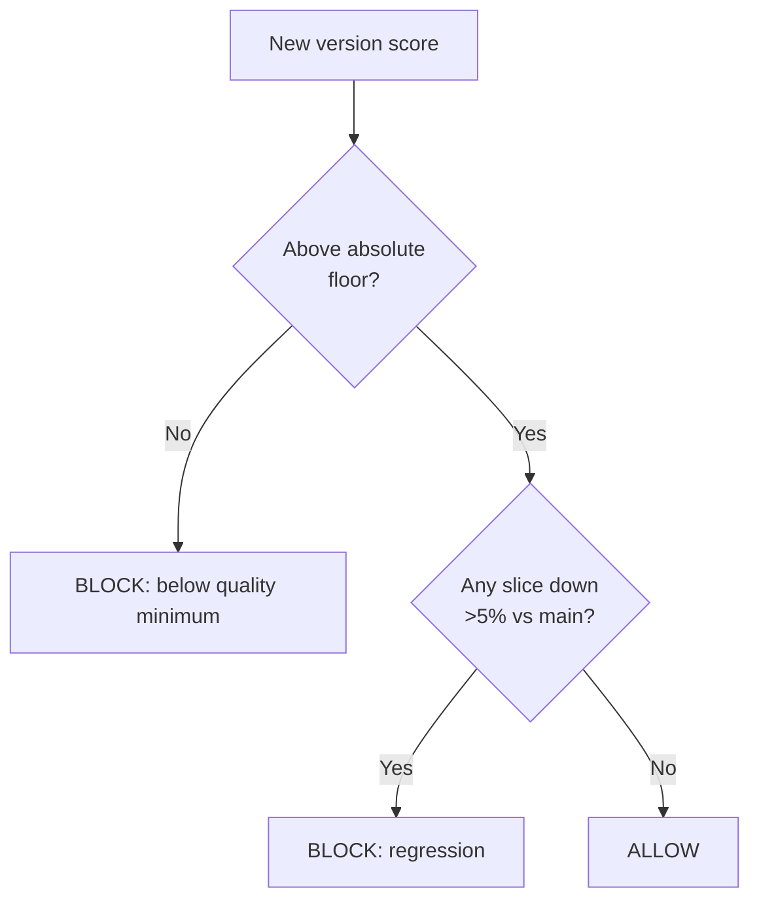

# Evals in CI/CD

> **In one line:** An eval you run by hand catches regressions only when you remember to look; an eval wired into CI catches them on every change, automatically, before they ship.

:::tip[In plain English]
You've built an eval suite. Now make it impossible to ignore. Just like normal software automatically runs its tests every time someone proposes a change — and blocks the change if a test fails — your AI system should automatically run its evals on every prompt edit, every model swap, every code change, and refuse to deploy if quality dropped. This turns "we should test this" (which everyone forgets under deadline pressure) into "the robot won't let us ship a regression." This page wires the eval into the pipeline and sets the rules for when a change is allowed through.
:::

## Why automate the gate

The value of an eval is in running it on *every* change, not occasionally. Humans under deadline pressure skip the manual step exactly when it matters most — the rushed Friday prompt tweak is the one that ships the regression. CI removes the human:



This is the same discipline as unit tests gating a normal codebase — adapted for graded, non-deterministic outputs. The mechanics differ (scores not pass/fail, comparison to a baseline not an absolute) but the principle is identical: **the pipeline refuses to merge a regression.**

## Regression gating

A **regression** is any change that makes the system worse. Gating means the pipeline blocks the change unless it clears your bar versus the current baseline (usually `main`).

The non-negotiable rule, which you met in [datasets](./04-datasets.md): gate on **overall AND per-slice**, never overall alone, because an aggregate gain can hide a slice disaster.

```python
# gate.py — the heart of CI gating
def check_gate(new: dict, baseline: dict, slice_tolerance=0.05) -> tuple[bool, list]:
    """new/baseline are {'overall': float, 'by_slice': {name: float}} reports."""
    failures = []

    # 1) Overall must not drop below an absolute floor.
    if new["overall"] < 0.80:
        failures.append(f"Overall {new['overall']:.3f} below floor 0.80")

    # 2) No individual slice may regress more than the tolerance vs baseline.
    for slice_name, base_score in baseline["by_slice"].items():
        new_score = new["by_slice"].get(slice_name, 0.0)
        if new_score < base_score - slice_tolerance:
            failures.append(
                f"Slice '{slice_name}' regressed: "
                f"{base_score:.3f} -> {new_score:.3f}"
            )

    passed = len(failures) == 0
    return passed, failures
```

```yaml
# .github/workflows/evals.yml — block the merge on regression
name: evals
on: [pull_request]
jobs:
  eval:
    runs-on: ubuntu-latest
    steps:
      - uses: actions/checkout@v4
      - run: pip install -r requirements.txt
      - name: Run eval suite and gate
        env:
          OPENAI_API_KEY: ${{ secrets.OPENAI_API_KEY }}
        run: python -m evals.run --gate --baseline main
        # exit code 1 (gate fail) fails the job and blocks the merge
```

## Thresholds: absolute vs relative

Two kinds of bar, and you usually want both:

- **Absolute floor.** "Overall faithfulness must stay ≥ 0.80." A hard quality minimum that no version may dip below, regardless of history.
- **Relative (no-regression) bar.** "No slice may drop more than 5% versus `main`." Catches gradual erosion even while you're above the absolute floor.



**Setting the numbers:** start by running the suite on your current `main` to get today's scores; set the absolute floor a little below today's overall (so normal noise doesn't false-alarm) and the relative tolerance just above your set's noise level. Remember from [datasets](./04-datasets.md): on a 100-case set a single flip is ~1%, so a 5% slice tolerance is sensible — set it *below* your noise floor and CI cries wolf on every PR, set it *too high* and real regressions slip through.

> **The noise problem is real.** LLM outputs vary run-to-run. To keep the gate from flapping, run at low/zero temperature where possible, use a large-enough set per slice, and consider averaging a couple of runs for the borderline-stochastic evals. A gate that fails randomly gets ignored — and an ignored gate is no gate.

## Blocking deploys vs the full rollout

CI gating is the *first* line. The complete deployment discipline is layered:

1. **PR gate (offline eval).** Block the merge if the suite regresses. Fast, runs on every PR. ← this page.
2. **Pre-deploy gate.** Re-run the full (not sampled) suite on the release candidate before it goes out.
3. **Canary / shadow rollout.** Send a small slice of real traffic (or mirror traffic) to the new version and watch *online* signals before full rollout.
4. **Auto-rollback.** If production quality signals drop, roll back automatically.

This page owns steps 1–2 (offline gates). Steps 3–4 are the safe-rollout discipline covered in [model swaps & canary deploys](/docs/patterns/pattern-rag-prod) and picked up in [production evals](./09-production-evals.md). The point: an offline gate proves a change is *safe to try*; the canary proves it's *actually good in the wild*.

## Tracking prompt & model versions

A score is meaningless unless you know *what produced it*. Every eval run must record the full configuration, so any score is reproducible and you can answer "what changed between the good run and the bad one?"

Capture, on every run:

- **Eval set version** (`eval_set_v7`) — which cases.
- **Prompt version** — a hash or version tag of every prompt template used.
- **Model + version** — `gpt-5.1-2026-03`, `claude-opus-4.x`, including the exact dated snapshot, not just "gpt-5".
- **Retriever config** — embedding model, top-k, reranker — if RAG.
- **Decoding params** — temperature, max tokens, seed.
- **Commit SHA** of the code.

```python
# Every eval run emits a fully-pinned record
run_record = {
    "timestamp": "2026-06-03T10:14:00Z",
    "git_sha": "a1b2c3d",
    "eval_set_version": "v7",
    "model": "gpt-5.1-2026-03-15",      # dated snapshot, never a floating alias
    "prompt_versions": {"system": "sys-v12", "judge": "judge-v4"},
    "retriever": {"embed": "text-embed-4", "k": 5, "reranker": "rerank-3"},
    "temperature": 0,
    "scores": {"overall": 0.86, "by_slice": {"billing": 0.91, "hard": 0.74}},
}
```

> **Floating model aliases are a silent-regression trap.** If you pin to `gpt-5` (an alias that points to the latest snapshot), a provider's behind-the-scenes update can change your behavior and scores with *zero* change on your side — and you'll have no record of it. Always pin the **dated snapshot**, and treat a model-version bump as a change that must pass the gate like any other.

This versioning is what lets you build a **score-over-time dashboard**: plot overall and per-slice scores across commits, annotate each point with model/prompt version, and a regression becomes a visible cliff you can trace to the exact change. Platforms like **Braintrust**, **Langfuse**, and **LangSmith** store these run records and render the trend lines for you (see [eval tools](/docs/stack/eval-tools)); a CSV and a chart works fine to start.

## A realistic CI setup for 2026

- Evals run on every PR that touches prompts, retriever config, model selection, or relevant code.
- A **fast sampled subset** (say 100 cases, deterministic graders where possible) runs on the PR for quick feedback; the **full suite** runs pre-deploy and nightly.
- The pipeline **posts a diff comment** on the PR: overall delta, per-slice deltas, and a list of newly-failing cases — so the reviewer sees the quality impact inline.
- The gate **blocks the merge** on regression; an engineer must fix it or explicitly justify and update the baseline in a reviewed commit.
- Every run is pinned and logged for the trend dashboard.

## Common pitfalls

:::caution[Where people trip up]
- **Gating on overall only.** Hides slice regressions. Gate on per-slice deltas too.
- **Thresholds set without measuring noise.** Too tight → flaky gate everyone ignores; too loose → regressions slip through. Calibrate to your set's run-to-run variance.
- **Floating model aliases.** A provider update silently changes your scores with no commit. Pin dated snapshots.
- **Not recording what produced a score.** An unpinned score can't be reproduced or compared. Log set/prompt/model/params/SHA every run.
- **No PR-level feedback.** If the eval result lives in a buried log, reviewers won't see the regression. Post the diff as a PR comment.
- **Treating the offline gate as sufficient.** Passing offline means "safe to try," not "good in production." Still canary and watch online signals.
- **A flaky gate.** If CI fails randomly, the team learns to click "merge anyway." Make the gate trustworthy or it's worse than nothing.
:::

---

→ Next: [Production evaluation](./09-production-evals.md)
