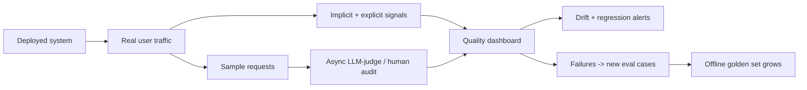
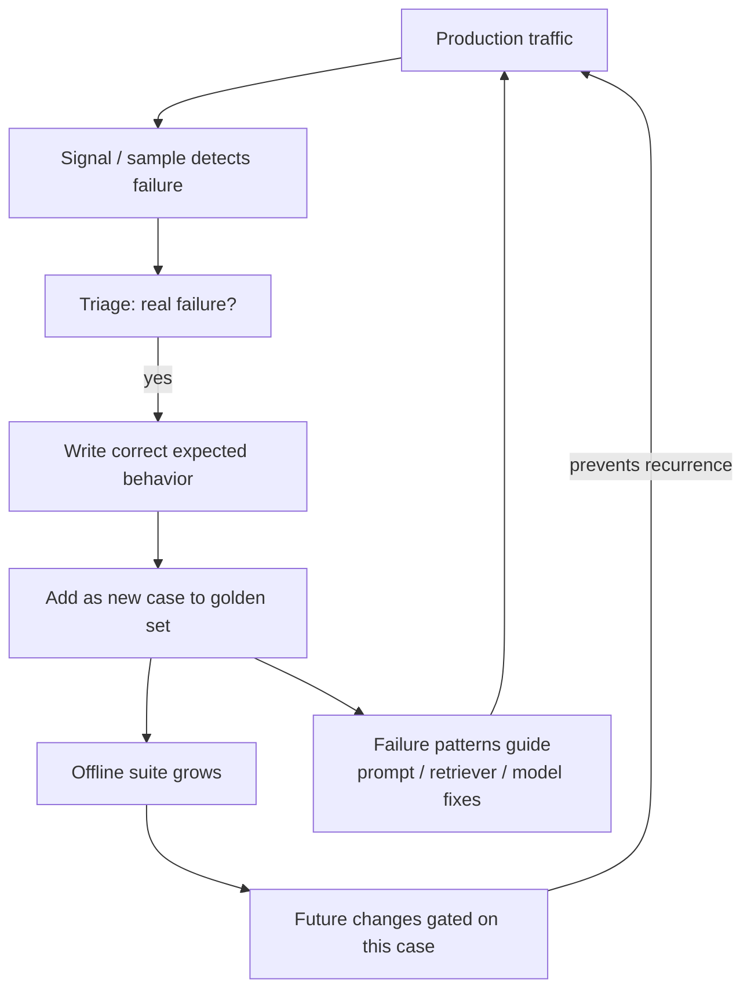
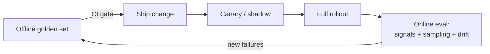

# Production evaluation

> **In one line:** Offline evals tell you a change is safe to ship; production evals tell you the truth — and feed the failures back so your offline set never goes stale.

:::tip[In plain English]
Your lab tests can only contain situations you thought of. Real users will always do things you never imagined — type in another language, paste a 50-page contract, ask the question in a way your eval set never covered. Production evaluation is watching the real, live system and measuring its quality on actual traffic. It does two jobs: it catches problems your lab missed, and — crucially — it harvests those real failures and turns them into new lab tests, so your offline eval keeps getting smarter. This is the loop that makes an AI product genuinely improve over time instead of slowly rotting.
:::

## Why offline isn't enough

A frozen eval set is a snapshot of the world as you understood it on the day you built it. The world moves:

- **Users do unimaginable things.** No matter how good your coverage, real traffic contains inputs you never wrote a case for.
- **Inputs drift.** A new product launches, a competitor changes behavior, a news event shifts what people ask. Your set, built last quarter, no longer matches today's traffic.
- **Models drift.** A provider updates the model behind an alias; behavior shifts under you.
- **The eval set can be gamed.** If you tune hard against a fixed set, you can climb the offline score while real users get *no* better — classic overfitting.

Production evaluation closes the gap between "scored well in the lab" and "actually works for users."



## Real-time quality signals

In production you usually *can't* compute reference-based metrics (there's no gold answer for a live query), so you lean on **signals** — proxies for quality you can collect from real usage. Two kinds:

**Implicit signals** (free, automatic, from behavior):

- **Retries / regenerations** — user asked again or hit "regenerate" → likely a bad first answer.
- **Edits** — user heavily edited the AI's draft before sending → the draft missed.
- **Abandonment** — user closed the chat or rephrased → frustration.
- **Tool-call / parse failures** — the output didn't validate against your schema.
- **Fallback / escalation rate** — how often the system bailed to a human or a backup path.
- **Latency / cost per request** — quality of *service*, also worth watching.

**Explicit signals** (cheap, sparse, from asking):

- Thumbs up/down, star ratings, "was this helpful?"
- Reported answers, support escalations on a specific response.

```python
# Log structured signals on every production response
def log_interaction(request_id, response, schema_valid: bool):
    record = {
        "request_id": request_id,
        "schema_valid": schema_valid,         # implicit: did it parse?
        "regenerated": False,                 # updated if user hits regenerate
        "user_edited_chars": 0,               # updated if user edits the draft
        "thumbs": None,                       # explicit: filled if user rates
        "escalated_to_human": False,
        "latency_ms": response.latency_ms,
        "cost_usd": response.cost_usd,
    }
    metrics.emit(record)
```

> **Implicit beats explicit on volume.** Only a tiny fraction of users ever click thumbs-down, and the ones who do are a biased sample (angriest users). Implicit signals like regeneration and edit-distance cover *every* interaction and are usually your most reliable production quality proxy. Use explicit ratings as a sanity-check, not the primary metric.

## Production sampling

You can't human-grade or even LLM-judge *every* production request — too expensive at scale. So you **sample**: take a subset of live traffic and grade it (async LLM-judge for volume, human audit for a smaller slice).

Smart sampling beats uniform random:

- **Random baseline sample** — a uniform slice for an unbiased quality estimate.
- **Stratified by slice** — sample across categories so a low-volume-but-high-value slice (enterprise tier, a critical intent) isn't drowned out.
- **Signal-triggered sampling** — *always* grade requests that threw a quality signal (a regeneration, a thumbs-down, a schema failure). These are your richest failure source.
- **Uncertainty sampling** — if you have a confidence score, oversample the low-confidence cases where the model was unsure.

```python
def should_sample(record, base_rate=0.02) -> bool:
    # Always grade anything that looks like a failure...
    if record["regenerated"] or record["thumbs"] == "down" \
       or not record["schema_valid"] or record["escalated_to_human"]:
        return True
    # ...plus a small uniform sample of everything else for an unbiased read.
    return random.random() < base_rate
```

Sampled requests go to an **async judge** (off the user's critical path — never block the response on grading) and a subset to **human audit** (per [human eval](./07-human-eval.md)), giving you a continuous production quality number you can put on a dashboard and alert on.

## Drift detection

**Drift** is when something changes over time such that yesterday's quality no longer holds. Two flavors:

- **Input drift** — the *distribution of requests* shifts (new topics, new languages, longer inputs). Detectable even without quality grades: track input length, language mix, embedding-cluster distribution, intent mix, and alert when they move.
- **Quality drift** — the *scores* decline over time (model update, retrieval corpus going stale, prompt no longer fitting new inputs). Detectable from your sampled-judge scores and signal rates.

```python
# Simple drift alert: compare this window's quality to a baseline window
def drift_alert(recent_scores: list, baseline_scores: list, threshold=0.05):
    recent = sum(recent_scores) / len(recent_scores)
    base = sum(baseline_scores) / len(baseline_scores)
    if base - recent > threshold:
        alert(f"Quality drift: {base:.3f} -> {recent:.3f} (last 7 days)")
    # Also watch leading indicators that move BEFORE scores do:
    #   regeneration rate, escalation rate, schema-failure rate, p95 latency
```

> **Watch leading indicators, not just scores.** A spike in regeneration rate or schema-failure rate often shows up *before* your sampled quality scores move, because it covers all traffic in real time. Treat a rising failure-signal rate as an early warning to investigate.

## The data flywheel

This is the most important idea on the page and the reason production eval pays for itself. Every real failure you find becomes a new offline test case, so your golden set continuously absorbs reality:



The loop:

1. A production signal or sample surfaces a bad output.
2. You triage — is it a genuine failure (vs. a rude-but-correct user)?
3. A human writes the *correct* expected behavior for that input.
4. It enters the golden set as a **regression case** — frozen forever (the `regressions.jsonl` from [datasets](./04-datasets.md)).
5. Every future change is now gated on that case in CI, so the failure can never silently return.

This is what makes the difference between a product that *compounds* and one that *rots*. Each shipped failure makes the eval suite permanently smarter; the same class of bug can't recur because the gate now catches it. A team running this flywheel watches both their production quality *and* their offline coverage climb month over month.

## How it fits the whole eval system



Offline evals ([CI/CD](./08-evals-in-cicd.md)) prove a change is safe to try; canary proves it's good on a little real traffic; online evals measure the truth at full scale and harvest failures back into the offline set. The arrow from online back to offline is the flywheel — and it's what closes the loop the whole chapter has been building toward. (This connects directly to production [monitoring](/docs/lifecycle/lifecycle-monitor) and [observability tooling](/docs/stack/observability-tools).)

## Common pitfalls

:::caution[Where people trip up]
- **Relying only on thumbs up/down.** Tiny, biased response rate. Lean on implicit signals (regeneration, edits, escalation) that cover all traffic.
- **Blocking responses on grading.** Never put the judge on the user's critical path. Sample and grade *asynchronously*.
- **Uniform sampling only.** You'll under-sample rare-but-critical slices and waste budget on easy traffic. Stratify and signal-trigger.
- **No drift detection.** Quality erodes silently as inputs and models shift. Track input distribution and leading-indicator rates, not just scores.
- **Finding failures but not feeding them back.** If production failures don't become offline cases, you fix the same bug repeatedly. Wire the flywheel.
- **Overfitting the offline set.** If offline scores rise but production signals don't improve, your set has drifted from reality — refresh it from sampled traffic.
- **No privacy guardrails on sampled data.** Production samples contain real user data; scrub PII and respect retention rules before they enter your eval store (see [safety](/docs/safety)).
:::

---

→ Next: [Chapter checkpoint](./99-checkpoint.md)
