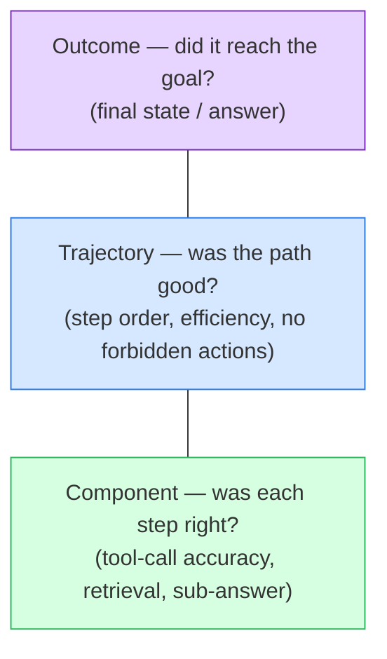

# Evaluating agents

> **In one line:** An agent doesn't just produce one answer — it takes a *sequence of steps* (think, call a tool, read the result, decide again), so evaluating one needs three layers: did it reach the goal (**outcome**), did it take a sensible path to get there (**trajectory**), and did each individual tool call go right (**component**) — because an agent can land on the right answer through a broken, expensive, or unsafe route.

:::tip[In plain English]
Grading a single LLM call is like grading a multiple-choice answer: right or wrong. Grading an *agent* is like grading a math student's full worked solution. Two students can both write "42" at the bottom — but one showed clean steps and the other guessed, copied, and got lucky. If you only check the final number, you can't tell them apart, and the lucky one will fail the next problem. Agents are the same: you have to look at *how* they got there, not just *where* they ended up.
:::

This page assumes you've met [the agent loop](/docs/foundations/agent-loop) (the think → act → observe cycle) and the general [eval vocabulary](./03-eval-types.md) (offline/online, the scope pyramid, reference-based vs reference-free). Here we apply that vocabulary to agents specifically.

## Why single-shot eval isn't enough

A normal LLM eval scores **input → output**. An agent's run is a whole *trajectory*: a list of `(thought, tool_call, tool_result)` steps ending in a final answer. New failure modes live *between* the start and the end:

- It reached the goal but **called the wrong tool five times first** (slow, expensive).
- It reached the goal but **took a forbidden action** on the way (deleted a record, emailed a customer) — a policy violation an outcome check never sees.
- It produced a **plausible final answer that the trajectory doesn't support** (it never actually called the lookup tool — it guessed).
- It **looped** until it hit the step cap and gave up.

Outcome-only scoring is blind to all four. That's why agent eval is layered.

## The three layers of agent eval

Terms, defined once:

- **Outcome eval** — did the agent achieve the goal? A reference-based or judge check on the *final state* ("was the refund actually issued?", "does the PR pass tests?").
- **Trajectory eval** — was the *sequence of steps* good? Compared against a **golden path** (a human-approved reference trajectory) or scored for properties like efficiency, order, and not taking forbidden actions.
- **Component eval** — was each *individual step* correct in isolation? The headline metric here is **tool-call accuracy**: given this state, did the agent pick the right tool with the right arguments?



You need all three. **Outcome** tells you *if* it works; **trajectory** tells you whether it works *for the right reasons and safely*; **component** localizes *which step* broke when it doesn't — exactly the same logic as the [eval pyramid](./03-eval-types.md), one level up.

### Tool-call accuracy (the component workhorse)

The single most useful agent component metric. For a given step, you have a *gold* tool call (which tool, which arguments) and the *actual* one. You score:

- **Tool selection** — did it pick the right tool name?
- **Argument correctness** — are the arguments right (exact match for IDs, semantic match for free text)?
- **Did-not-call** — did it *avoid* calling a tool when none was needed? (Spurious tool calls are a real failure.)

```python
# Component eval: tool-call accuracy on a labeled step.
# `gold` and `actual` are each like: {"name": "search_orders", "args": {"id": "A-91"}}
def score_tool_call(gold, actual) -> dict:
    name_ok = gold["name"] == actual["name"]
    # exact-match args here; for free-text args, swap in an embedding or judge check
    args_ok = name_ok and gold["args"] == actual["args"]
    return {"tool_selected": name_ok, "args_correct": args_ok}

cases = [
    {"gold": {"name": "search_orders", "args": {"id": "A-91"}},
     "actual": {"name": "search_orders", "args": {"id": "A-91"}}},
    {"gold": {"name": "issue_refund",  "args": {"id": "A-91"}},
     "actual": {"name": "search_orders", "args": {"id": "A-91"}}},  # wrong tool
]
scored = [score_tool_call(c["gold"], c["actual"]) for c in cases]
selection_acc = sum(s["tool_selected"] for s in scored) / len(scored)  # 0.5 here
```

This needs **labeled traces** — someone has to write down the right tool call for each state. That labeling cost is the price of trajectory-level confidence.

### Trajectory eval (the path)

Two common approaches, often combined:

1. **Match against a golden path.** Record an ideal trajectory once; score a run by how closely its step sequence matches (exact order, or a looser "did it hit these key steps in a valid order"). Good for well-defined tasks; brittle for tasks with many valid paths.
2. **Reference-free trajectory judging.** An [LLM-as-judge](./06-llm-as-judge.md) reads the whole trace against a rubric: *was the path efficient? did it avoid forbidden actions? did it recover from errors?* Good for open-ended tasks — but the judge must be **calibrated against human labels** (aim for ~85–90% agreement) before you trust it in CI, or you're gating on a grader you haven't validated.

A cheap, high-signal property to compute directly: **efficiency** — steps taken vs. steps in the golden path. An agent that needs 14 tool calls where 4 suffice is a cost and latency problem even when the outcome is correct.

```python
# Trajectory property: step efficiency vs the golden path.
def efficiency(actual_steps: int, golden_steps: int) -> float:
    return golden_steps / max(actual_steps, golden_steps)  # 1.0 = ideal, lower = wandered
```

### Policy adherence

For agents that take real actions (refunds, emails, writes), the most important trajectory check is often **"did it stay inside the rules?"** — never refund above the cap without approval, never act on another customer's account. This is a *constraint on the path*, invisible to outcome scoring. The 2026 **τ²-bench** (tau-squared-bench, from Sierra) popularized scoring exactly this: a tool-using agent talking to a simulated user, graded on whether it followed the business policy, not just whether it closed the ticket.

## The 2026 agent benchmark landscape

Public benchmarks are a sanity check, not a substitute for evals on *your* task (see the warning below). The ones worth knowing as of mid-2026:

| Benchmark | What it measures |
|---|---|
| **τ²-bench** (Sierra) | Tool + user interaction with **policy adherence** scoring |
| **GAIA** | General assistant tasks needing multi-step tool use |
| **SWE-bench Verified** | Resolving real GitHub issues (coding agents) |
| **OSWorld** | Computer-use agents operating a real desktop |
| **WebArena / BrowseComp** | Web-navigation agents on realistic sites |

:::caution[Simulated users are not real users]
A 2026 line of research ("Lost in Simulation") showed that **LLM-simulated users are unreliable proxies** — an agent can ace a benchmark with a scripted simulated user and still fail real ones. Treat benchmark scores as directional. Your gate is an eval suite built from *your* traffic.
:::

## Wiring it into the dev loop

Agent eval is offline-first, exactly like the rest of the chapter: capture real traces, label a curated set, and run the three layers on every change so a refactor can't silently regress tool selection or start taking a forbidden action. Trace-capture and trajectory scoring are first-class features in 2026 platforms — **LangSmith**, **Langfuse**, **Braintrust**, and **Arize Phoenix** all record agent traces and let you attach outcome/trajectory/tool-call scores (see [eval tools](/docs/stack/eval-tools) and [observability](/docs/stack/observability-tools)). This is **eval-driven development** ([evals in CI](./08-evals-in-cicd.md)) applied to agents: a regression below baseline blocks the merge.

## Why it matters

Agents are the highest-stakes thing you can ship with an LLM — they *act*, not just answer. The gap between "demo that worked once" and "agent you trust in production" is almost entirely an eval gap: without trajectory and policy scoring you cannot tell a robust agent from one that's been getting lucky, and the failure shows up as a refund issued to the wrong account rather than a slightly-off sentence. For deeper agent design, pair this with [the agent loop](/docs/foundations/agent-loop) and [multi-agent systems](/docs/foundations/multi-agent); for the production guardrails that these evals verify, see [the agent loop with guardrails](../10-patterns/agent-loop.md).

## Common pitfalls

:::caution[Where people trip up]
- **Scoring only the final answer.** The classic agent eval mistake. You miss wrong-tool detours, forbidden actions, and lucky guesses. Score the trajectory too.
- **No labeled traces.** Tool-call accuracy and golden-path matching need someone to write down the right steps. Skipping the labeling means you only ever get outcome scores.
- **An uncalibrated trajectory judge.** An LLM-judge grading paths is itself unvalidated until you check it against human labels. Calibrate before you gate CI on it.
- **Trusting a public benchmark as your eval.** A high GAIA or τ²-bench score doesn't mean the agent works on *your* tools, *your* policies, *your* users. Build a suite from your traffic.
- **Ignoring efficiency.** "It got the right answer in 20 steps" is a cost, latency, and reliability problem. Track steps-vs-golden, not just success.
- **No policy/constraint check on action-taking agents.** Outcome scoring never sees "it refunded $5,000 without approval." Make forbidden actions an explicit fail.
:::

<Quiz id="agent-evaluation-quiz" title="Check yourself: evaluating agents" sampleSize={3}>
  <Question
    prompt="An agent answers a customer's refund question correctly, but the trace shows it queried three unrelated orders and made a write call it shouldn't have before landing on the answer. An outcome-only eval marks this run as a PASS. What is the eval missing, and which layer would catch it?"
    options={[
      { text: "Nothing — the outcome was correct, so the run is genuinely fine" },
      { text: "Trajectory eval — outcome scoring is blind to inefficient paths and forbidden actions taken on the way to a correct answer" },
      { text: "A bigger model would fix it; eval layering is irrelevant" },
      { text: "Only an online eval could ever catch this" }
    ]}
    correct={1}
    explanation="The final answer was right, so outcome eval passes — but the path was wasteful and took a forbidden write action. Trajectory eval (golden-path / policy adherence) is the layer that scores the sequence of steps, not just the endpoint."
  />
  <Question
    prompt="You want to measure 'tool-call accuracy' for an agent. What do you fundamentally need that an outcome-only eval doesn't?"
    options={[
      { text: "A larger eval set of final answers" },
      { text: "Labeled traces — the gold tool name and arguments for each step — so you can compare the agent's actual call against the right one" },
      { text: "A public benchmark score like GAIA" },
      { text: "Nothing extra; tool-call accuracy is derivable from the final answer" }
    ]}
    correct={1}
    explanation="Tool-call accuracy is a component (per-step) metric. To score whether the agent picked the right tool with the right arguments at each state, you need labeled traces with the gold step — which is the labeling cost trajectory-level eval pays for."
  />
  <Question
    prompt="Your agent scores 85% on τ²-bench. What is the correct way to use that number?"
    options={[
      { text: "Ship with confidence — a high public-benchmark score means it works on your task" },
      { text: "Treat it as directional only; build your gating eval suite from your own traffic, tools, and policies, because simulated-user benchmarks are unreliable proxies for real users" },
      { text: "Replace your internal evals with the benchmark to save time" },
      { text: "Ignore it entirely; benchmarks have no value" }
    ]}
    correct={1}
    explanation="Public benchmarks (and their simulated users) are a sanity check, not a substitute. 2026 research showed simulated users are unreliable proxies, so an 85% benchmark can coexist with real-world failure. Your real gate is an eval suite built from your own traffic."
  />
</Quiz>

---

→ Next: [Chapter checkpoint](./99-checkpoint.md)
