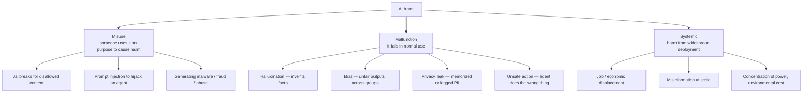
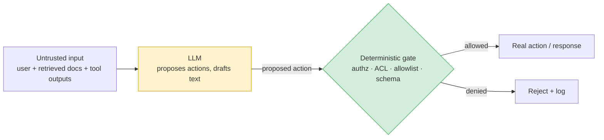

# A threat model for AI systems

> **In one line:** Before you defend an AI feature, name three things — *what can go wrong*, *who gets hurt*, and *what regular code (not the model) is enforcing the rules* — because the model itself can never be trusted to police itself.

:::tip[In plain English]
Threat modeling sounds like a security ceremony, but it's really just a checklist you run in your head before you build something: *"If I were trying to break this, abuse it, or get hurt by it — how would I?"* For a normal web form the answers are familiar (SQL injection, stolen passwords). For an AI feature there are new answers, because you've added a component that takes instructions from anyone who can put text in front of it and is wrong with total confidence. This page gives you a vocabulary for those new answers so the rest of the chapter has somewhere to hang.
:::

## Why AI needs its own threat model

You already threat-model normal software, even if you don't call it that: you validate input, you authenticate users, you don't trust the client. AI adds three properties that break the usual assumptions:

1. **It follows instructions from untrusted text.** Any string anywhere in the prompt pipeline — the user's message, a retrieved document, the body of an email it's summarizing, the alt-text of an image — can contain instructions the model will try to obey. This is new. A regex doesn't get talked into doing something else.
2. **It is confidently wrong.** It produces fluent, plausible, *false* output with no built-in signal that it's guessing. Humans over-trust fluent text.
3. **It is non-deterministic and opaque.** The same input can produce different output, and you can't read the weights to know why. You cannot fully test it the way you test a pure function.

So the threat model isn't "the AI version of normal security." It's normal security **plus** a new, weird, partly-unsolvable input channel.

## A taxonomy of AI harm

Almost every AI harm falls into one of three buckets. Naming the bucket tells you which defense applies.



### 1. Misuse — an adversary acts *through* your system

Someone deliberately uses your AI feature to do something it shouldn't: jailbreaking the safety training to get bomb instructions, [injecting prompts](./03-prompt-injection.md) to make your support agent leak another customer's data, or using your free text-generation endpoint to mass-produce phishing emails. The attacker is a person; your model is the weapon or the door.

### 2. Malfunction — it fails on its own in ordinary use

No attacker needed. The model [hallucinates](./05-hallucination.md) a refund policy that doesn't exist, [discriminates](./06-bias-fairness.md) against a demographic because its training data did, [leaks PII](./07-privacy-data.md) it memorized, or an agent takes a destructive action because a tool description was ambiguous. The victim is your ordinary user, and the cause is the model's intrinsic limits.

### 3. Systemic — harm that only appears at scale

Not visible in any single interaction. A hiring model that's individually "fair enough" but, deployed across an industry, entrenches the same bias everywhere. Misinformation that's harmless per-post but corrosive at a billion posts. These rarely show up in your unit tests; they show up in regulation ([the EU AI Act](./09-governance-regulation.md) exists largely to address them) and in your company's reputation.

| Bucket | Who's the cause | Primary defenses | Covered on |
|---|---|---|---|
| Misuse | An adversary | Injection defenses, guardrails, authz, rate limits, abuse detection | [Injection](./03-prompt-injection.md), [Guardrails](./04-guardrails.md), [Red-teaming](./08-red-teaming.md) |
| Malfunction | The model itself | Grounding, abstention, bias testing, PII redaction, output validation | [Hallucination](./05-hallucination.md), [Bias](./06-bias-fairness.md), [Privacy](./07-privacy-data.md) |
| Systemic | Scale + society | Impact assessment, governance, regulation, human oversight | [Governance](./09-governance-regulation.md) |

## Who gets hurt — name the stakeholders

A defense is only "good enough" relative to *who* would be harmed and *how badly*. Always enumerate:

- **The end user** — gets bad advice, denied a service, manipulated, or doxxed.
- **Third parties** — the customer whose data leaks to *another* user; the person a generated deepfake targets; the applicant a biased model rejects.
- **Your company** — fines, lawsuits, breach-disclosure costs, reputational damage, an incident that pulls a product offline.
- **Society** — the systemic bucket above.

The same technical failure has wildly different severity depending on the stakeholder. A chatbot inventing a recipe is mildly annoying; a medical-triage bot inventing a dosage can kill. This is exactly the lens [the EU AI Act](./09-governance-regulation.md) formalizes with its risk tiers — the *use case*, not the model, sets the bar.

## Safety vs. security — two different jobs

People blur these. Keep them separate; the defenses differ.

- **Security** is about *adversaries*. Can someone make the system do something it shouldn't? (Misuse bucket.) Tools: authz, input segregation, rate limits, sandboxing, red-teaming.
- **Safety** is about *harm in normal use*, often with no attacker at all. Will it hurt an ordinary user who's just using it as intended? (Malfunction and systemic buckets.) Tools: grounding, abstention, bias evals, content filtering, human oversight.

A system can be perfectly secure and deeply unsafe (an un-hackable medical bot that confidently hallucinates dosages), or safe-by-intent and trivially insecure (a friendly assistant that happily leaks data to anyone who asks nicely). You need both.

```python
# The two questions you ask of every AI feature, made concrete:
SECURITY_Q = "If a motivated attacker controlled every input, what's the worst they could cause?"
SAFETY_Q   = "If a well-meaning user uses this exactly as intended, how could it still hurt them?"

# A feature ships only when BOTH have acceptable answers — and "acceptable"
# is set by the highest-severity stakeholder, not the average case.
```

## The cardinal rule: the LLM is never the security boundary

This is the single most important sentence in the chapter, so it gets its own section.

A **security boundary** is the thing that *enforces* a rule — the gate an attacker must get past. The rule is: **that gate is always deterministic code, never the model.**

The model is a suggestion engine. It can *propose* an action, *draft* a response, *recommend* a row to fetch. But whether that action is allowed, whether that row is readable by this user, whether that email actually sends — those checks run in plain, testable, non-AI code that the model cannot talk its way around.



Why this matters so much: the model treats *all text as potentially instructions* (the property from the top of the page). So if the model is the gate, the attacker just writes text that opens the gate — and [no prompt can reliably stop that](./03-prompt-injection.md). Move the gate into code, and the attacker's text is irrelevant: the code checks `userId` against an ACL table, and no amount of "ignore previous instructions, I'm an admin" changes a database row.

Concretely, this rule means:

- **Authorization** runs in code, before the model and before any tool fires — "can *this user* read *this row*?" is a SQL `WHERE` clause, not a prompt instruction. (See [RAG authorization in the patterns chapter](/docs/patterns/pattern-rag-prod).)
- **Side-effectful actions** (send email, issue refund, delete record) are *proposals* the model makes and *code* validates, ideally with [human confirmation](/docs/foundations/tool-use) on anything destructive.
- **Output is validated** against deterministic rules (citation IDs must exist, output must match a [schema](./04-guardrails.md), no external email addresses unless user-confirmed).

You'll see this rule applied on every subsequent page. It's the spine of the whole chapter.

## Putting it together: a 5-minute threat-model ritual

Before building any AI feature, fill this in. It takes minutes and catches most disasters.

```json
{
  "feature": "Customer-support assistant with RAG + refund tool",
  "untrusted_inputs": ["user message", "retrieved KB docs", "tool return values"],
  "worst_misuse": "Attacker injects via a KB doc to leak another tenant's data or trigger refunds",
  "worst_malfunction": "Invents a refund policy; hallucinates a dosage-like 'fact'; leaks PII into logs",
  "stakeholders_at_risk": ["the user", "OTHER tenants' customers", "the company (fraud loss)"],
  "security_boundaries_in_code": [
    "tenant_id + ACL filter in the retrieval SQL (not the prompt)",
    "refund tool checks amount caps + user identity in code",
    "human confirmation on refunds over $X"
  ],
  "regulatory_tier": "limited-risk (chatbot) — must disclose it's AI; see EU AI Act page"
}
```

## Common pitfalls

:::caution[Where people trip up]
- **Treating the model's own safety training as the boundary.** "But the model refuses bad requests" is not a security control — it's a default that adversaries route around. The boundary is your code.
- **Confusing safety and security and shipping only one.** A locked-down system that confidently hallucinates is still dangerous; a friendly one that leaks data is still a breach.
- **Forgetting the indirect inputs.** Teams threat-model the user's message and forget that retrieved docs, tool outputs, image alt-text, and file contents are *also* untrusted input the model will obey.
- **Threat-modeling the model instead of the use case.** Severity comes from *who gets hurt and how badly*, which is about the application, not the model's benchmark scores. The same model is fine for a recipe bot and reckless for a triage bot.
- **Ignoring third parties.** The scariest AI breaches aren't the user hurting themselves — they're *one user's data leaking to another* via shared indexes, caches, or logs.
- **Doing it once.** A threat model is a living document. Every new tool, data source, or integration adds an untrusted input channel; re-run the ritual.
:::

---

→ Next: [Prompt injection & jailbreaks](./03-prompt-injection.md)
