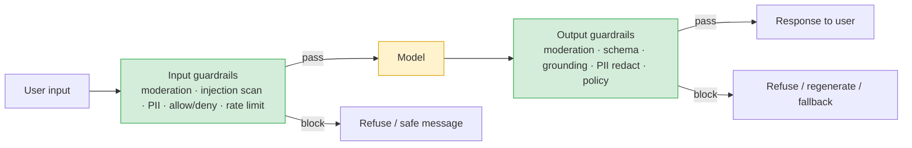

# Guardrails: input & output

> **In one line:** Guardrails are the deterministic checks you wrap around the model — on the way in *and* the way out — and when one of them breaks, it must block the request, not wave it through.

:::tip[In plain English]
A guardrail on a mountain road doesn't make the car a better driver — it just makes sure that when something goes wrong, you don't go off the cliff. Guardrails for AI are the same: small, boring, fast checks that sit *outside* the model and catch the bad stuff the model can't be trusted to catch itself. Some run on the input ("is this user trying something abusive?"), some on the output ("did the model just produce something toxic, off-topic, or malformed?"). The golden rule: if a guardrail can't decide, it should say *no*.
:::

## Where guardrails sit

A guardrail is anything between the user and the model, or between the model and the user, that can **inspect and block or modify**. Picture a pipeline with the model in the middle:



The model is the untrusted middle. Guardrails are the trusted edges. This is the [cardinal rule](./02-threat-model.md) operationalized — the *checks* are code, the model just generates.

## Input guardrails

Run before you spend a token on the main model. They protect against abuse and reduce cost.

### 1. Moderation / content classification

A cheap, fast classifier flags disallowed categories (hate, self-harm, sexual content involving minors, violence, etc.). Use a dedicated moderation endpoint, not your expensive chat model.

```python
from openai import OpenAI
client = OpenAI()

def input_is_allowed(text: str) -> tuple[bool, list[str]]:
    """Returns (allowed, flagged_categories). Uses a cheap moderation model."""
    res = client.moderations.create(model="omni-moderation-latest", input=text)
    result = res.results[0]
    flagged = [cat for cat, hit in result.categories.model_dump().items() if hit]
    return (not result.flagged, flagged)

allowed, cats = input_is_allowed(user_message)
if not allowed:
    log_safety_event("input_blocked", categories=cats)
    return safe_refusal()   # do NOT call the main model
```

Options in 2026: **OpenAI Moderation API** (free, multimodal), **Llama Guard** / **Llama Prompt Guard** (self-hostable, open weights), **Google Perspective API** (toxicity), **AWS Comprehend / Bedrock Guardrails**, **Azure AI Content Safety**, and Anthropic's built-in message safety.

### 2. Prompt-injection / jailbreak scanning

A classifier tuned to detect [injection and jailbreak attempts](./03-prompt-injection.md): Lakera Guard, Prompt Armor, Llama Prompt Guard, or a small LLM-as-classifier. Treat it as a tripwire with false negatives — useful telemetry and a basis for rate-limiting repeat abusers, never the only defense.

### 3. PII detection on input

Catch PII *before* it reaches the provider or your logs. Detect, then redact or reject. Covered in depth on the [privacy page](./07-privacy-data.md); the tools are Microsoft Presidio (OSS), AWS Comprehend PII, Google DLP.

### 4. Allow / deny lists & topic scoping

The simplest, most reliable guardrail: deterministic string/regex/keyword rules and topic classifiers that keep the bot on-mission. A banking assistant should refuse to write poetry — not for safety, but to shrink the attack surface and avoid embarrassing screenshots.

```python
DENY_TOPICS = {"medical_diagnosis", "legal_advice", "competitor_products"}

def topic_allowed(text: str) -> bool:
    topic = classify_topic(text)          # small classifier or LLM router
    return topic not in DENY_TOPICS       # deny-by-category beats whack-a-mole on phrasing
```

Prefer **allow-lists** (only these topics) over **deny-lists** (everything except these) when the domain is narrow — allow-lists fail safe; deny-lists leak through the cases you forgot.

### 5. Rate limiting & abuse throttling

Anchor on the **authenticated `user_id` / `tenant_id`**, never a client-supplied header (a malicious client rotates those). Limits cost-abuse and slows down anyone iterating jailbreaks. (More in [cost control](/docs/patterns/pattern-cost-control).)

## Output guardrails

The model produced something. Now check it before the user sees it — this is where most *safety* (vs. security) wins happen.

### 1. Schema & grammar constraints (the cheapest, strongest guardrail)

If the output *must* be a typed object, don't ask politely and parse hopefully — **constrain generation** so invalid output is impossible. This is "structured output" / "constrained decoding" / "grammar-constrained sampling," and it's the single highest-leverage output guardrail.

```python
from pydantic import BaseModel
from typing import Literal

class SupportReply(BaseModel):
    answer: str
    # An enum the model literally cannot violate — the cheapest hallucination guard there is.
    action: Literal["answer", "escalate", "refuse"]
    confidence: float
    cited_doc_ids: list[str]

# Most providers support a "response_format"/JSON-schema mode that constrains
# decoding to valid instances. Open models can use grammar-constrained sampling
# (llama.cpp GBNF, Outlines, XGrammar, vLLM guided decoding).
reply = client.chat.completions.parse(
    model="gpt-...", messages=msgs, response_format=SupportReply
).choices[0].message.parsed
```

A `Literal`/enum field is impossible to "almost" satisfy — the model can't return `"answre"` or invent a new action. Constrained decoding turns a class of failures into a structural impossibility. (See [structured output](/docs/patterns/pattern-structured-output).)

### 2. Output moderation

Run the same moderation classifier on the *output*. The model can be talked into producing toxic content even when the input looked clean (especially under jailbreak). Block or regenerate.

### 3. Grounding / faithfulness checks

For RAG and factual tasks, verify the answer is supported by the retrieved context and that citations are real — covered fully on the [hallucination page](./05-hallucination.md). The minimal version: every `cited_doc_id` must be in the actually-retrieved set, or you drop it.

```python
def validate_citations(reply: SupportReply, retrieved_ids: set[str]) -> SupportReply:
    real = [cid for cid in reply.cited_doc_ids if cid in retrieved_ids]
    if len(real) != len(reply.cited_doc_ids):
        log_safety_event("invented_citation", dropped=set(reply.cited_doc_ids) - set(real))
    return reply.model_copy(update={"cited_doc_ids": real})
```

### 4. Output PII redaction & secret scanning

Scrub PII from the output before it's shown or logged, and scan for leaked secrets (API keys, internal hostnames) the model might have regurgitated from its context or system prompt.

### 5. Policy / business-rule checks

Domain rules in plain code: a refund bot's output can't promise a refund over the policy cap; a medical bot's output must carry the "not medical advice, consult a professional" disclaimer; financial output can't give individualized investment advice. These are *your* rules, enforced *after* generation.

## Guardrail frameworks

You can hand-roll all of the above, and for a first product you should (it's just functions). When you have many rules across many features, frameworks help you compose, order, and observe them:

- **NVIDIA NeMo Guardrails** — define rails (input/output/topic/dialog) in a config language (Colang); strong for conversational flow control.
- **Guardrails AI** (`guardrails-ai`) — a library of composable "validators" (toxicity, PII, format, competitor mentions) with auto-reask/fix on failure.
- **Bedrock Guardrails / Azure AI Content Safety / Vertex safety filters** — managed, provider-side rails (content categories, denied topics, PII, word filters, grounding checks).
- **Llama Guard / Llama Prompt Guard** — open-weight classifiers you run yourself as input/output rails.
- **Lakera, Prompt Armor, Guardrails.ai, Robust Intelligence** — commercial guardrail/firewall products.

A framework is convenience and observability; it is **not** a substitute for the architectural defenses (authz, least privilege, human confirmation) from the [injection page](./03-prompt-injection.md). Guardrails catch *content*; architecture stops *actions*.

## Fail closed, not open

The most important design decision. When a guardrail errors, times out, or is uncertain, what happens?

- **Fail open** — on error, let the request through. *Wrong for safety.* Now an attacker just needs to make your moderation API time out to bypass it (and outages happen on their own).
- **Fail closed** — on error, block (or downgrade to a safe canned response, or escalate to a human). The system's *failure mode* is safe.

```python
def moderate_or_block(text: str) -> bool:
    try:
        allowed, _ = input_is_allowed(text)
        return allowed
    except Exception:
        log_safety_event("moderation_unavailable")
        return False        # FAIL CLOSED: if we can't check it, we don't allow it
```

The asymmetry justifies it: a wrongly-blocked benign request is an annoyed user; a wrongly-allowed harmful one is an incident. Tune the *strictness* to the stakes — a recipe bot can fail softer than a [high-risk](./09-governance-regulation.md) medical or financial one — but the *default* is closed.

## Putting it together

```python
def handle(user_message: str, session: Session) -> Response:
    # ---- input guardrails (fail closed) ----
    if not moderate_or_block(user_message):       return safe_refusal()
    if injection_score(user_message) > THRESHOLD: flag_and_throttle(session); return safe_refusal()
    if not topic_allowed(user_message):           return off_topic_message()
    clean_input = redact_pii(user_message)

    # ---- model ----
    reply = generate_structured(clean_input, session)   # schema-constrained, authz'd retrieval

    # ---- output guardrails (fail closed) ----
    if not moderate_output(reply.answer):         return safe_refusal()
    reply = validate_citations(reply, session.retrieved_ids)
    reply = reply.model_copy(update={"answer": redact_pii(reply.answer)})
    if violates_business_rules(reply):            return escalate_to_human(session)

    log_interaction(session, clean_input, reply)        # PII already scrubbed
    return Response(reply)
```

Every check is deterministic, fast, outside the model, and fails closed. That's a guardrail layer.

## Common pitfalls

:::caution[Where people trip up]
- **Failing open.** The most common and most dangerous default. If you can't check it, don't allow it.
- **Only guarding the input.** Jailbreaks and injections aim to produce bad *output*; output guardrails are where you catch what slipped through.
- **Using your expensive chat model as the guardrail.** Moderation/classification should be cheap, fast, dedicated models — otherwise latency and cost balloon and you're tempted to skip them.
- **Parsing instead of constraining.** "Ask for JSON and `JSON.parse` it" fails on malformed output. Use schema/grammar-constrained decoding so invalid output can't be produced.
- **Allow-list vs deny-list confusion.** Deny-lists leak through forgotten cases. For narrow domains, allow-list the permitted topics instead.
- **Guardrails as a substitute for architecture.** A content filter can't stop an injected agent from firing a tool — that needs authz and confirmation, not a classifier.
- **No telemetry.** If you don't log every block (category, score, which rail), you can't tune thresholds, spot an attack campaign, or prove compliance later.
:::

---

→ Next: [Hallucination & confabulation](./05-hallucination.md)
