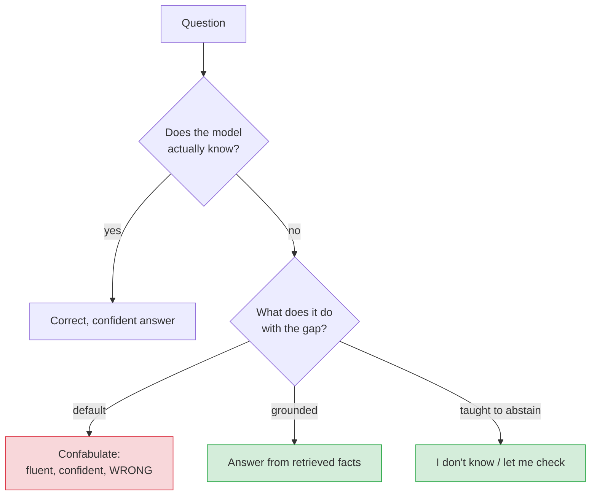
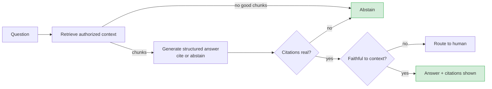

# Hallucination & confabulation

> **In one line:** A language model is a fluent guesser, not a database — it will produce a confident, well-formatted, completely false answer rather than admit it doesn't know, so the fix is to *ground* it, *check* it, and *let it say "I don't know."*

:::tip[In plain English]
Picture a brilliant student who never studied for the exam but refuses to leave any answer blank. Every answer is grammatical, plausible, and delivered with total confidence — and some of them are just made up, because the goal was "write a convincing answer," not "be correct." That's a language model. It was trained to produce *likely-sounding* text, and a confident wrong answer often sounds more likely than "I'm not sure." Hallucination isn't a glitch you can patch out; it's the default behavior of the thing. Your job is to bolt on the parts it's missing: real sources to lean on, permission to abstain, and a fact-checker on the way out.
:::

## Why models confabulate — first principles

A base language model is trained to predict the next token that best continues the text. It has **no internal flag** for "I know this" vs. "I'm pattern-matching." Two consequences:

1. **It optimizes for plausibility, not truth.** "The capital of Australia is Sydney" is a *plausible* completion (Sydney is the famous city) even though it's wrong (it's Canberra). The model picks fluent and likely over correct.
2. **It has no calibrated sense of its own ignorance.** Facts it saw a million times and facts it's interpolating from nothing both come out in the same confident tone. The famous failure: invent a citation, a court case, a function in a library, an API endpoint — all formatted perfectly, all fictional.

"Confabulation" is the more accurate word borrowed from neuroscience: the model fills a gap with a fabricated-but-coherent story, not maliciously, just *because that's what completes the pattern*. Instruction tuning and RLHF reduce it but cannot eliminate it — and can even *reward* confident answers if raters preferred them.

A second, separate failure mode matters in RAG: the answer can be **unfaithful** to its sources — the retrieved doc says X, the model says Y, while *citing* the doc. Faithfulness (does the answer follow from the context?) is distinct from factuality (is the answer true in the world?). You can be faithful to a wrong source, or unfaithful to a right one. Defend both.



## When hallucination becomes a *safety* problem

It's always a quality problem; it becomes a **safety** problem (per the [threat model](./02-threat-model.md)'s malfunction bucket) when a confident falsehood causes real harm:

- An invented medication **dosage**, drug interaction, or medical claim.
- A fabricated **legal** precedent or compliance rule someone acts on.
- A made-up **price, refund policy, deadline, or contractual term**.
- A wrong **phone number / address** that routes someone to a scam or a crisis the wrong way.
- An invented **citation** that lends fake authority, so the user trusts the fabrication.

Severity is set by the stakeholder and use case — exactly why [high-risk applications](./09-governance-regulation.md) get extra scrutiny.

## Defense 1 — Grounding (give it the facts)

The biggest single lever: don't ask the model what it *remembers*; give it the relevant facts and ask it to answer *from those*. This is [RAG](/docs/foundations/rag-basics) used as a safety control. Retrieved, current, authoritative context replaces fuzzy parametric memory.

```python
SYSTEM = """Answer ONLY using the <context> below.
If the answer is not in the context, reply exactly: "I don't have that information."
Do not use outside knowledge. Cite the doc id for every claim."""

prompt = f"{SYSTEM}\n\n<context>\n{retrieved}\n</context>\n\nQuestion: {q}"
```

Grounding shrinks the gap the model would otherwise confabulate into — but it doesn't close it (the model can still ignore the instruction or be unfaithful), which is why grounding pairs with abstention and faithfulness checks below.

## Defense 2 — Abstention (let it say "I don't know")

Models confabulate partly because nothing rewarded "I don't know." So **explicitly reward it**: make abstention a first-class, structured output and short-circuit on it.

```python
from pydantic import BaseModel
from typing import Literal

class Answer(BaseModel):
    status: Literal["answered", "insufficient_context", "out_of_scope"]
    text: str
    cited_doc_ids: list[str]

ans = generate_structured(prompt, schema=Answer)

if ans.status != "answered" or not ans.cited_doc_ids:
    return "I couldn't find a reliable answer. Want me to connect you to a human?"
```

Two reinforcing techniques:

- **Make abstention an enum value** (`insufficient_context`) so it's a structural option, not a tone the model has to muster.
- **Require evidence to answer** — `answered` is only valid with at least one real citation, enforced in code (below). No evidence → forced abstention.

This trades a little coverage (more "I don't know"s) for a lot of safety (fewer confident lies). For high-stakes domains, that trade is almost always right.

## Defense 3 — Faithfulness & citation checks (verify the output)

After generation, verify the answer is actually supported. Cheapest first:

**Citation existence (deterministic, free).** Every cited id must be in the actually-retrieved set, or you drop it / abstain:

```python
def enforce_citations(ans: Answer, retrieved_ids: set[str]) -> Answer:
    real = [c for c in ans.cited_doc_ids if c in retrieved_ids]
    if not real:                       # answer with no real support → abstain
        return ans.model_copy(update={"status": "insufficient_context", "cited_doc_ids": []})
    return ans.model_copy(update={"cited_doc_ids": real})
```

**Faithfulness / NLI check (cheap model).** Does the context *entail* each claim? Use a small entailment model or an [LLM-as-judge](/docs/evaluation) to score "is this answer supported by this context?" Frameworks: **RAGAS** (faithfulness, answer-relevance, context-precision metrics), **TruLens**, **DeepEval**.

```python
def is_faithful(answer_text: str, context: str) -> bool:
    verdict = judge(  # cheap, separate model
        f"Context:\n{context}\n\nClaim:\n{answer_text}\n\n"
        "Is EVERY statement in the claim directly supported by the context? "
        'Reply JSON {"supported": true|false}.'
    )
    return verdict["supported"]

if not is_faithful(ans.text, retrieved):
    return "I'm not fully confident in that answer — let me get a human to confirm."
```

**Self-consistency (no extra model).** Sample the answer a few times at moderate temperature; if the samples disagree on the key fact, the model is guessing → abstain or flag. Effective for factual short answers, costs N× the tokens.

## Defense 4 — Confidence estimation

You want a usable signal of "how sure is the model?" Honest caveat up front: **LLMs are poorly calibrated**, and a model's *stated* confidence is itself often a hallucination. Use signals, not faith:

- **Token logprobs.** Average/min log-probability of the answer tokens correlates (weakly) with confidence; very low logprob on a key token is a useful red flag. Available via the API's logprobs field on many providers.
- **Self-consistency agreement** (above) — the most reliable cheap proxy: disagreement across samples = low confidence.
- **"Verbalized" confidence** — asking the model for a 0–1 score. Convenient, weakly calibrated; use only as a soft input, never as the gate.
- **Retrieval signals** — low retrieval scores / no good chunks is a strong prior that any answer will be ungrounded → bias toward abstention.

Combine them into a threshold that, on failure, abstains or routes to a human. Don't show users a precise "92% confident" — it implies a calibration you don't have.

## Putting it together — the grounded, abstaining, checked pipeline



Each gate is a chance to *not* show a confident lie. Tune how many gates you enforce to the stakes of the domain.

## Common pitfalls

:::caution[Where people trip up]
- **Trusting the model's stated confidence.** "I'm 95% sure" is generated text, not a measurement. Use logprobs / self-consistency / retrieval signals instead.
- **Grounding without checking.** RAG reduces hallucination but the model can still ignore or contradict the context. Verify citations and faithfulness in code.
- **Confusing faithful with true.** Faithful = matches the source; true = matches the world. A confidently faithful answer to a wrong/outdated doc is still harmful. Keep your sources current and authoritative.
- **No abstention path.** If "I don't know" isn't a first-class, rewarded output, the model will confabulate to fill the gap every time.
- **Inventing citations that look real.** A fabricated `[doc_12]` lends false authority. Validate every citation id against the actually-retrieved set.
- **Over-abstaining and calling it safe.** A bot that says "I don't know" to everything is safe and useless. Tune the threshold to the stakes; for low-risk domains, lean toward answering.
- **Evaluating only on questions that have answers.** Add fixtures with *no* answer in the context and assert the model abstains — that's the test most teams skip. (See [safety evals](./08-red-teaming.md).)
:::

<Quiz id="safety-hallucination-quick-check" variant="micro" title="Quick check">

<Question
  prompt="Why does a language model produce a confident wrong answer instead of saying 'I don't know', according to this page's first-principles explanation?"
  options={[
    { text: "Providers fine-tune models to never admit uncertainty for product reasons" },
    { text: "It optimizes for plausible-sounding completions and has no internal flag separating 'I know this' from 'I'm pattern-matching'" },
    { text: "Its training data contained no examples of people saying 'I don't know'" },
    { text: "Hallucination only happens when the context window overflows" }
  ]}
  correct={1}
  explanation="Confabulation is the default behavior of next-token prediction: a fluent guess often sounds more 'likely' than an admission of ignorance, and nothing in the architecture marks interpolated facts as guesses. The provider-conspiracy answer is tempting because RLHF can indeed reward confident answers — but the root cause is structural, which is why it can be reduced, not patched out."
/>

<Question
  prompt="Your RAG bot answers strictly from a retrieved policy document and passes every faithfulness check — but the document is two years out of date and the policy changed. What does this page call this situation?"
  options={[
    { text: "Faithful but not true — faithfulness means matching the source, truth means matching the world, and you must defend both" },
    { text: "A hallucination, since the answer is wrong" },
    { text: "A grounding failure, since retrieval returned the wrong chunk" },
    { text: "An acceptable outcome, since the pipeline worked as designed" }
  ]}
  correct={0}
  explanation="Faithfulness and factuality are distinct: you can be faithful to a wrong source or unfaithful to a right one. Calling it 'hallucination' is the tempting label since the user got a falsehood, but the model invented nothing — the fix is keeping sources current and authoritative, not adding more faithfulness checks."
/>

<Question
  prompt="You want to gate answers on confidence, and the model writes 'I am 95% confident' when asked. How should you treat that number?"
  options={[
    { text: "Use it as the gate — verbalized confidence is the most direct measurement available" },
    { text: "Show it to users so they can calibrate their own trust" },
    { text: "Treat it as generated text, not a measurement — prefer signals like self-consistency across samples, token logprobs, and retrieval scores" },
    { text: "Average it with the temperature setting to get a calibrated score" }
  ]}
  correct={2}
  explanation="A model's stated confidence is itself often a confabulation — LLMs are poorly calibrated, so '95%' is just plausible-sounding text. Verbalized confidence feels like the obvious gate because it's explicit, but the page allows it only as a soft input; disagreement across samples is the most reliable cheap proxy, and showing users a precise percentage implies calibration you don't have."
/>

</Quiz>

---

→ Next: [Bias & fairness](./06-bias-fairness.md)
