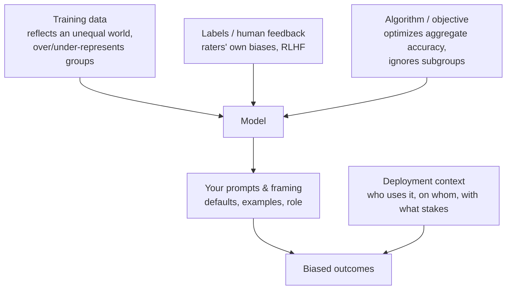

# Bias & fairness

> **In one line:** A model learns the patterns in its data — including the unfair ones — so the only way to know if it's biased is to *measure outcomes across groups*, and the only honest stance is that you can reduce bias, not delete it.

:::tip[In plain English]
If you train a model on a million résumés from a company that mostly hired men, the model learns "successful candidate" looks male — not because anyone programmed that, but because that's the pattern in the data. The model is a mirror, and the mirror reflects the world it was shown, warts and all. Worse, it can make the warts *worse*: it smooths the data into confident rules and applies them at scale. You cannot fix this by hoping; you have to *measure* — run the same inputs varying only the demographic, and check if the outcomes differ. This page is about doing that measurement honestly and acting on it.
:::

## What we mean by "bias"

Two senses get tangled; keep them apart:

- **Statistical bias** — the model's predictions are systematically off in a way that *isn't* tied to protected groups (e.g., it underestimates prices). A quality problem.
- **Social / unfairness bias** — the model treats people differently based on protected attributes (race, gender, age, disability, religion, etc.) in ways that are unjust or illegal. The safety/ethics problem this page is about.

Unfairness shows up two ways: **allocative harm** (who gets the loan, the job interview, the lower price — material outcomes distributed unfairly) and **representational harm** (who gets stereotyped, erased, or demeaned — "nurse → she," "CEO → he," refusing to depict some groups, toxic associations). Allocative harm gets the lawsuits; representational harm erodes trust and dignity. Both count.

## Where bias comes from



- **Data bias** — the corpus over-represents some groups and viewpoints and under-represents others; historical inequities are baked into the text.
- **Label / feedback bias** — human annotators and RLHF raters bring their own biases; the model learns *their* preferences.
- **Objective bias** — training maximizes *average* performance, which can quietly tank performance for a minority subgroup that barely moves the average.
- **Prompt / framing bias** — your defaults, examples, and persona inject bias even with a "neutral" model.
- **Deployment bias** — a model that's fine in one context is harmful in another (a toy chatbot vs. a tenant-screening tool).

You can't address what you can't locate. Most engineering leverage is at the *prompt/framing* and *deployment* layers (you control those); the data/label/objective layers usually belong to whoever trained the model.

## Measuring bias — the core skill

You cannot eyeball fairness. You **test it**, and the workhorse technique is **counterfactual / slice testing**: take a fixed scenario, vary *only* a protected attribute, and check whether the outcome changes.

```python
NAMES = {
    "group_a": ["Emily", "Greg", "Brad"],          # names associated with one group
    "group_b": ["Lakisha", "Jamal", "Aisha"],      # names associated with another
}
TEMPLATE = "Résumé summary: {name}, 5 yrs experience, ...\nRate hireability 1-10 and explain."

def slice_test(model) -> dict:
    scores = {g: [] for g in NAMES}
    for group, names in NAMES.items():
        for name in names:
            for _ in range(20):                    # repeat: model is stochastic
                out = model(TEMPLATE.format(name=name))
                scores[group].append(parse_score(out))
    return {g: mean(v) for g, v in scores.items()}

result = slice_test(my_model)
gap = abs(result["group_a"] - result["group_b"])
assert gap < TOLERANCE, f"Disparate scoring by name group: {result}"   # CI gate
```

This is a direct echo of the famous "résumés with white-sounding vs. Black-sounding names" audit — now runnable as a unit test. The principle generalizes: vary gender, age, dialect, disability mentions; hold everything else constant; measure the gap.

### Group fairness metrics (when there's a decision/label)

For classification-style decisions, you can compute formal metrics per demographic slice. The key ones — and the uncomfortable truth that **they're mathematically incompatible** (you generally cannot satisfy all at once, so you must *choose* which matters for your use case):

| Metric | Plain-English meaning | Use when |
|---|---|---|
| Demographic parity | Each group gets positive outcomes at the same rate | You want equal *selection* rates |
| Equal opportunity | Equal true-positive rate across groups (qualified people approved equally) | False negatives are the harm (e.g., missed loans) |
| Equalized odds | Equal TPR *and* FPR across groups | Both error types matter |
| Calibration | A given score means the same thing for every group | Scores drive downstream decisions |

```python
def equal_opportunity_gap(y_true, y_pred, group) -> float:
    """Difference in true-positive rate between groups. Closer to 0 = fairer (on this metric)."""
    def tpr(mask):
        pos = mask & (y_true == 1)
        return (y_pred[pos] == 1).mean()
    groups = set(group)
    tprs = [tpr(group == g) for g in groups]
    return max(tprs) - min(tprs)
```

Tools: **Fairlearn** (Microsoft, OSS), **AIF360** (IBM), **What-If Tool**, plus LLM-eval frameworks for the generative case. For pure-text generation (no clean label), lean on counterfactual slice tests, toxicity-per-group (Perspective API), and stereotype benchmarks (BBQ, BOLD, RealToxicityPrompts, WinoBias).

### Pick the slices that matter — and watch intersections

Enumerate the protected attributes relevant to *your* use case and jurisdiction, then test **intersections** (e.g., older women, not just "older" and "women" separately) — bias often hides at the intersection while each single axis looks fine. Beware tiny slices: a 0.9 score on a slice of 8 samples is noise, not fairness.

## Mitigations — at every layer

No single fix; you stack interventions where you have access:

1. **Prompt & framing (most accessible).** Neutral defaults; instruct against stereotyping; provide balanced examples; strip demographic cues from inputs when they're irrelevant to the task ("evaluate the qualifications, not the name").
2. **Input pre-processing.** Redact or neutralize protected attributes the model shouldn't use (names, gendered pronouns, addresses as proxies). Caution: *proxies* (zip code → race, name → gender) leak the attribute back in, so removing the obvious field isn't enough.
3. **Output post-processing / business rules.** Threshold adjustments per group (Fairlearn's `ThresholdOptimizer`), or a deterministic guardrail that flags/blocks decisions exceeding your fairness tolerance.
4. **Model choice & fine-tuning.** Pick models with published fairness evals; [fine-tune](/docs/fine-tuning) on balanced, representative data; use RLHF/DPO with fairness-aware feedback. (Usually the model vendor's lever, not yours.)
5. **Human-in-the-loop for consequential decisions.** For [high-risk](./09-governance-regulation.md) allocative decisions (hiring, lending, housing), the model *assists*; a human decides and is accountable. Often a legal requirement.
6. **Continuous monitoring.** Bias drifts as inputs and the world change. Run the slice tests on production samples on a schedule, not just at launch.

## The honest limits of debiasing

This is the section most guides skip. Be opinionated and honest:

- **You can't reach zero.** The data reflects an unequal world; some signal of that survives every mitigation. "Unbiased" is not an achievable end state.
- **The metrics conflict.** Demographic parity and equal opportunity can't both hold in general — chasing one can *worsen* another. Fairness requires a *value choice* about which harm you most want to avoid, made with stakeholders and documented, not a setting you maximize.
- **Removing a feature doesn't remove the bias** because proxies remain. "We deleted gender" is not a defense if the model infers it from other fields.
- **Debiasing can hide bias.** Over-tuned outputs (e.g., refusing all demographic mentions, or forcing artificial balance) can mask the underlying problem and create new absurd failures, without fixing the model.
- **Fairness is contextual and contested.** What's fair in lending differs from hiring differs from content recommendation; reasonable people and different legal regimes disagree. There's no universal formula.

The mature posture: **measure, document the tradeoffs you chose and why, keep a human accountable for high-stakes decisions, monitor over time, and be transparent about residual risk** in your [model card](./09-governance-regulation.md). Honest measurement beats a false claim of neutrality — and regulators increasingly require the former.

## Common pitfalls

:::caution[Where people trip up]
- **Assuming "we didn't code any bias, so there's none."** Bias comes from data, not your `if` statements. The absence of explicit rules proves nothing — measure.
- **"Fairness through unawareness."** Deleting the protected field while leaving proxies (name, zip, school) in place. The model just reconstructs the attribute.
- **Optimizing one metric and declaring victory.** Demographic parity ≠ equal opportunity ≠ calibration, and they trade off. State which you chose and why.
- **Testing single axes, missing intersections.** Bias frequently hides where two attributes meet while each alone looks clean.
- **Tiny, noisy slices.** A fairness "win" on 6 samples is randomness. Get enough data per slice or widen the slice.
- **One-time check at launch.** Bias drifts with data and usage. Make slice tests a recurring eval, not a launch gate you forget.
- **No human accountable for consequential decisions.** For hiring/lending/housing, a model output should never be the final word — both ethically and, increasingly, legally.
:::

<Quiz id="safety-bias-fairness-quick-check" variant="micro" title="Quick check">

<Question
  prompt="You want to test whether a résumé-screening model scores candidates differently by demographic. What is the workhorse technique this page describes?"
  options={[
    { text: "Counterfactual slice testing — hold the scenario fixed, vary only the protected attribute (e.g. the name), repeat many times, and measure the outcome gap" },
    { text: "Reading the model's chain-of-thought to check for biased reasoning" },
    { text: "Asking the model directly whether it treats groups fairly" },
    { text: "Reviewing the training data for offensive content" }
  ]}
  correct={0}
  explanation="You can't eyeball fairness; you measure it — the modern version of the classic résumé-name audit, runnable as a CI test. Asking the model or inspecting its reasoning is tempting because it feels direct, but the model has no reliable insight into its own biases; only outcome gaps across controlled slices count as evidence."
/>

<Question
  prompt="A lending team deletes the gender field from inputs and declares the model can't be biased by gender. What does this page call this, and why does it fail?"
  options={[
    { text: "Data minimization — it works and is also a GDPR requirement" },
    { text: "Demographic parity — it equalizes selection rates by construction" },
    { text: "Fairness through unawareness — proxies like name, zip code, or school leak the attribute back in, so the model reconstructs it" },
    { text: "Output post-processing — valid but better done with threshold adjustment" }
  ]}
  correct={2}
  explanation="Removing the explicit field doesn't remove the signal: correlated features act as proxies and the model infers the attribute anyway. It feels like a clean fix — 'the model literally can't see gender' — which is exactly why it's the most common false defense; only measuring outcomes across groups shows whether bias survived."
/>

<Question
  prompt="Your team tunes the model until demographic parity is satisfied, then declares the system fair. What uncomfortable truth from this page does that ignore?"
  options={[
    { text: "Demographic parity can only be computed on training data, not production data" },
    { text: "Parity metrics only apply to image models" },
    { text: "Fairness metrics always improve together, so one metric is enough" },
    { text: "The group fairness metrics are mathematically incompatible — satisfying one can worsen another, so which to prioritize is a documented value choice, not a maximization" }
  ]}
  correct={3}
  explanation="Demographic parity, equal opportunity, equalized odds, and calibration generally cannot all hold at once — chasing one trades off others. 'We hit the metric, we're fair' is the trap: the mature posture is choosing which harm matters most for your use case with stakeholders, documenting it, and monitoring over time."
/>

</Quiz>

---

→ Next: [Privacy & data governance](./07-privacy-data.md)
