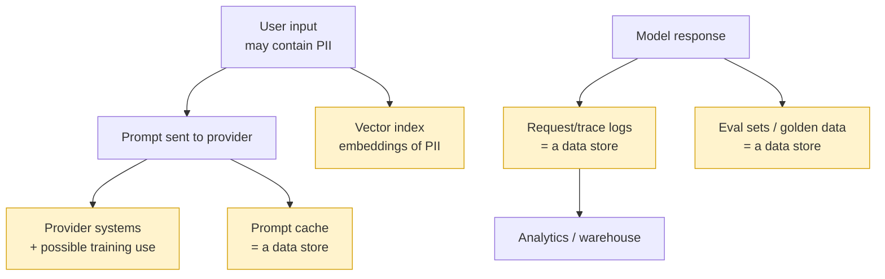

# Privacy & data governance

> **In one line:** Every place your AI touches personal data — prompts, logs, caches, vector indexes, training sets — is a data store with legal obligations, so redact early, retain little, know where it lives, and remember the model can *memorize and leak* what you feed it.

:::tip[In plain English]
When you send text to a model, you're not whispering into a void — that text lands in request logs, a prompt cache, maybe a vector database, maybe the provider's systems, and possibly (if you're not careful) future training data. Each of those is a filing cabinet full of personal information, and the law treats it like one. The model itself is also leaky: feed it enough secrets and it can regurgitate them to the next user. So the discipline is the same one good engineers already know for databases — collect less, redact what you can, keep it for as short as you can, lock down where it lives — applied to a pipeline that *spreads data into more places than you expect*.
:::

## The data map: where personal data actually goes

Before governing data, *find* it. An AI feature scatters personal data across more stores than a normal CRUD app:



Every yellow box is in scope for privacy law. The classic bug: a [right-to-be-forgotten](#regional-data-rules) deletion that scrubs Postgres but leaves the user's data in the logs, the prompt cache, the eval set, and the vector index. Map the pipes *first*.

## PII detection & redaction

**PII** (personally identifiable information) is anything that identifies a person directly (name, email, SSN, phone, face) or in combination (zip + birthdate + gender can re-identify most people). Some of it is **sensitive/special-category** (health, biometrics, religion, sexual orientation, race) with stricter rules.

The two-layer approach: a fast **regex** baseline for structured PII (emails, phones, SSNs, cards) plus a **model-based detector** for the unstructured stuff regex can't catch (names, addresses, contextual identifiers).

```python
import re

PATTERNS = {
    "email": re.compile(r"[\w.+-]+@[\w-]+\.[\w.-]+"),
    "phone": re.compile(r"\+?\d[\d\s\-().]{7,}\d"),
    "ssn":   re.compile(r"\b\d{3}-\d{2}-\d{4}\b"),
    "card":  re.compile(r"\b(?:\d[ -]?){13,16}\b"),
}

def redact_pii(text: str) -> str:
    """Regex baseline. Layer Presidio/Comprehend/DLP on top for names & addresses."""
    for kind, rx in PATTERNS.items():
        text = rx.sub(f"[REDACTED:{kind}]", text)
    return text
```

Two redaction styles — pick per use case:

- **Masking / removal** — replace with a tag (`[REDACTED:email]`). Irreversible, simplest, safest. Use for logs and analytics.
- **Tokenization / pseudonymization** — replace with a reversible token (`user_8f2a`) mapped in a secured vault, so you can re-link if you legally need to (and de-link on a deletion request). Use when downstream needs referential integrity.

Production tooling: **Microsoft Presidio** (OSS, detect + anonymize), **AWS Comprehend PII**, **Google Cloud DLP**, **Azure AI Language PII**. These find names and addresses that regex never will.

<CodeChallenge
  id="safety-redact-email"
  fnName="redactEmails"
  prompt="Write redactEmails(text) — replace every email address in the string with the literal token [REDACTED] and return the new string. An email is one-or-more of letters/digits/dot/underscore/plus/hyphen, then '@', then one-or-more letters/digits/dot/hyphen. Leave everything else untouched."
  starter={`function redactEmails(text) {\n  // replace each email with [REDACTED]\n}`}
  solution={`function redactEmails(text) {\n  return text.replace(/[A-Za-z0-9._+-]+@[A-Za-z0-9.-]+/g, "[REDACTED]");\n}`}
  tests={[
    {args: ["contact me at jane.doe@acme.com please"], expected: "contact me at [REDACTED] please"},
    {args: ["no email here"], expected: "no email here"},
    {args: ["a@b.co and c_d+1@x-y.io"], expected: "[REDACTED] and [REDACTED]"},
    {args: [""], expected: ""},
  ]}
  hint="Use String.replace with a global regex: /[A-Za-z0-9._+-]+@[A-Za-z0-9.-]+/g and the replacement '[REDACTED]'."
/>

That's the *baseline*. In production you'd run Presidio on top to also catch the sender's name two lines down — the part regex can never see.

### Redact before it leaves your perimeter

The rule: redact PII **as early as possible** — before the prompt goes to the provider (if the field isn't needed for the task), and *always* before anything is written to logs, traces, or analytics. Never log raw SSNs/PANs. If you must send some PII to the model to do the job, prefer a provider with a **no-training / zero-retention** agreement (enterprise tiers of Anthropic, OpenAI, Google, plus Azure OpenAI and AWS Bedrock keep data in your tenant) — necessary but not sufficient, because the data still left your walls.

For the highest-sensitivity workloads (healthcare/PHI under HIPAA, financial data), **self-host** open models (vLLM + Llama/Mistral) so PII never leaves your infrastructure at all. (See [self-hosting tradeoffs](/docs/decisions).)

## Data retention

Default retention is **the enemy**. "Keep logs forever" is a breach waiting to be disclosed. Set explicit, minimal windows tied to *why* you keep the data:

```python
RETENTION_DAYS = {
    "debug_traces": 14,        # just long enough to investigate incidents
    "analytics":    90,        # aggregate trends; redact PII before this hop
    "audit_logs":   2555,      # 7 yrs only if a regulation actually requires it
}
# Enforce with a TTL on the store (e.g., DB partition drop, S3 lifecycle, index TTL),
# not a cron job someone forgets to run.
```

Data minimization is also a legal principle (GDPR Art. 5): collect only what you need, keep it only as long as you need it. Less retained data = smaller breach, easier deletion requests, lower compliance cost.

## Memorization & leakage

A trained or fine-tuned model can **memorize** specific examples from its training data and **emit them verbatim** later — researchers have extracted real emails, phone numbers, and secrets from production models with crafted prompts. This is a distinct risk class:

- **Training-data extraction** — an attacker prompts the model to regurgitate memorized PII/secrets it saw in training.
- **Membership inference** — an attacker determines *whether a specific record* was in the training set (itself a privacy violation for sensitive datasets).
- **Cross-user leakage at inference** — the scarier operational version: one user's data bleeds to another via a **shared prompt cache, a shared context window, or a poorly-scoped vector index**. This is usually an *engineering* bug, not a model bug — and it's the one you'll actually cause.

Defenses:

- **Don't fine-tune on raw PII.** Redact/pseudonymize the training set first; the model can't memorize what isn't there.
- **Differential privacy / dedup** during training adds noise / removes duplicated secrets so no single record is memorizable (a vendor lever for the most part).
- **Strict tenant isolation at inference** — the cache key, the context you assemble, and the vector-index filter must all scope to the authenticated tenant/user. (The [cardinal rule](./02-threat-model.md) again: enforce in code.)
- **Output secret-scanning** — scan responses for leaked API keys/PII before they're shown (an [output guardrail](./04-guardrails.md)).

## Training-data consent

If you collect data — especially to train or fine-tune — *consent and provenance* matter, legally and ethically:

- **Lawful basis & purpose limitation (GDPR).** You need a legal basis to process personal data, and you can't quietly repurpose "support chat logs" into "training data" without a basis/notice. "We'll train on your conversations" must be disclosed, and often opt-in.
- **Provenance & licensing.** Know where training data came from and that you have the right to use it (copyright, scraped-content, and biometric-consent litigation is active in 2026).
- **User-facing controls.** Offer a clear opt-out (or opt-in) for using a user's data to improve the model, and honor it across the whole pipeline.

## Regional data rules

You don't need to be a lawyer, but you must know these exist and design for them. (Deeper treatment in [enterprise regulatory](/docs/enterprise/enterprise-regulatory) and [governance](./09-governance-regulation.md).)

| Regime | Region | What it forces you to do |
|---|---|---|
| **GDPR** | EU/EEA | Lawful basis, data minimization, purpose limitation, **right to access/erasure/portability**, breach notice (72h), DPAs with processors, restrictions on automated decisions |
| **CCPA/CPRA** | California | Right to know/delete/opt-out of "sale/sharing," notice at collection |
| **HIPAA** | US health | PHI safeguards, BAAs with any vendor touching PHI (incl. model providers) |
| **AI-specific** | EU & beyond | [EU AI Act](./09-governance-regulation.md) obligations layered on top of GDPR |
| **Sectoral/other** | varies | GLBA (US finance), PIPEDA (Canada), LGPD (Brazil), PIPL (China), etc. |

Two cross-cutting engineering consequences:

- **Data residency / sovereignty.** Some data must *physically stay* in a region (EU data in EU, etc.). Pick provider regions deliberately (Azure/AWS/GCP region pinning, EU data-boundary offerings) and don't let a prompt cache or log sink quietly ship it elsewhere.
- **Right to erasure is a pipeline, not a row delete.** A deletion request must reach Postgres **and** the logs, the prompt cache, the analytics warehouse, the eval set, and the vector index. Build that fan-out *before* the first request arrives — retrofitting it under a 30-day legal deadline is misery.

```python
async def handle_erasure_request(user_id: str):
    await asyncio.gather(
        db.delete_user(user_id),
        logs.purge(user_id),
        prompt_cache.evict(user_id),
        vector_index.delete(filter={"user_id": user_id}),   # the one everyone forgets
        warehouse.delete(user_id),
        eval_store.purge(user_id),
    )
    audit.record("erasure_completed", user_id=user_id)       # prove you did it
```

## Common pitfalls

:::caution[Where people trip up]
- **Logging raw prompts/responses.** Trace logs are the #1 accidental PII store. Redact at write time, set a TTL.
- **Forgetting the prompt cache and vector index are data stores.** Same retention, residency, and deletion rules apply. They're the most-missed pipes in an erasure request.
- **Cross-tenant leakage via shared cache/context/index.** Scope every cache key and index filter to the authenticated tenant in code. This is the privacy bug you're most likely to *cause*.
- **Assuming a no-training agreement = safe.** It stops training use; the data still leaves your perimeter and lives in the provider's systems under their retention. For top-sensitivity data, self-host.
- **Repurposing user data for training without a basis/notice.** "Improve our model" using customer chats needs disclosure and often consent — and an honored opt-out.
- **Fine-tuning on un-redacted PII.** The model can memorize and later emit it verbatim. Redact the training set first.
- **Treating residency as an afterthought.** EU data quietly flowing to a US region (via a default provider endpoint or log sink) is a GDPR violation. Pin regions deliberately.
:::

---

→ Next: [Red-teaming & adversarial testing](./08-red-teaming.md)
