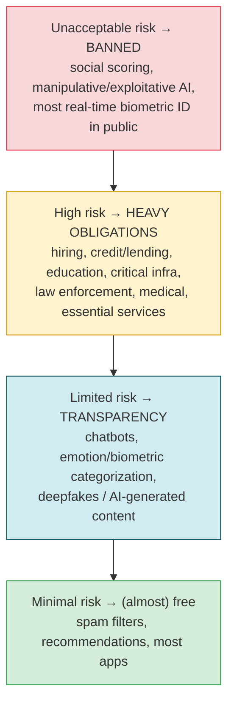
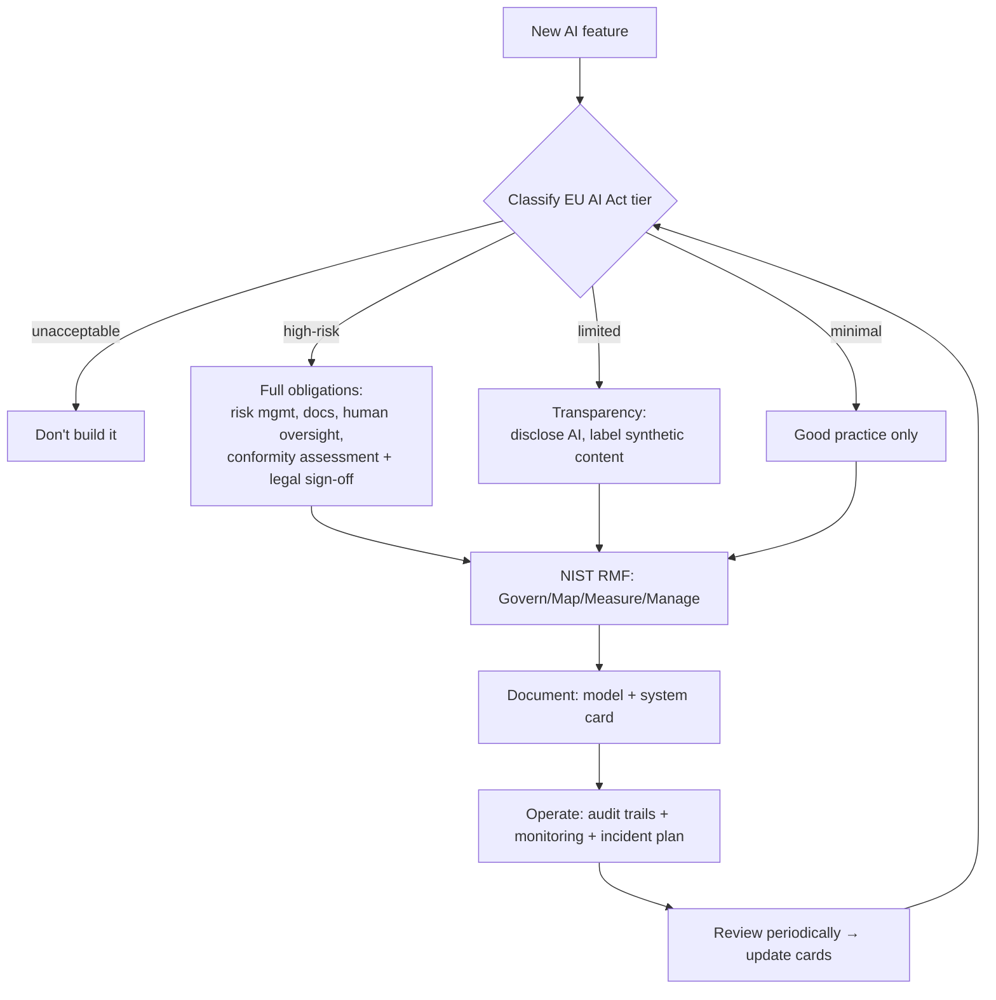

# Governance & regulation in 2026

> **In one line:** Regulators now treat AI like a regulated product — the harm tier of your *use case* decides your legal obligations, so know your tier, follow a recognized framework (NIST AI RMF), document with model/system cards, and keep audit trails that *prove* you did the safe things.

:::tip[In plain English]
Everything in this chapter so far has been engineering — defenses you build because they're the right thing to do. Governance is the layer that makes you *prove* it, on paper, to auditors and regulators who can fine you. As of 2026 this is no longer optional vibes: the EU AI Act is in force with real penalties, the US leans on the NIST framework, and "we're careful, trust us" is not a defense. The good news: if you've done the engineering in this chapter, governance is mostly *documenting and proving* it. Know which risk tier your feature falls in, follow a recognized framework, write the cards, and log enough to reconstruct any decision.
:::

## The EU AI Act — risk tiers decide everything

The EU AI Act is the world's first comprehensive AI law and the de-facto global benchmark (like GDPR, it applies to anyone serving EU users, wherever you're based). Its core idea: **obligations scale with the risk of the *use case*, not the cleverness of the model.** Four tiers:



- **Unacceptable** — *prohibited outright.* Social scoring, manipulation that causes harm, exploiting vulnerabilities, most real-time public biometric identification. Don't build these.
- **High-risk** — allowed but **heavily regulated**: risk management system, data governance, technical documentation, logging/traceability, transparency to users, **human oversight**, accuracy/robustness/cybersecurity, a conformity assessment, and EU registration. This is where hiring, lending, medical, education, and critical-infrastructure AI live — exactly the [allocative-harm](./06-bias-fairness.md) cases.
- **Limited-risk** — **transparency** obligations: tell users they're talking to AI; label AI-generated/deepfake content; mark synthetic media. Most chatbots land here.
- **Minimal-risk** — the vast majority of apps; no specific obligations (follow general good practice).

Plus a separate track for **General-Purpose AI (GPAI) / foundation models** (the providers of GPT/Claude/Llama-scale models): technical documentation, training-data summaries, copyright compliance, and — for the most capable "systemic-risk" models — extra evaluation, red-teaming, and incident reporting. If you *use* an API you mostly inherit the provider's compliance; if you *fine-tune or distribute* a model you may take on some of it.

**Timeline (as of 2026):** the Act entered into force in 2024; the bans on unacceptable-risk uses and AI-literacy duties applied first (early 2025), GPAI obligations next (mid-2025), and the bulk of high-risk obligations phase in through 2026–2027. Penalties are GDPR-scale: up to **€35M or 7% of global turnover** for prohibited-use violations. Treat the specific dates as "check the current text," but the *structure* — tiers + GPAI track — is stable.

**Your job as an engineer:** classify your feature's tier *early* (it changes everything downstream), and if it's high-risk, loop in legal/compliance *before* building, not after.

## NIST AI RMF — the framework to organize around (US & global)

Where the EU AI Act is *law*, the **NIST AI Risk Management Framework** is a *voluntary* (but widely adopted, including a Generative AI Profile) framework that tells you *how* to manage AI risk. It's the practical backbone US companies use, and it maps cleanly onto everything in this chapter. Four functions:

| Function | Plain meaning | Maps to |
|---|---|---|
| **Govern** | Culture, policies, roles, accountability for AI risk | [Internal AI policy](#internal-ai-policy) below |
| **Map** | Identify context and risks of *this* system | [Threat model](./02-threat-model.md) |
| **Measure** | Assess, test, track those risks quantitatively | [Evals](/docs/evaluation), [bias slices](./06-bias-fairness.md), [red-teaming](./08-red-teaming.md) |
| **Manage** | Prioritize, mitigate, monitor, respond | [Guardrails](./04-guardrails.md), [incident response](./08-red-teaming.md) |

If someone asks "what's your AI risk process?", answering in Govern/Map/Measure/Manage terms signals you know the standard. Related: ISO/IEC 42001 (AI management system certification) and ISO/IEC 23894 (AI risk) for organizations that want an auditable certification.

## Model cards & system cards — the documentation that proves it

A **model card** is a short, standardized document describing a model: what it's for, what it's *not* for, training data at a high level, evaluation results (including [fairness across slices](./06-bias-fairness.md)), known limitations, and safety considerations. Originated in research; now an expectation (and, for high-risk, effectively a requirement).

A **system card** zooms out to the *whole deployed system*: the model **plus** your prompts, guardrails, retrieval, tools, human-oversight design, and intended use — i.e., the thing users actually touch. The big labs publish system cards for frontier releases; you should keep one (even a lightweight internal one) for any consequential AI feature.

```json
{
  "system": "Acme Support Assistant v3",
  "intended_use": "Answer billing/product questions for authenticated customers",
  "out_of_scope": ["medical, legal, or financial advice", "anonymous users"],
  "model": "claude-/gpt- via API (no-training tier)",
  "guardrails": ["input+output moderation", "schema-constrained output",
                 "citation validation", "PII redaction (Presidio)"],
  "human_oversight": "Refunds > $X require human approval; escalation path to support team",
  "eval_results": {"faithfulness": 0.94, "bias_slice_max_gap": 0.03, "red_team_pass": "47/47"},
  "known_limitations": ["may abstain on rare edge policies", "EN/ES only"],
  "data_handling": {"retention_days": 30, "residency": "EU", "pii": "redacted pre-log"},
  "eu_ai_act_tier": "limited-risk (discloses it is AI)",
  "owner": "support-platform-team", "last_reviewed": "2026-06-01"
}
```

Keeping this current is cheap insurance: it's your launch checklist, your onboarding doc, *and* your audit artifact in one file.

## Internal AI policy

Before regulators, your own organization needs rules so engineers don't each invent their own. A workable internal AI policy covers:

- **Approved tools & data** — which providers/models are allowed, what data may be sent to each (the [no-training/residency](./07-privacy-data.md) rules), what's forbidden (e.g., never paste customer PHI into a consumer chatbot).
- **Risk classification** — how to determine a feature's tier and what review it triggers (a high-risk feature needs legal sign-off; a minimal one doesn't).
- **Human oversight requirements** — which decisions a model may never make alone.
- **Approval gates** — who reviews/signs off before a consequential AI feature ships (the [pre-launch red-team checklist](./08-red-teaming.md) is part of this).
- **Incident response** — the runbook, kill switch, and notification clocks from the [red-teaming page](./08-red-teaming.md).
- **AI literacy** — basic training so staff using AI tools understand the risks (the EU AI Act actually mandates this).

This is the NIST **Govern** function made concrete. See also [enterprise governance](/docs/enterprise/enterprise-governance) and [enterprise regulatory](/docs/enterprise/enterprise-regulatory) for the org-scale version.

## Audit trails — proving what happened

Governance is unprovable without records. The principle: **you must be able to reconstruct, after the fact, what the AI did and why.** Practically, log (PII-redacted) for every consequential interaction:

```python
audit.record({
    "trace_id": trace_id,
    "timestamp": now(),
    "user_id": session.user.id,          # who
    "model": "claude-...", "prompt_version": "support-v3",   # what version
    "input_redacted": redact_pii(user_input),
    "retrieved_doc_ids": retrieved_ids,  # what context informed it
    "tool_calls": tool_calls,            # what it did
    "output_redacted": redact_pii(output),
    "guardrails_fired": ["moderation:pass", "citation:1 dropped"],
    "human_approved": approval_record,   # for high-stakes actions
    "retention_days": 30,
})
```

This single record serves four masters: **incident response** (reconstruct a breach), **EU AI Act high-risk logging** (traceability is a legal requirement), **disputes** ("the AI told me X" → here's exactly what it said and why), and **continuous improvement** (feed failures back into [evals](/docs/evaluation)). Redact PII at write time, set a retention window, and store it tamper-evident for high-stakes systems.

## Putting it together — the governance ladder



Engineering keeps it safe; governance proves it's safe and keeps it legal. You need both to ship AI to real users in 2026.

## Common pitfalls

:::caution[Where people trip up]
- **Classifying the model instead of the use case.** The EU AI Act tier comes from *what the feature does to people*, not the model's benchmark scores. The same model is minimal-risk in a recipe app and high-risk in a hiring tool.
- **Discovering the tier after building.** A high-risk classification changes architecture, documentation, and timelines. Classify *first*.
- **Assuming "we use an API, so the provider handles compliance."** You inherit *their* model obligations, but *your* deployment obligations (transparency, human oversight, your data handling, your audit trail) are yours.
- **Skipping the EU because you're not in it.** Like GDPR, the AI Act applies if you serve EU users. Geography of your office is irrelevant.
- **Model/system cards as a one-time artifact.** They must track the deployed reality — update on every model swap, prompt change, or new tool.
- **No audit trail, or one full of raw PII.** You can't prove compliance without records, and records full of un-redacted PII are themselves a violation. Redact and retain deliberately.
- **No human accountable for high-risk decisions.** Both the EU AI Act and good sense require a human in the loop on consequential automated decisions — design it in, don't bolt it on.
:::

---

→ Next: [Chapter checkpoint](./99-checkpoint.md)
