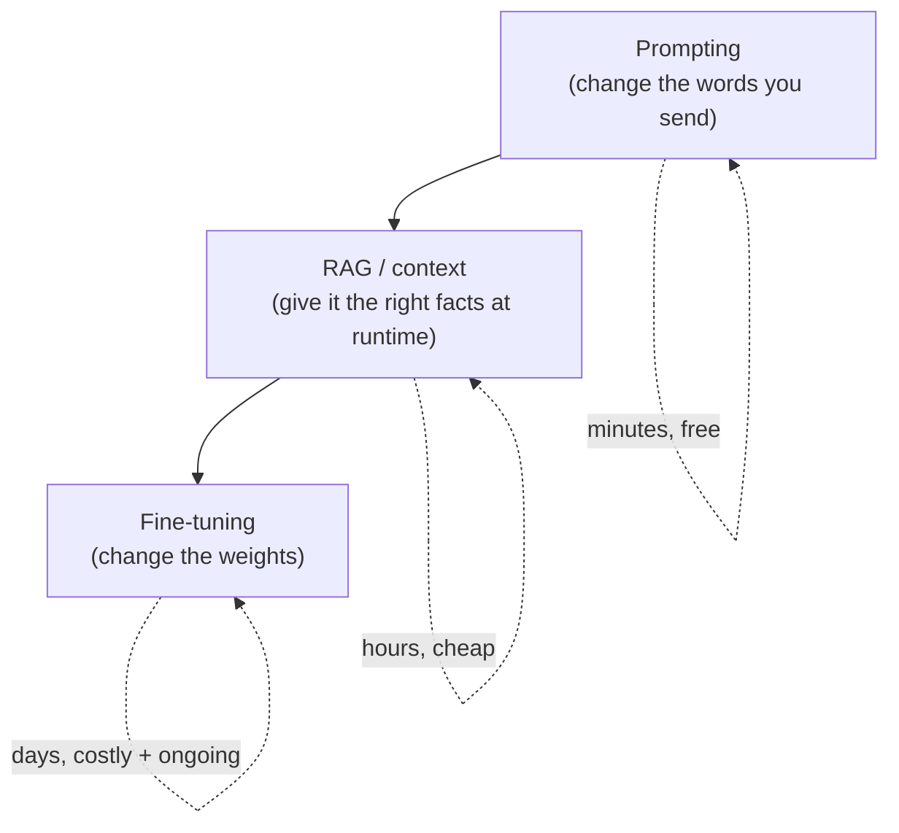

# When to fine-tune (and when not to)

> **In one line:** Fine-tuning is the *last* lever you should reach for, not the first — it's powerful for teaching *behaviour and format*, useless for teaching *facts*, and it saddles you with a maintenance bill that prompting and RAG never do.

:::tip[In plain English]
A new hire who keeps formatting reports wrong doesn't need a brain transplant — they need either (a) clearer instructions on the task, or (b) access to the company handbook. Only if you've given great instructions, they've got the handbook, and they *still* can't internalize the house style after the hundredth report — do you send them on a dedicated training course. Fine-tuning is that course. It's the right call surprisingly rarely, and people reach for it far too early because it feels more "serious" than writing a good prompt.
:::

## The three levers, cheapest first

You have three ways to make a model do what you want. They are not alternatives ranked by power — they're a ladder you climb only when the rung below runs out.



1. **Prompting** — change the instructions, examples, and system message. Iteration time: seconds. Cost: a few tokens. Reversible instantly.
2. **RAG / context** — retrieve relevant documents at query time and stuff them into the prompt. Iteration time: hours. This is how you give a model *knowledge it didn't have*. (See [RAG basics](/docs/foundations/embeddings) for the mechanics.)
3. **Fine-tuning** — keep training the model on your examples so the behaviour is encoded in the weights. Iteration time: days. Cost: GPU time up front *plus* a permanent maintenance burden.

The golden rule: **exhaust prompting and RAG before you fine-tune.** Most "we need to fine-tune" instincts are solved by a better prompt or a retrieval step.

## What fine-tuning is genuinely good at

Fine-tuning teaches **behaviour, style, and format** — the *how*, not the *what*. The three solid use cases:

- **Consistent format / structure.** You need every output to be valid JSON in your exact schema, or to follow a rigid template, and few-shot examples in the prompt aren't reliable enough. A fine-tune that has seen 1,000 correct outputs nails the shape almost every time.
- **A tone or "voice" that's hard to describe.** "Write like our brand" or "respond like our senior support agents do" is easier to *show* with 500 real examples than to *spell out* in a prompt.
- **Cost and latency on a narrow task.** You've got a great prompt that works on a big expensive model with a 2,000-token system message. Fine-tune a *small* model on input→output pairs from the big one and you can often drop the system prompt entirely, shrink the model, and cut cost and latency 5–10×. (This is [distillation](./07-distillation.md), and it's the highest-ROI reason to fine-tune in 2026.)

## What fine-tuning is bad at (the trap)

**Fine-tuning does not reliably teach facts, and it never gives you fresh or private knowledge on demand.**

- **It's not how you add knowledge.** If you fine-tune a model on your company wiki, it will *sound* like it knows the wiki but will confidently invent details — it absorbed the *style* of the wiki, not a reliable lookup table of its contents. For "the model should know our docs," the answer is almost always RAG, not fine-tuning.
- **It goes stale.** A fine-tune is a snapshot. The day your product, policy, or price list changes, the fine-tune is wrong and you must re-train. RAG just re-indexes a document.
- **It can make a model *worse* elsewhere.** Training hard on your narrow task can degrade general ability — this is *catastrophic forgetting* (see [evaluating fine-tunes](./08-evaluating-finetunes.md)).

| You want the model to… | Reach for |
| --- | --- |
| Know your current docs / inventory / policies | **RAG** |
| Follow an exact output format reliably | **Fine-tune** (after trying few-shot) |
| Adopt a specific tone / voice | **Fine-tune** |
| Be cheaper/faster on one narrow task | **Fine-tune (distillation)** |
| Use a new tool or follow a new rule *today* | **Prompting** |
| Answer questions about a 500-page PDF | **RAG** |

## The cost and maintenance reality nobody warns you about

The training run is the *cheap* part. The real bill is ongoing:

- **You now own a model artifact.** Every base-model upgrade (and there's a new frontier model every few months) means re-evaluating, possibly re-training, and re-deploying. A prompt, by contrast, usually just works on the newer, better base model for free.
- **You need an eval harness *before* you start** — otherwise you can't tell whether the fine-tune helped or quietly regressed. Budget the eval work as part of the project, not an afterthought. (See the [Evaluation chapter](/docs/evaluation).)
- **Data pipelines rot.** Your dataset needs refreshing as the task drifts. Someone owns that.
- **Serving is more complex.** A hosted base model is one API call. A self-hosted fine-tune means GPUs, autoscaling, and on-call. (See [serving fine-tunes](./09-serving-finetunes.md).)

A rough rule of thumb for 2026:

```text
Fine-tune when ALL of these hold:
  1. Prompting + RAG have been honestly tried and fall short.
  2. The gap is about BEHAVIOUR/FORMAT/TONE/COST — not missing facts.
  3. You have (or can build) 500+ high-quality examples.
  4. The task is stable enough that the model won't be stale in a month.
  5. You have an eval set to prove it worked and catch regressions.

If any one fails, stay on the cheaper rung.
```

## A quick decision walkthrough in code

You don't need a framework for this decision — it's a checklist. But here's the logic as a script you could actually run in a planning doc:

```python
def should_finetune(task) -> str:
    if not task.tried_prompting_and_rag:
        return "No. Exhaust a better prompt + RAG first."
    if task.gap_is_missing_knowledge:
        return "No. Missing facts -> use RAG, not fine-tuning."
    if task.num_quality_examples < 500:
        return "Probably not yet. Collect more clean examples first."
    if task.changes_weekly:
        return "No. Too volatile; the fine-tune will be stale. Use RAG/prompting."
    if not task.has_eval_set:
        return "Not until you can measure it. Build the eval harness first."
    # Behaviour/format/tone/cost gap, stable task, enough data, measurable:
    return "Yes — and seriously consider distillation onto a small model."
```

## Common pitfalls

:::caution[Where people trip up]
- **Fine-tuning to add knowledge.** The single most common mistake. You'll get a confident hallucinator. Use RAG for facts.
- **Skipping the prompt-engineering work.** Teams fine-tune to fix a problem a 20-minute prompt rewrite would have solved — and then own a model forever.
- **No eval set.** Without held-out evals you are *guessing* whether the fine-tune helped. You'll often ship a regression and not know.
- **Ignoring the maintenance tail.** The next base model drops in three months and is better than your fine-tune out of the box. If you didn't plan for re-training, you're now stuck on an aging model.
- **Fine-tuning a frontier model when a small one would do.** If the goal is cost/latency, distilling onto a *small* model is the win, not fine-tuning the big one.
:::

<Quiz id="ft-when-quick-check" variant="micro" title="Quick check">

<Question
  prompt="A team fine-tunes a model on their company wiki so it will 'know our documentation'. What does this page predict the result will be?"
  options={[
    { text: "The model will reliably answer questions about the wiki contents" },
    { text: "The model will sound like the wiki but confidently invent details — it absorbed the style, not a lookup table; facts need RAG" },
    { text: "The fine-tune will fail to converge because wikis are unstructured" },
    { text: "It will work, but only if they train for more epochs" }
  ]}
  correct={1}
  explanation="Fine-tuning teaches behaviour, style, and format — not reliable factual recall — so this produces a confident hallucinator. It's called the single most common mistake on the page because the intuition 'training on docs = knowing docs' feels right; but 'the model should know our docs' is a retrieval problem, solved by giving it the right facts at runtime."
/>

<Question
  prompt="You have a great 2,000-token prompt that works on a big expensive model, and your goal is to cut cost and latency on this one narrow task. What does this page call the highest-ROI move?"
  options={[
    { text: "Fine-tune the big model so it needs fewer output tokens" },
    { text: "Cache the system prompt to amortize its cost" },
    { text: "Negotiate volume pricing with the provider" },
    { text: "Distill — fine-tune a small model on input/output pairs from the big one, often dropping the long system prompt entirely" }
  ]}
  correct={3}
  explanation="Distillation is named as the highest-ROI reason to fine-tune in 2026: the small student internalizes the behaviour, so you can shrink the model and prompt and cut cost/latency 5-10x. Fine-tuning the big model is the tempting reflex, but if cost is the goal, the win comes from the model getting smaller, not better."
/>

<Question
  prompt="Six months after shipping a fine-tune, a much better base model is released. Why does this page say the prompting team is in a better position than the fine-tuning team?"
  options={[
    { text: "A prompt usually just works on the newer base model for free, while the fine-tune team must re-evaluate, re-train, and re-deploy their artifact" },
    { text: "Prompts are version-controlled and fine-tunes are not" },
    { text: "New base models cannot load old LoRA adapters, so the fine-tune is deleted" },
    { text: "The fine-tuning team isn't worse off — fine-tunes transfer automatically to new bases" }
  ]}
  correct={0}
  explanation="The training run is the cheap part; owning a model artifact is the ongoing bill. Each base-model upgrade forces the fine-tune team through re-evaluation and likely re-training, while a prompt simply rides the better model. The adapter-compatibility answer has a kernel of truth but isn't the page's point — the burden is the maintenance cycle, not file formats."
/>

</Quiz>

---

→ Next: [Data preparation: the dataset IS the product](./03-data-prep.md)
