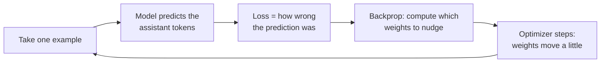

# Supervised fine-tuning (SFT) from scratch

> **In one line:** SFT is just "keep training the model on your input→ideal-output pairs, nudging its weights a little each time so it predicts your ideal answers" — and once you understand loss, epochs, and learning rate, the whole process stops being magic.

:::tip[In plain English]
The model already knows how to write — fine-tuning is like a few extra weeks of coaching, not relearning the language. You show it a prompt, let it guess the response, measure how far off it was from your ideal answer, and tweak its internal dials a tiny bit so next time it guesses closer. Do that across all your examples, a few times over, and the desired behaviour settles into the weights. Nudge too hard or too many times and it stops *learning* and starts *memorizing* — which is the one failure mode you'll spend the most effort avoiding.
:::

## What "training" actually does, step by step

"SFT" = **S**upervised **F**ine-**T**uning: supervised because every example comes with the *correct* answer (the assistant turn), fine-tuning because you start from an already-trained model rather than from scratch.



A model generates text one token at a time, each as a probability over the whole vocabulary. Training measures how much probability it put on the *correct* next token (the one in your ideal answer) and nudges the weights to put *more* there next time.

## Loss: the number you're driving down

The loss for language models is **cross-entropy** — formally, the average negative log-probability the model assigned to the correct next tokens. Intuitively:

- The model was *confident and right* → tiny loss.
- The model was *confident and wrong* → huge loss.
- High loss means "you're surprised by the right answer; adjust."

```python
import math

# Toy: the model's predicted probability for each correct next token.
correct_token_probs = [0.9, 0.8, 0.3, 0.95]   # one per token in the ideal answer

# Cross-entropy = mean of -log(prob assigned to the correct token)
loss = -sum(math.log(p) for p in correct_token_probs) / len(correct_token_probs)
print(round(loss, 3))   # ~0.39 ; lower is better. Confident+correct -> near 0.
```

**Crucially, loss is computed only on the assistant tokens** (this is "loss masking" / "completion-only" training). You don't want to teach the model to generate the user's questions — only to respond well. Frameworks handle this for you, but it's why your *responses* must be the part that's perfect.

## Epochs: how many times to see the data

An **epoch** is one full pass over the training set. More epochs = the model sees each example more times = it learns harder.

- **Too few** (under-training): the behaviour doesn't stick; outputs barely change from the base model.
- **Too many** (over-training): the model *memorizes* your exact examples and loses the ability to generalize — **overfitting**.
- **Practical default:** 1–3 epochs for most fine-tunes. With a larger or noisier dataset, fewer epochs; with a tiny dataset, you might do more — but watch validation loss like a hawk.

## Learning rate: the size of each nudge

The **learning rate (LR)** controls how big a step the optimizer takes when it adjusts weights.

- **Too high:** the model "forgets" its general abilities, loss spikes/diverges, outputs turn to garbage.
- **Too low:** training crawls; behaviour barely changes.
- **For fine-tuning, LR is much smaller than pre-training** — you're nudging, not rebuilding. Typical full-FT LRs are tiny (e.g. `1e-5` to `2e-5`); LoRA tolerates larger (e.g. `1e-4` to `3e-4`) because it's only touching small adapters.
- **A warmup** (LR ramps up over the first few % of steps) and a **decay schedule** (LR shrinks toward the end) are standard and stabilize training.

If you're using a hosted FT API (OpenAI/Together/Fireworks), these are usually `auto` by default and you only touch them if results disappoint.

## Full fine-tuning vs parameter-efficient (PEFT)

There are two ways to do SFT, differing in *how many* weights you change:

| | Full fine-tuning | Parameter-efficient (PEFT / LoRA) |
| --- | --- | --- |
| Weights updated | **All** of them (billions) | A **tiny** added set (often `<1%`) |
| GPU memory | Huge — needs the whole model + optimizer states in memory | Modest — fits on one consumer/cloud GPU |
| Output artifact | A full new copy of the model | A small "adapter" file (MBs) |
| Catastrophic forgetting | Higher risk | Lower (base weights frozen) |
| Cost | High | Low |
| When | You have lots of data, compute, and need maximum quality | **Almost always your default in 2026** |

For the vast majority of real fine-tunes you'll use PEFT — specifically **LoRA/QLoRA**, which the [next page](./05-lora-qlora.md) explains in full. Full fine-tuning is for teams with serious compute who've measured that LoRA leaves quality on the table.

## A real SFT run with Hugging Face TRL

The `SFTTrainer` from Hugging Face's TRL library is the standard way to run SFT locally. This is the actual shape of a training script (here with LoRA — see next page):

```python
from datasets import load_dataset
from peft import LoraConfig
from trl import SFTConfig, SFTTrainer

# 1. Data: your chat JSONL from the data-prep page.
train_ds = load_dataset("json", data_files="train.jsonl", split="train")
val_ds   = load_dataset("json", data_files="val.jsonl",   split="train")

# 2. Hyperparameters — the knobs from this page.
args = SFTConfig(
    output_dir="acme-support-ft",
    num_train_epochs=2,                 # epochs
    learning_rate=2e-4,                 # LR (LoRA-sized)
    warmup_ratio=0.03,                  # warmup
    lr_scheduler_type="cosine",         # decay schedule
    per_device_train_batch_size=4,
    gradient_accumulation_steps=4,      # effective batch = 16
    eval_strategy="steps", eval_steps=50,   # measure val loss regularly
    logging_steps=10,
    bf16=True,
)

# 3. PEFT config (LoRA) — only train small adapters.
peft_config = LoraConfig(r=16, lora_alpha=32, lora_dropout=0.05,
                         target_modules="all-linear", task_type="CAUSAL_LM")

trainer = SFTTrainer(
    model="meta-llama/Llama-3.1-8B-Instruct",
    args=args,
    train_dataset=train_ds,
    eval_dataset=val_ds,                # so we SEE overfitting
    peft_config=peft_config,
)
trainer.train()
trainer.save_model()                    # saves the small adapter
```

And the hosted-API equivalent, when you don't want to manage GPUs at all:

```python
from openai import OpenAI
client = OpenAI()

f = client.files.create(file=open("train.jsonl", "rb"), purpose="fine-tune")
v = client.files.create(file=open("val.jsonl", "rb"),   purpose="fine-tune")

job = client.fine_tuning.jobs.create(
    training_file=f.id,
    validation_file=v.id,               # gives you val metrics in the dashboard
    model="gpt-4.1-mini-2025-04-14",
    hyperparameters={"n_epochs": "auto"},  # let the platform pick; override if needed
)
print(job.id)   # poll jobs.retrieve(job.id) until status == "succeeded"
```

## Overfitting: the failure mode to watch for

Overfitting is when the model memorizes the training set instead of learning the task. The tell-tale sign is in the two loss curves:

```text
loss
 │           training loss  (keeps falling — it's memorizing)
 │  \
 │   \____
 │        \________________
 │   ____/  validation loss (falls, then RISES <-- overfitting starts here)
 │  /        ^ stop training around here
 └────────────────────────────────────► steps
```

- **Training loss falling + validation loss rising = overfitting.** Stop at (or restore the checkpoint from) the validation-loss minimum.
- **Symptoms in outputs:** the model parrots phrasings from your training data, becomes brittle on slightly-different inputs, or loses general ability.

Defenses: fewer epochs, more/cleaner data, lower learning rate, dropout (LoRA has it), and — most reliably — **early stopping** based on validation loss. But validation *loss* is only a proxy; the real verdict comes from running your [held-out evals](./08-evaluating-finetunes.md).

## Common pitfalls

:::caution[Where people trip up]
- **Computing loss on the whole conversation.** If loss isn't masked to the assistant turns, you teach the model to generate user questions too. Use a framework that masks (TRL does).
- **Too many epochs.** 5+ epochs on a small dataset is a near-guaranteed overfit. Default to 1–3 and watch validation loss.
- **Learning rate too high.** Loss diverges or the model forgets how to write. When in doubt, go lower.
- **No validation set / not watching it.** Training loss always looks great; it tells you nothing about generalization.
- **Judging success by training loss.** Low training loss can just mean memorization. Judge by held-out evals.
- **Reaching for full fine-tuning by default.** It's expensive and forgets more. Start with LoRA.
:::

---

→ Next: [LoRA & QLoRA](./05-lora-qlora.md)
