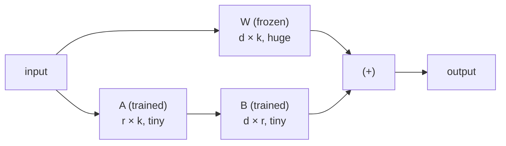
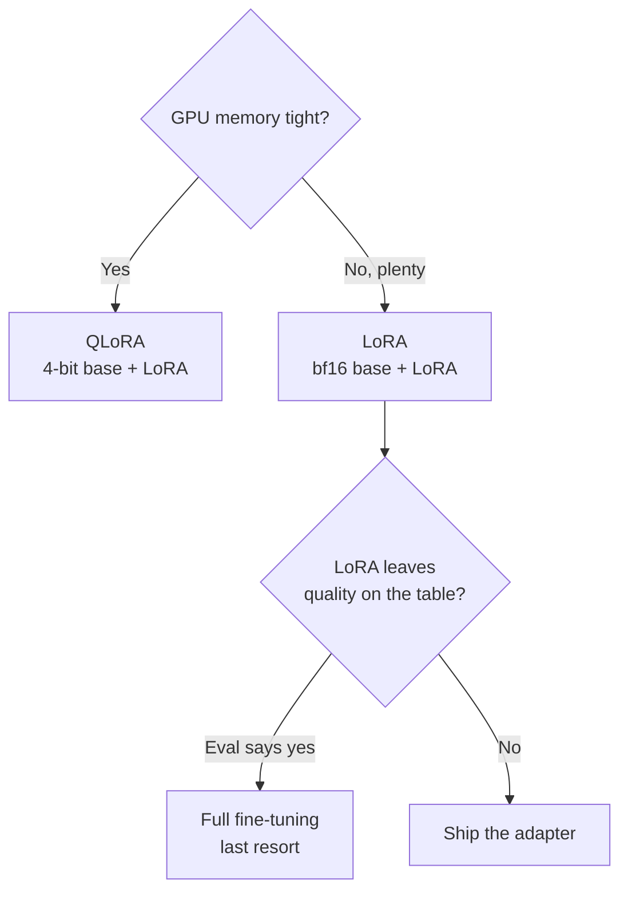

# LoRA & QLoRA

> **In one line:** LoRA freezes the giant model and trains two tiny matrices "alongside" each weight so you update `<1%` of the parameters and still change the behaviour — and QLoRA shrinks the frozen model to 4-bit so the whole thing fits on a single GPU.

:::tip[In plain English]
Imagine a finished oil painting (the trained model). Full fine-tuning means repainting the whole canvas — expensive and risky. LoRA is painting your changes on a thin sheet of *transparent overlay* you lay on top: the original is untouched, your overlay is tiny and cheap, and you can peel it off or swap a different one in. QLoRA goes further: it photographs the original at lower resolution (4-bit) so it takes up far less space on your desk, then you paint your overlay on top of *that*. The magic is that a surprisingly thin overlay is enough to teach the model a new behaviour.
:::

## The core idea: low-rank adapters

A model is full of big weight matrices. Full fine-tuning changes every number in them. **LoRA** (Low-Rank Adaptation) makes a bet that pays off: *the change you need to make is "low-rank"* — it can be approximated by multiplying two skinny matrices together.

Instead of updating a weight matrix `W` (size `d × k`), you **freeze `W`** and learn a small update `ΔW = B · A`, where:

- `A` is `r × k` (skinny)
- `B` is `d × r` (skinny)
- `r` (the **rank**) is tiny — often 8, 16, or 32.

At inference, the model uses `W + ΔW`. During training, only `A` and `B` get gradients; the billions of numbers in `W` never move.



**Why this works:** adapting a model to a narrow task doesn't require rich, full-rank changes everywhere — a low-rank nudge captures most of the needed adjustment. Empirically, LoRA matches full fine-tuning quality on most tasks while training a fraction of a percent of the weights.

## The parameter math (why it's so cheap)

For one matrix of size `d × k`:

- **Full fine-tuning trains** `d × k` parameters.
- **LoRA trains** `r × (d + k)` parameters (matrix `A` has `r·k`, matrix `B` has `d·r`).

Take a typical `4096 × 4096` projection with rank `r = 16`:

```text
Full:  4096 × 4096                = 16,777,216  params
LoRA:  16 × (4096 + 4096)         =    131,072  params   ->  ~0.8% of full
```

That ratio is why LoRA adapters are *megabytes*, not gigabytes, and why you can train on one GPU.

<CodeChallenge
  id="ft-lora-params"
  fnName="loraParams"
  prompt="Write loraParams(d, k, r) — return the number of TRAINABLE parameters a single LoRA adapter adds for a weight matrix of size d×k at rank r. Remember: matrix A is r×k and matrix B is d×r, and you train both. Return a single number."
  starter={`function loraParams(d, k, r) {\n  // A is r×k, B is d×r — count both\n}`}
  solution={`function loraParams(d, k, r) {\n  return r * k + d * r;\n}`}
  tests={[
    {args: [4096, 4096, 16], expected: 131072},
    {args: [4096, 4096, 8], expected: 65536},
    {args: [1024, 1024, 32], expected: 65536},
    {args: [4096, 11008, 16], expected: 241664},
    {args: [2048, 512, 4], expected: 10240},
  ]}
  hint="It's r*k (for A) plus d*r (for B). No bias terms. Just add the two products."
/>

## Rank and alpha — the two knobs

**Rank `r`** = the capacity of the adapter (how much it can change).

- Small `r` (4–8): cheapest, enough for simple style/format tweaks.
- Medium `r` (16–32): the common sweet spot for most tasks.
- Large `r` (64+): more capacity, more memory, more overfitting risk — only if evals say you need it.

**Alpha `α`** = a scaling factor on the adapter's contribution. The adapter output is scaled by `α / r` before being added to the frozen weights. The practical takeaway:

- A common convention is **`α = 2 × r`** (e.g. `r=16, α=32`).
- Raising `α` makes the adapter's effect stronger (like a louder learning rate for the adapter); lowering it makes it gentler.
- Don't overthink it: start at `r=16, α=32` and tune only if evals disappoint.

```python
from peft import LoraConfig

config = LoraConfig(
    r=16,                       # rank
    lora_alpha=32,              # alpha (= 2r convention)
    lora_dropout=0.05,          # regularization against overfitting
    target_modules="all-linear",# which layers get an adapter (broad = better quality)
    task_type="CAUSAL_LM",
)
```

`target_modules` chooses *which* matrices get adapters. Targeting all linear layers ("all-linear") usually gives the best quality; targeting only the attention projections is cheaper. Default to all-linear unless memory-bound.

## Quantization and QLoRA

**Quantization** = storing each weight in fewer bits. A model's weights are normally 16-bit floats (`bf16`). Quantizing to 8-bit halves the memory; to **4-bit** quarters it — with a small, usually acceptable, quality cost.

**QLoRA** = **Q**uantized model + Lo**RA**:

1. Load the big base model in **4-bit** (it's frozen, so low precision is fine).
2. Train **LoRA adapters in 16-bit** on top of it.

This is the combination that put fine-tuning large models within reach of a single GPU. The frozen base shrinks 4×; the trainable part is already tiny. A 70B model that needs ~140 GB in bf16 drops to ~35 GB in 4-bit — suddenly trainable on one high-memory GPU.

```python
from transformers import BitsAndBytesConfig
import torch

bnb = BitsAndBytesConfig(
    load_in_4bit=True,                          # the "Q" in QLoRA
    bnb_4bit_quant_type="nf4",                  # 4-bit NormalFloat — best for weights
    bnb_4bit_compute_dtype=torch.bfloat16,      # compute in bf16
    bnb_4bit_use_double_quant=True,             # quantize the quant constants too
)
# Pass quantization_config=bnb to from_pretrained / SFTTrainer, then attach LoRA as above.
```

## The memory math: will it fit on my GPU?

A rough rule for *full* fine-tuning memory: you need the model **plus** optimizer states (Adam keeps ~2 extra copies) **plus** gradients **plus** activations — call it **~16 bytes per parameter**. LoRA/QLoRA only pays the optimizer/gradient cost on the *tiny* adapter, so the dominant term becomes just storing the frozen base.

| Setup | ~Memory for a 7–8B model | Fits on… |
| --- | --- | --- |
| Full fine-tuning (bf16) | ~120+ GB | Multi-GPU cluster |
| LoRA (bf16 base) | ~18 GB | One 24 GB GPU (tight) |
| **QLoRA (4-bit base)** | **~6–10 GB** | One consumer GPU (e.g. 12–16 GB) |

```python
def gpu_gb_estimate(params_billions: float, bits: int) -> float:
    """Very rough memory to STORE the frozen base, in GB."""
    bytes_per_param = bits / 8
    base_gb = params_billions * 1e9 * bytes_per_param / 1e9
    return round(base_gb * 1.2, 1)   # +20% overhead for activations/runtime

print(gpu_gb_estimate(8, 16))   # ~9.6 GB just to store an 8B model in bf16
print(gpu_gb_estimate(8, 4))    # ~3.8 GB in 4-bit -> QLoRA headroom for training
print(gpu_gb_estimate(70, 4))   # ~33.6 GB -> a 70B QLoRA on one big GPU
```

## When to use which



- **QLoRA** — your default when memory is the constraint (one GPU, large model). Tiny quality cost, huge memory win.
- **LoRA** (non-quantized) — when you have memory headroom and want to avoid even the small quantization penalty. Slightly faster training, slightly better quality.
- **Full fine-tuning** — only when you have the compute *and* your evals prove LoRA isn't reaching the quality bar. Rare.

Tooling note for 2026: **Unsloth** (drop-in, 2× faster LoRA/QLoRA, lower memory) and **Axolotl** (config-file-driven training) are the two most popular wrappers around this exact stack — both produce standard LoRA adapters you serve like any other. A bonus you'll meet again on the [serving page](./09-serving-finetunes.md): because adapters are small and the base is shared, you can hot-swap *many* LoRA adapters on one served base model.

## Common pitfalls

:::caution[Where people trip up]
- **Rank cargo-culting.** Cranking `r` to 256 "to be safe" wastes memory and invites overfitting. Start at 16; raise only if evals demand it.
- **Forgetting the α/r scaling.** Alpha isn't independent of rank — if you change `r`, the effective strength changes unless you keep the `α = 2r` ratio in mind.
- **Targeting too few modules.** Adapting only attention layers can underperform; "all-linear" is usually the better quality/cost trade.
- **Assuming 4-bit is free.** QLoRA has a small quality cost. For most tasks it's invisible; on the hardest tasks, compare against bf16 LoRA before committing.
- **Losing the base model.** A LoRA adapter is useless without the exact base weights it was trained against. Version and pin both. (See [serving](./09-serving-finetunes.md).)
:::

<Quiz id="ft-lora-quick-check" variant="micro" title="Quick check">

<Question
  prompt="A colleague is surprised that your LoRA fine-tune of an 8B model produced a file of just a few megabytes. Why is the artifact so small?"
  options={[
    { text: "LoRA compresses the full model with 4-bit quantization before saving" },
    { text: "The trainer only saves layers whose weights actually changed" },
    { text: "It's a delta-encoded diff of the full weights" },
    { text: "Only the two skinny adapter matrices per layer are trained and saved — r×(d+k) parameters instead of d×k, under 1% of the model — while the frozen base never moves" }
  ]}
  correct={3}
  explanation="LoRA's bet is that the needed change is low-rank: freeze W and learn ΔW = B·A from two tiny matrices, e.g. ~131K params instead of ~16.8M for a 4096x4096 layer at r=16. The quantization answer confuses QLoRA's memory trick with the artifact size — the adapter is small because so few parameters were ever trainable."
/>

<Question
  prompt="You want to fine-tune a 70B model (~140 GB in bf16) on a single high-memory GPU. How does QLoRA make this possible?"
  options={[
    { text: "Load the frozen base in 4-bit (~35 GB) and train 16-bit LoRA adapters on top — low precision is fine for weights that never move" },
    { text: "Quantize both the base and the adapters to 4-bit so everything shrinks" },
    { text: "Stream layers from disk one at a time during training" },
    { text: "Train on a random 25% subset of the layers" }
  ]}
  correct={0}
  explanation="QLoRA = quantized frozen base + full-precision tiny adapters: the base shrinks 4x and the trainable part was already megabytes, so the whole job fits on one GPU. Quantizing the adapters too is the tempting symmetry — but the adapters are where gradients flow, so they stay in 16-bit; only the frozen part tolerates low precision."
/>

<Question
  prompt="Months later you try to deploy an old LoRA adapter but can't remember which base model checkpoint it was trained against. How bad is this?"
  options={[
    { text: "Not a problem — adapters are base-agnostic and work on any model of the same size" },
    { text: "Minor — the adapter will work but with slightly reduced quality" },
    { text: "Fatal — an adapter is a learned delta on top of specific frozen weights and is useless without the exact base it was trained against; version and pin both" },
    { text: "Recoverable — the base model can be reconstructed from the adapter weights" }
  ]}
  correct={2}
  explanation="The adapter encodes 'how to nudge these exact weights', so applying it to different weights produces nonsense — that's why the page says to version and pin base and adapter together. 'Same size = compatible' is the tempting shortcut, but matching dimensions only means the math runs, not that the result is meaningful."
/>

</Quiz>

---

→ Next: [Preference tuning: RLHF & DPO](./06-preference-tuning.md)
