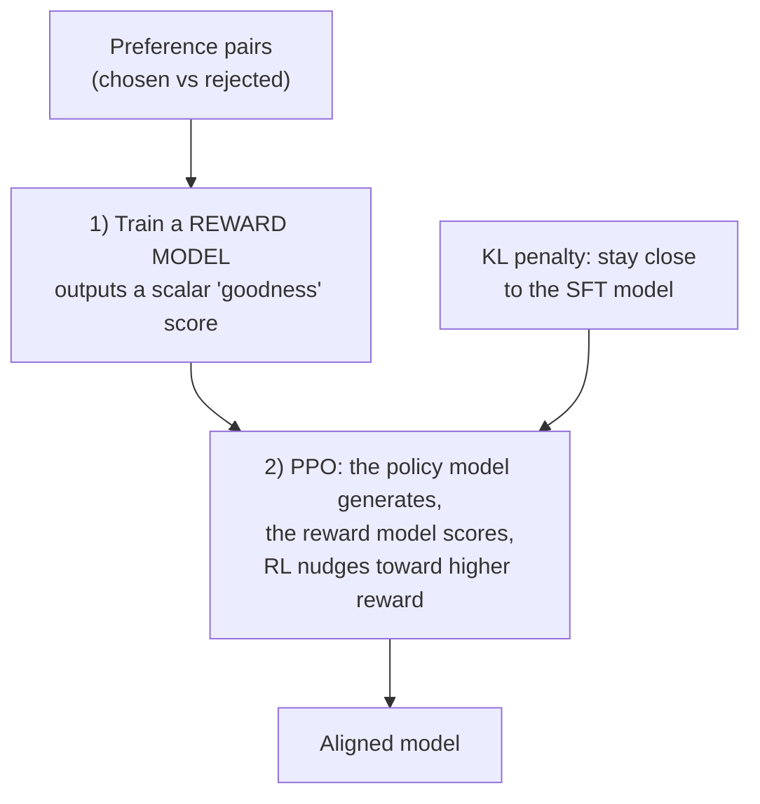
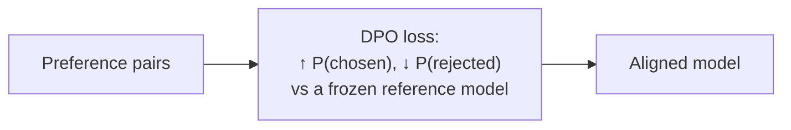

# Preference tuning: RLHF & DPO

> **In one line:** SFT teaches the model *one right answer per prompt*; preference tuning teaches it which of *two* answers is **better**, which is how you instill fuzzy, hard-to-write-down qualities like helpfulness, tone, and "don't be preachy."

:::tip[In plain English]
Some lessons are easy to teach by example ("here's the exact answer"). Others are only learnable by comparison — you can't write down "the perfect joke," but you can reliably say "that one was funnier than this one." Preference tuning is teaching by *thumbs-up / thumbs-down on pairs*: you show the model two of its own responses, tell it which the humans preferred, and it shifts toward producing more of the good kind. It's how the "assistant personality" of every chat model you've used was shaped, on top of plain SFT.
:::

## Why SFT isn't enough

SFT imitates ideal answers. But for many qualities there's no single ideal answer — there's only *better and worse*:

- Which of two correct answers is more **helpful**?
- Which is the right **tone** — warm without being saccharine?
- Which one **refused** appropriately vs over-refused a harmless request?

You can't easily author a "perfect" example for these, but humans (or a strong model) can *compare* two outputs quickly. Preference tuning turns that comparison signal into weight updates. The standard pipeline is: **pre-train → SFT → preference-tune.** Preference tuning is the final polish, never the starting point.

## The data: preference pairs

Preference tuning runs on a different dataset shape — for each prompt, a **chosen** (preferred) and a **rejected** response:

```json
{"prompt": "My package is late and I'm furious.", "chosen": "I'm really sorry — that's frustrating. I've located your order and re-shipped it express at no charge; tracking arrives within the hour.", "rejected": "Per policy, shipping delays are not guaranteed. You may file a claim through the portal."}
{"prompt": "Explain recursion simply.", "chosen": "Recursion is when a function calls itself on a smaller piece of the problem until it hits a base case — like Russian dolls, each opening a smaller one until the tiniest.", "rejected": "Recursion is a fundamental computer science concept involving self-reference in computational procedures and is widely studied."}
```

Where the pairs come from:

- **Human labelers** ranking two model outputs (the classic RLHF source).
- **A strong model as judge** ("AI feedback" / RLAIF) picking the better of two — cheaper, scalable, the common 2026 default for in-house work.
- **Implicit signals** — the answer a user kept vs the one they regenerated, the support reply an agent sent vs the draft they discarded.

## RLHF: reward model + PPO (the original recipe)

**RLHF** = **R**einforcement **L**earning from **H**uman **F**eedback. It's a two-stage machine:



1. **Train a reward model (RM).** Feed it the preference pairs; it learns to output a single number — how "good" a response is — that's higher for chosen than rejected answers.
2. **Optimize the policy with PPO** (Proximal Policy Optimization, a reinforcement-learning algorithm). The model generates responses, the reward model scores them, and PPO nudges the model toward higher-scoring outputs — with a **KL penalty** that punishes drifting too far from the original SFT model (so it doesn't find degenerate, reward-hacking outputs).

RLHF works and powered the first generation of aligned chat models, but it's **notoriously fiddly**: you train and serve a second model (the RM), RL is unstable, and "reward hacking" (the model games the RM with weird outputs that score high but are bad) is a constant threat.

## DPO: the simpler successor (your default)

**DPO** = **D**irect **P**reference **O**ptimization. Its insight: you don't actually need a separate reward model or RL at all. You can optimize directly on the preference pairs with a clever loss that, in effect, says: **"raise the probability of the chosen response and lower the probability of the rejected one, while not straying too far from the reference (SFT) model."**



Why DPO mostly replaced PPO for practitioners:

- **No reward model** to train, tune, or serve.
- **No RL loop** — it's just supervised-style training on pairs, stable and familiar.
- **Far less compute and far fewer ways to shoot yourself in the foot.**

It runs on the same TRL tooling as SFT, with LoRA, on one GPU:

```python
from datasets import load_dataset
from trl import DPOConfig, DPOTrainer
from peft import LoraConfig

pairs = load_dataset("json", data_files="prefs.jsonl", split="train")  # prompt/chosen/rejected

args = DPOConfig(
    output_dir="acme-dpo",
    beta=0.1,                       # KL strength: higher = stay closer to the reference model
    learning_rate=5e-6,             # preference tuning uses a LOW LR
    num_train_epochs=1,             # usually 1 epoch is enough; more risks degradation
    per_device_train_batch_size=2,
    bf16=True,
)

trainer = DPOTrainer(
    model="acme-support-ft",        # START from your SFT model, not the raw base
    args=args,
    train_dataset=pairs,
    peft_config=LoraConfig(r=16, lora_alpha=32, task_type="CAUSAL_LM"),
)
trainer.train()
```

The key knob is **`beta`** — how strongly to stay near the reference (SFT) model. Too low and the model over-optimizes the preferences and degrades; too high and it barely changes. Start around `0.1`.

**The DPO family keeps evolving.** You'll see successors and variants — **IPO** (fixes a DPO overfitting failure mode), **KTO** (learns from *single* thumbs-up/down labels instead of needing matched pairs, which is great when your data is "good/bad" not "A vs B"), and **ORPO** (folds SFT and preference tuning into one stage, skipping the separate SFT step). They share the same spirit — optimize preferences directly without RL. For a first project, plain **DPO** is the right starting point; reach for KTO if you only have unpaired good/bad labels.

## When would you actually reach for preference tuning?

Honestly: **less often than SFT, and usually only after SFT.** Reach for it when:

- The remaining gap is about *tone, helpfulness, refusal behaviour, or "feel"* — qualities you can compare but not author.
- You have (or can cheaply generate) **preference pairs**, and SFT alone plateaued.
- You're building a product-defining "voice" where the difference between good and great matters.

Skip it when SFT already hits your eval bar, when you can't produce reliable preference data, or when the real problem is missing knowledge (RAG) or format (SFT). Many excellent fine-tunes never touch preference tuning at all.

## Common pitfalls

:::caution[Where people trip up]
- **Starting preference tuning from the raw base model.** Always SFT first; preference tuning is polish on an already-competent model.
- **Reaching for PPO/RLHF by default.** Unless you have a specific reason and an ML team, use **DPO** (or a successor). PPO is more power, far more pain.
- **Reward hacking / over-optimization.** Push too hard (low `beta`, too many epochs) and the model games the signal — verbose, sycophantic, or degenerate outputs that "score well." Keep `beta` sane and **evaluate against held-out tasks**, not the preference signal.
- **Low-quality or inconsistent preference pairs.** Garbage comparisons teach garbage preferences. Calibrate your labelers/judge just like an [LLM-as-judge](/docs/evaluation).
- **Using it to fix the wrong problem.** Preference tuning won't add knowledge or fix a broken format — it shapes *which good answer* the model prefers, nothing more.
:::

<Quiz id="ft-preference-quick-check" variant="micro" title="Quick check">

<Question
  prompt="Your SFT model is accurate but its tone is off — sometimes too curt, sometimes saccharine — and you can't write down what the 'perfect' tone is, only recognize the better of two replies. Which technique fits, and why?"
  options={[
    { text: "More SFT with longer, more detailed tone instructions in the examples" },
    { text: "RAG, so the model can retrieve tone guidelines at runtime" },
    { text: "Preference tuning — it learns from comparisons (chosen vs rejected), exactly for qualities you can compare but not author" },
    { text: "A higher temperature to vary the tone until users find one they like" }
  ]}
  correct={2}
  explanation="SFT needs a single ideal answer per prompt, but 'better tone' only exists as a relative judgment — preference tuning turns thumbs-up/down pairs into weight updates. More SFT is the tempting answer since it's familiar, but if you can't author the perfect example, you can't SFT toward it; you can still reliably rank pairs."
/>

<Question
  prompt="Why did DPO mostly replace the classic RLHF (reward model + PPO) recipe for practitioners, according to this page?"
  options={[
    { text: "DPO optimizes the preference pairs directly — no separate reward model to train and serve, no unstable RL loop, far fewer ways to fail" },
    { text: "DPO produces strictly higher-quality models than PPO in all cases" },
    { text: "PPO is patented and requires licensing fees" },
    { text: "DPO doesn't need preference data, only regular SFT examples" }
  ]}
  correct={0}
  explanation="DPO's insight is that you can raise P(chosen) and lower P(rejected) against a frozen reference model with a supervised-style loss — eliminating the reward model, the RL instability, and the constant threat of reward hacking. 'Strictly better quality' overstates it: PPO is more power with more pain; DPO wins on simplicity and stability, which is what most teams need."
/>

<Question
  prompt="You set DPO's beta very low and train for several epochs to 'really lock in' the preferences. What does this page warn will happen?"
  options={[
    { text: "Training will diverge immediately with NaN losses" },
    { text: "The model over-optimizes and games the signal — verbose, sycophantic, or degenerate outputs that 'score well' on preferences while degrading on real tasks" },
    { text: "Nothing — lower beta and more epochs simply mean stronger alignment" },
    { text: "The model reverts to the raw base model's behaviour" }
  ]}
  correct={1}
  explanation="Beta is the leash to the reference model; loosen it too far and push too long, and the model finds outputs that satisfy the preference signal without being genuinely better — the DPO cousin of reward hacking. 'Stronger alignment' is the intuitive reading of the knobs, which is why the page says keep beta sane and judge on held-out tasks, never the preference signal itself."
/>

</Quiz>

---

→ Next: [Distillation](./07-distillation.md)
