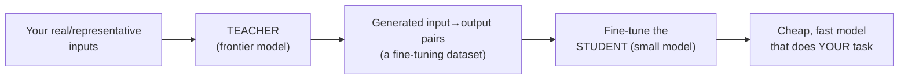

# Distillation

> **In one line:** Distillation is "have an expensive genius model do the task perfectly thousands of times, then train a cheap small model to imitate it" — the result is a tiny model that nails *your one job* at a fraction of the cost and latency.

:::tip[In plain English]
A world-class chef (the frontier model) is brilliant but charges a fortune per dish and is slow. You can't afford to call them for every order. So you have them cook 5,000 dishes while a line cook (the small model) watches and copies — and soon the line cook makes *your specific menu* almost as well, for cents, fast, at scale. You'll never serve the genius's full range from the line cook, but you don't need the full range. You need *your menu*, cheap. That's distillation: transfer the skill for one job from a big teacher into a small student.
:::

## The idea: teacher → student

You have two models:

- **The teacher** — a frontier model (GPT-4.1, Claude, Gemini Pro, a big open model). Expensive, slow, but excellent.
- **The student** — a small model (a 1–8B open model, or a small hosted model). Cheap, fast, but mediocre out of the box.

You use the teacher to *generate the training data*, then fine-tune the student on it. The student learns to reproduce the teacher's behaviour on your task.



This is just SFT (and optionally [preference tuning](./06-preference-tuning.md)) where the *labels come from a model* instead of a human. Everything you learned in [data prep](./03-data-prep.md) and [SFT](./04-sft.md) applies — distillation is a *data-sourcing strategy*, not a separate training algorithm.

## Why it's often the best reason to fine-tune

Distillation is the use case where fine-tuning's ROI is clearest, because the win is concrete and measurable:

- **Cost.** A small fine-tuned model can be **10–50× cheaper per token** than the frontier model it imitates.
- **Latency.** Small models are dramatically faster — often the difference between a 2s and a 200ms response.
- **Throughput / control.** You can self-host the student, scale it, and you're not rate-limited by a provider.
- **No prompt overhead.** The teacher needed a 2,000-token system prompt + few-shot examples to behave; the distilled student has the behaviour *baked in* and needs almost no prompt — saving tokens on every single call.

The honest caveat: the student matches the teacher **only on the distribution you trained it on.** Push it off-task and it falls apart. That's fine — distillation is for *narrowing* a model to one job, not preserving general intelligence.

## Generating the distillation dataset

The whole game is getting the teacher to produce a diverse, high-quality dataset over inputs that match what the student will see in production.

```python
from openai import OpenAI
import json
client = OpenAI()

# 1. Collect REAL inputs (best) or generate representative ones.
real_inputs = [
    "Summarize this email and extract any action items: ...",
    "Classify this support ticket as billing/technical/account: ...",
    # ... ideally thousands, sampled from real production traffic
]

TEACHER_SYSTEM = (
    "You are an expert assistant. Produce the IDEAL response. "
    "Output strictly as: {\"summary\": str, \"action_items\": [str]}."
)

def label_with_teacher(user_input: str) -> dict:
    r = client.chat.completions.create(
        model="gpt-4.1",                         # the expensive teacher
        messages=[{"role": "system", "content": TEACHER_SYSTEM},
                  {"role": "user", "content": user_input}],
        response_format={"type": "json_object"},
        temperature=0.2,                          # low temp = consistent labels
    )
    return json.loads(r.choices[0].message.content)

# 2. Build the student's training file (note: SHORT system prompt for the student).
STUDENT_SYSTEM = "Summarize and extract action items as JSON."
with open("distill_train.jsonl", "w") as f:
    for inp in real_inputs:
        ideal = label_with_teacher(inp)
        row = {"messages": [
            {"role": "system", "content": STUDENT_SYSTEM},
            {"role": "user", "content": inp},
            {"role": "assistant", "content": json.dumps(ideal)},
        ]}
        f.write(json.dumps(row) + "\n")
```

Then fine-tune the student exactly as in [SFT](./04-sft.md) — LoRA/QLoRA on an 8B open model, or a hosted FT job on a small model.

Quality levers that decide whether distillation works:

- **Use real production inputs** if you can — they carry the true distribution and edge cases. Synthetic inputs work but need deliberate diversity (see [synthetic data](./03-data-prep.md)).
- **Use the strongest teacher you can afford**, with your best prompt. The student's ceiling is the teacher's output. Garbage teacher → garbage student.
- **Filter the teacher's outputs.** Even great teachers occasionally produce bad labels — drop malformed JSON, off-policy answers, refusals you didn't want.
- **Match the student's prompt to training.** If you trained with a short system prompt, serve with that same short prompt.

## Beyond imitation: what "distillation" can include

The simple, dominant form in practice is **response/output distillation** — train the student on the teacher's *final text*, as above. You'll also encounter richer variants (good "go deeper" territory, not required for a first project):

- **Logit / soft-label distillation.** The student also learns to match the teacher's full *probability distribution* over next tokens, not just the chosen word. Richer signal, but requires access to the teacher's logits — usually only possible with open teacher models.
- **Rationale / chain-of-thought distillation.** Have the teacher produce its reasoning, and train the student on the reasoning *and* the answer. This is how small models are taught to "reason" — and it's exactly how the open reasoning-model wave was built (see [reasoning models](/docs/foundations/reasoning-models)).
- **Preference distillation.** Use the teacher to *rank* pairs, then DPO the student — combining distillation with [preference tuning](./06-preference-tuning.md).

For 99% of product work, plain response distillation onto a small model is what you want.

## A quick cost sketch

```python
def monthly_cost(calls, in_tok, out_tok, in_price, out_price):
    """Prices are $ per 1M tokens."""
    return calls * (in_tok * in_price + out_tok * out_price) / 1e6

# Frontier teacher serving production directly, with a big prompt:
teacher = monthly_cost(calls=2_000_000, in_tok=2200, out_tok=300,
                       in_price=2.5, out_price=10.0)

# Distilled small model: tiny prompt baked-in, cheap tokens:
student = monthly_cost(calls=2_000_000, in_tok=250, out_tok=300,
                       in_price=0.10, out_price=0.30)

print(round(teacher), round(student), f"{teacher/student:.0f}x cheaper")
# e.g. ~17000  ~230  ~74x  (plus a one-time teacher cost to LABEL the dataset)
```

The teacher cost to *label* the dataset is a one-time expense; the student then serves cheaply forever (until the task drifts and you re-distill).

## A legal/ToS note

Some frontier providers' terms restrict using their model's outputs to train a *competing* model. For internal task-specific distillation this is generally fine, but check the provider's terms for your use case, especially if you plan to release the student model.

## Common pitfalls

:::caution[Where people trip up]
- **Weak teacher.** The student can't exceed the teacher. Use the best model + best prompt to generate labels.
- **No input diversity.** A student trained on 500 near-identical inputs is brittle. Use real traffic or deliberately varied synthetic inputs.
- **Not filtering teacher outputs.** Teachers occasionally err; unfiltered errors get baked into the student.
- **Expecting general intelligence.** A distilled small model is a *specialist*. It will fail off-task — by design. Don't benchmark it on things you didn't train it for.
- **Prompt mismatch at serving time.** Train and serve with the *same* (short) prompt, or behaviour shifts.
- **Ignoring provider ToS.** Confirm you're allowed to train on the teacher's outputs for your use case.
:::

<Quiz id="ft-distillation-quick-check" variant="micro" title="Quick check">

<Question
  prompt="Your distilled 8B student matches the frontier teacher on your ticket-classification task, but a teammate benchmarks it on general trivia and reports it's 'broken'. What's the right interpretation?"
  options={[
    { text: "The distillation failed — a good student should match the teacher everywhere" },
    { text: "The student needs more epochs to absorb the teacher's general knowledge" },
    { text: "The benchmark is buggy; small models retain general ability after distillation" },
    { text: "Working as designed — distillation narrows a model to one job; the student matches the teacher only on the trained distribution and fails off-task by design" }
  ]}
  correct={3}
  explanation="The student is a specialist: you transferred the skill for your menu, not the chef's full range. 'Should match everywhere' is the natural expectation since the teacher does both — but the cost/latency win comes precisely from giving up generality, so don't benchmark the student on things you didn't train it for."
/>

<Question
  prompt="To save money, a team generates their distillation dataset with a cheap mid-tier model instead of the frontier teacher. What does this page predict?"
  options={[
    { text: "A weak student — the student's ceiling is the teacher's output quality, so a garbage teacher makes a garbage student" },
    { text: "The same result, since the student can't tell teachers apart anyway" },
    { text: "A better student, because mid-tier outputs are easier for a small model to imitate" },
    { text: "Failure to train, since distillation requires logit access to the teacher" }
  ]}
  correct={0}
  explanation="The student learns to imitate whatever labels it's shown, errors included — the labeling cost is a one-time expense, so skimping there caps your quality forever. The 'easier to imitate' theory sounds clever but inverts the logic; and logits are only needed for the soft-label variant, not standard response distillation."
/>

<Question
  prompt="You trained the student with a short 10-word system prompt, but in production someone deploys it with the teacher's original 2,000-token system prompt 'to be safe'. What's the risk?"
  options={[
    { text: "None — more instructions can only help" },
    { text: "Slower inference, but identical output quality" },
    { text: "Behaviour shifts — the student learned to behave under the prompt it was trained with, so serve with that same short prompt" },
    { text: "The long prompt overflows the small model's context window" }
  ]}
  correct={2}
  explanation="Prompt mismatch between training and serving changes the input distribution the model conditioned on, so its behaviour drifts unpredictably — and you also forfeit the token savings that motivated distillation. 'More instructions can only help' is the safe-sounding intuition; for a distilled specialist, the behaviour is baked into the weights, and the prompt should match training."
/>

</Quiz>

---

→ Next: [Evaluating fine-tunes](./08-evaluating-finetunes.md)
