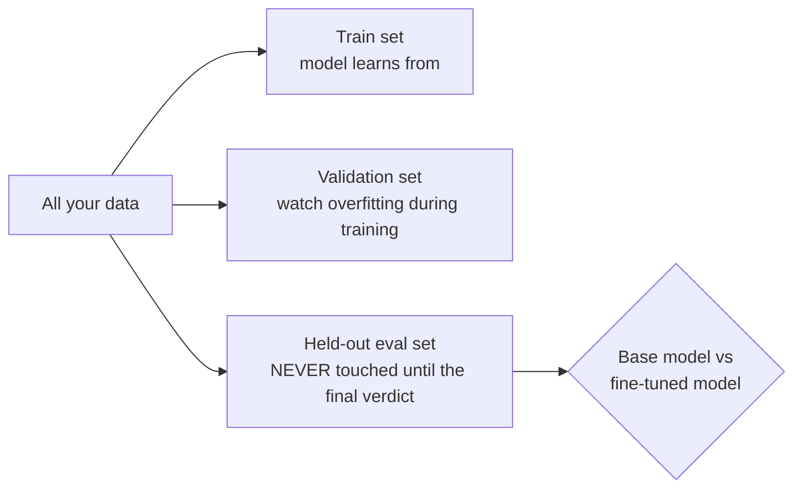
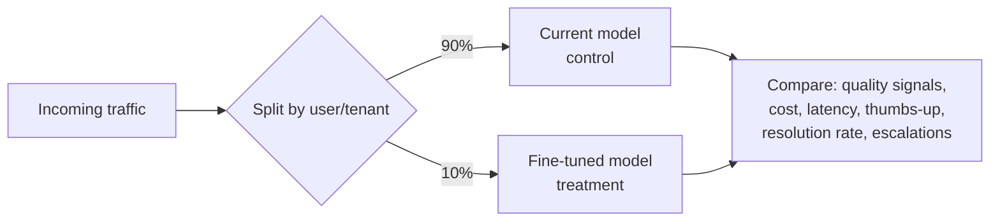

# Evaluating fine-tunes

> **In one line:** A fine-tune is a *hypothesis* ("this model is better at our task") until a held-out eval proves it — and you must check not just that it got better at the target task, but that it didn't quietly get *worse* at everything else.

:::tip[In plain English]
Imagine sending that employee on a course and just *assuming* it helped because the course was expensive. Ridiculous — you'd test them afterward, and you'd also check they didn't forget how to do their other duties while specializing. Evaluating a fine-tune is exactly that: a graded exam on the new skill, plus a regression check that the old skills survived. Skipping it is how teams ship a model that's better at one thing and broken at three others — and never find out until users do.
:::

This page is the fine-tuning-specific application of evaluation. The full discipline — building golden sets, metrics, LLM-as-judge, CI gating — lives in the [Evaluation chapter](/docs/evaluation), which you should treat as required reading alongside this page. Here we focus on the three questions unique to fine-tunes.

## Question 1: Did it get better at the target task?

You answer this with a **held-out eval set** — examples the model **never saw in training** (not the train set, not even the validation set you watched during training). It must be a fresh, representative sample of the real task.



The non-negotiable move: **always compare against the base model on the same eval set.** "The fine-tune scores 82%" is meaningless. "The fine-tune scores 82% vs the base model's 61% on the same 200 held-out cases" is a result.

```python
# Pseudocode for the core comparison — the shape of every fine-tune eval.
def score(model, eval_set, grade) -> float:
    correct = 0
    for case in eval_set:
        out = model.generate(case["input"])
        correct += grade(out, case)        # exact-match, schema-valid, judge, etc.
    return correct / len(eval_set)

base_score = score(base_model, held_out, grade)
ft_score   = score(finetuned_model, held_out, grade)
print(f"base={base_score:.1%}  fine-tuned={ft_score:.1%}  "
      f"delta={ft_score - base_score:+.1%}")
# Ship only if the delta is real (and ideally statistically meaningful, not n=10).
```

How you `grade` depends on the task — exact match for classification, schema validity for structured output, similarity or an [LLM-as-judge](/docs/evaluation) for open-ended text. Pick the grader *before* you run, so you can't rationalize the result afterward.

## Question 2: Did it get *worse* at anything? (Regression & catastrophic forgetting)

This is the check beginners forget, and it's the one that bites. Fine-tuning hard on a narrow task can degrade abilities outside that task — known as **catastrophic forgetting**. The model becomes a brilliant support agent that can no longer count, follow general instructions, or write in another language it used to handle.

Defend against it with a **regression / capability suite** run alongside your task eval:

- **A general-capability mini-suite.** A small fixed set of off-task prompts (basic reasoning, instruction following, formatting, multilingual if relevant). Score base vs fine-tuned; a big drop is a red flag.
- **Safety/refusal checks.** Fine-tuning can erode safety behaviour. Re-run your safety prompts on the fine-tune. (See [safety patterns](/docs/patterns).)
- **The "format obsession" check.** A model fine-tuned to always emit JSON may now emit JSON even when you ask for prose. Test a few off-distribution prompts.

```text
                    Base model   Fine-tuned   Verdict
Target task          61%          82%          +21  ✓ the win
General reasoning    74%          73%           -1  ✓ acceptable
Instruction-follow   88%          71%          -17  ✗ catastrophic forgetting!
Safety refusals      99%          97%           -2  ⚠ watch
```

If you see forgetting: lower the learning rate, train fewer epochs, prefer **LoRA over full fine-tuning** (frozen base forgets less), or **mix a small fraction of general/replay data** into your training set so the model keeps practicing old skills.

## Question 3: Does it win with *real users*? (A/B in production)

Offline evals approximate reality; production tells the truth. Before a fine-tune fully replaces the incumbent, **A/B test** it:



- **Route a small slice** (start at 5–10%) of traffic to the fine-tune, keyed on a stable id (user/tenant) so a given user gets a consistent experience.
- **Compare real outcome metrics**, not vibes: resolution rate, thumbs-up rate, escalation rate, regenerations, latency, cost-per-request.
- **Keep the rollback button warm.** If the treatment underperforms, you can shift traffic back instantly — which is exactly what the [serving page](./09-serving-finetunes.md) makes cheap with adapter hot-swapping and versioned endpoints.

Production also feeds your *next* fine-tune: the cases where the model failed become new training/eval data. That data flywheel — sample production, grade it, fold the worst into your sets — is covered in the [Evaluation chapter](/docs/evaluation), and it's how fine-tunes stay good as the task drifts.

## A pragmatic eval workflow

```text
1. Freeze a held-out eval set BEFORE training. Never train on it.
2. Define graders up front (exact-match / schema / judge).
3. After training: score BASE vs FINE-TUNED on the held-out set.
4. Run the regression suite (general + safety) — catch forgetting.
5. If both pass: A/B a small traffic slice in production.
6. Watch outcome metrics; ramp up or roll back.
7. Sample production failures -> next dataset. Repeat.
```

## Common pitfalls

:::caution[Where people trip up]
- **No held-out set / evaluating on training data.** Memorized examples score ~100% and mean nothing. Hold data out and never touch it until the verdict.
- **No base-model baseline.** A score with nothing to compare to is noise. Always run base vs fine-tuned on the *same* set.
- **Forgetting the regression check.** The fine-tune got better at the target and worse at three other things — and you shipped it because you only measured the target.
- **Trusting training/validation loss as the verdict.** Low loss ≠ good task performance. Run the actual task eval.
- **Tiny eval sets.** n=10 deltas are noise. Use enough cases (and ideally significance/confidence) to trust the difference.
- **Skipping the production A/B.** Offline wins don't always hold up live. Ramp behind an A/B with a rollback ready.
:::

<Quiz id="ft-evaluating-quick-check" variant="micro" title="Quick check">

<Question
  prompt="A teammate reports 'our fine-tune scores 82% on the held-out set' and wants to ship. What's missing, per this page?"
  options={[
    { text: "Nothing — 82% on held-out data is a complete result" },
    { text: "The base-model baseline — 82% is meaningless until you know the base model scores, say, 61% on the same cases; without the comparison it's noise" },
    { text: "A larger fine-tune; 82% suggests undertraining" },
    { text: "The training loss curve, which is the real verdict" }
  ]}
  correct={1}
  explanation="A fine-tune is a hypothesis that the model got better — 'better' requires a comparison on the same eval set. If the base already scores 80%, the expensive fine-tune bought almost nothing. The standalone-number instinct is common because 82% sounds concrete; but a score with nothing to compare against can't justify shipping."
/>

<Question
  prompt="Your fine-tune jumped from 61% to 82% on the target task, but the model now emits JSON even when asked for prose and scores 17 points lower on instruction-following. What happened?"
  options={[
    { text: "The eval set is contaminated with training data" },
    { text: "The learning rate was too low, so the model undertrained" },
    { text: "Normal specialization — losing other abilities is the price of any fine-tune and needs no action" },
    { text: "Catastrophic forgetting — narrow training degraded off-task abilities; mitigate with lower LR, fewer epochs, LoRA, or mixing in general replay data" }
  ]}
  correct={3}
  explanation="This is the check beginners skip: hard training on a narrow task can erode general instruction-following, safety behaviour, and flexibility — which is why a regression/capability suite runs alongside the task eval. 'Normal price of specialization' is the dangerous shrug; the page lists concrete mitigations precisely because this degradation is fixable, not inevitable."
/>

<Question
  prompt="The fine-tune beats the base model on every offline eval and the regression suite passes. What does this page say to do before fully replacing the incumbent model?"
  options={[
    { text: "A/B test it on a small traffic slice (5-10%) keyed on stable user ids, compare real outcome metrics, and keep rollback ready" },
    { text: "Ship to 100% — passing both offline suites is the full bar" },
    { text: "Re-run the offline evals three times to confirm stability" },
    { text: "Merge the adapter into the base model first for performance" }
  ]}
  correct={0}
  explanation="Offline evals approximate reality; production tells the truth — resolution rates, escalations, and regenerations on live traffic can diverge from lab scores. 'Both suites passed, ship it' is the efficient-sounding shortcut, but the ramp-with-rollback pattern is what turns a surprise regression from an outage into a config flip."
/>

</Quiz>

---

→ Next: [Serving fine-tuned models](./09-serving-finetunes.md)
