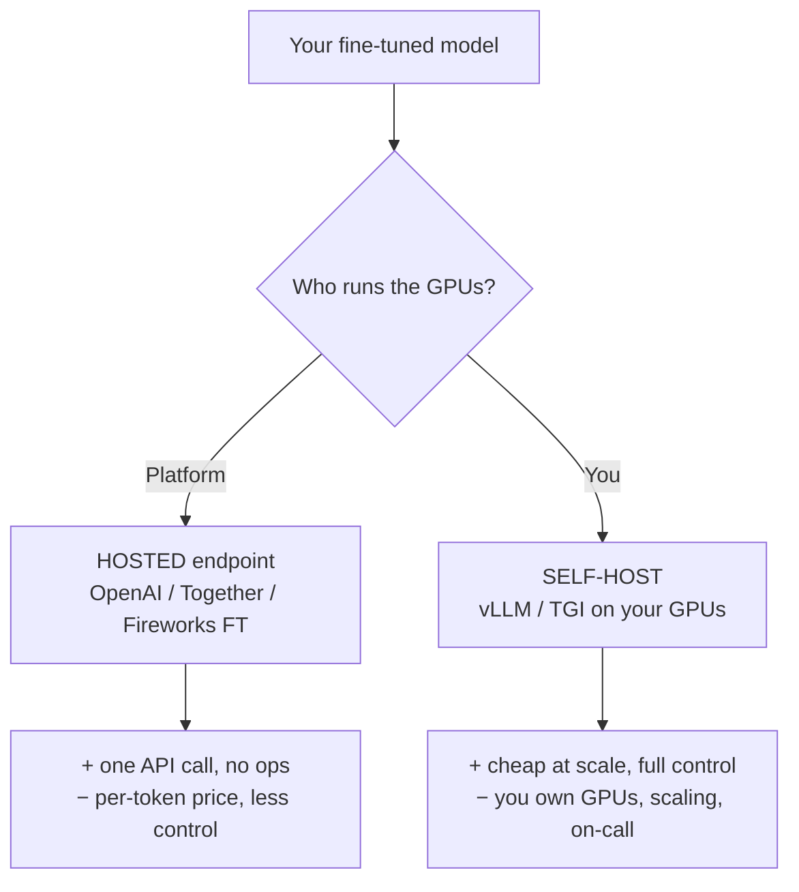
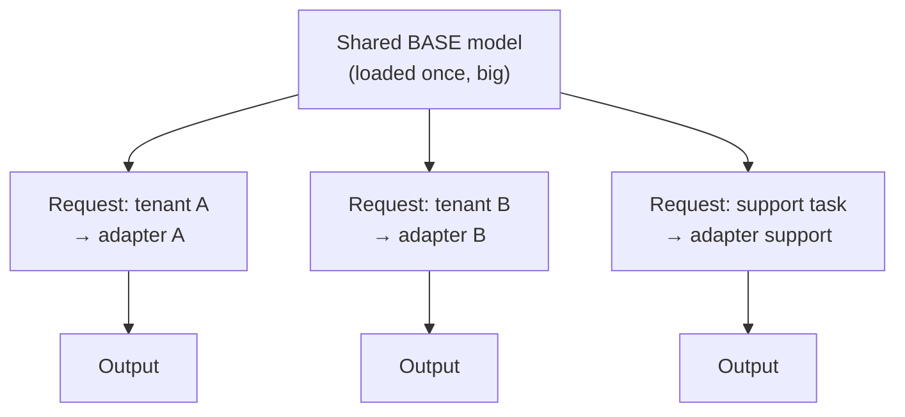
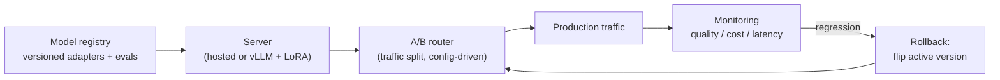

# Serving fine-tuned models

> **In one line:** A trained model is worthless until it's reachable behind an API — and the big decision is hosted-vs-self-host, the big efficiency trick is serving *many LoRA adapters on one shared base*, and the big safety net is versioning with instant rollback.

:::tip[In plain English]
You finished the training course; now the employee has to actually show up for work. Serving is "show up for work" for models. The easiest option is to let a platform run them for you (you just call an API). The cheaper-at-scale but harder option is to run the GPUs yourself. And the clever trick: since a LoRA adapter is just a thin overlay on a shared base model, one GPU can hold the base once and *swap overlays per request* — so you can serve fifty different fine-tunes for barely more than the cost of one. Throughout, you treat each fine-tune like a software release: numbered versions, and a button to roll back the instant one misbehaves.
:::

## The two paths: hosted vs self-host



**Hosted fine-tune endpoints** (OpenAI, Together, Fireworks). You upload data, the platform trains, and your fine-tune becomes a model name you call exactly like a base model:

```python
from openai import OpenAI
client = OpenAI()

resp = client.chat.completions.create(
    model="ft:gpt-4.1-mini-2025-04-14:acme::abc123",   # your fine-tuned model id
    messages=[{"role": "user", "content": "My order is late."}],
)
```

No GPUs, no scaling, no on-call. You pay a per-token premium and accept less control. **This is the right default unless cost-at-scale or data-residency forces self-hosting.**

**Self-hosting** with an inference server like **vLLM** (or TGI) on your own GPUs. More work, but cheaper at high volume, fully under your control, and required if your data can't leave your infrastructure:

```bash
# Serve a base model with vLLM, OpenAI-compatible API, with LoRA enabled.
vllm serve meta-llama/Llama-3.1-8B-Instruct \
  --enable-lora \
  --lora-modules acme-support=/models/acme-support-lora \
  --max-loras 8                    # how many adapters to keep hot at once
```

(See [inference servers](/docs/stack/inference-servers) for the deeper serving treatment.)

## Multi-adapter serving: LoRA hot-swapping (the big win)

This is the trick that makes fine-tuning economical at scale. Recall from the [LoRA page](./05-lora-qlora.md) that an adapter is a tiny overlay on a frozen base model. So:

- **Load the base model once.** It's the expensive part (gigabytes of GPU memory).
- **Attach many small adapters** to that one base. Each adapter is MBs.
- **Pick the adapter per request** by name — the server swaps the active overlay on the fly.



```python
# vLLM: route each request to a different LoRA adapter by name — one base, many tunes.
from openai import OpenAI
client = OpenAI(base_url="http://localhost:8000/v1", api_key="x")

for adapter in ["acme-support", "acme-sales", "acme-legal"]:
    r = client.chat.completions.create(
        model=adapter,                        # the adapter name = the "model"
        messages=[{"role": "user", "content": "Draft a reply."}],
    )
```

Why this matters: serving 50 per-customer fine-tunes the naive way means 50 model copies and 50× the GPUs. With LoRA hot-swapping it's **one base + 50 tiny adapters on a handful of GPUs.** This is also how hosted platforms can offer cheap fine-tuning — under the hood, your fine-tune is often a LoRA adapter multiplexed onto a shared base. The trade-off: hot-swapping adds a little latency vs a dedicated merged model, and very large adapter counts need enough memory/`--max-loras` headroom.

> **Merge vs adapter.** You *can* "merge" a LoRA into the base to get a single standalone model (slightly faster inference, no swap overhead) — but you lose the multi-adapter and easy-rollback benefits. Merge only when you're serving exactly one fine-tune at high volume.

## Versioning: treat models like software releases

A fine-tune is an artifact that will change. Without versioning you can't answer "which model produced this output?" or "what changed?"

- **Pin both the adapter *and* its exact base model.** An adapter is meaningless without the precise base weights it was trained against. Record `base_model@version + adapter@version` as one unit.
- **Immutable, numbered versions.** `acme-support-v3`, never "latest." Each maps to a specific training run, dataset hash, and eval scores.
- **Track lineage.** For every deployed model store: dataset version, hyperparameters, base model, and the held-out [eval](./08-evaluating-finetunes.md) numbers that justified shipping it.
- **A model registry** (even a simple table or MLflow) is enough to start.

```python
# Minimal version record — what you log for every shipped fine-tune.
deployment = {
    "name": "acme-support",
    "version": "v3",
    "base_model": "Llama-3.1-8B-Instruct@2025-07",
    "adapter_uri": "s3://models/acme-support/v3/adapter",
    "dataset_hash": "sha256:9f1c…",
    "hyperparams": {"epochs": 2, "lr": 2e-4, "r": 16, "alpha": 32},
    "eval": {"target_task": 0.82, "regression_suite": "pass"},
    "promoted_at": "2026-05-30T10:00:00Z",
}
```

## Rollback: the button you must have before you need it

Fine-tunes regress. When `v3` misbehaves in production, you need to be back on `v2` in seconds, not after a re-deploy.

- **Keep the previous version warm** (or instantly loadable). With hosted endpoints, just point your app's model id back. With self-host + LoRA, the old adapter is already on disk — swap the name.
- **Make the active model a config value, not a code constant.** Flip an environment variable / feature flag; no deploy required.
- **Wire rollback to your [A/B and monitoring](./08-evaluating-finetunes.md).** If treatment metrics dip below a threshold, auto-shift traffic back to control.

```python
# The active model is config, so rollback = change one value.
ACTIVE_MODEL = config.get("acme_support_model", "acme-support-v3")  # flip to v2 instantly

resp = client.chat.completions.create(model=ACTIVE_MODEL, messages=msgs)
```

## Putting it together



That's the full serving picture: a registry of versioned fine-tunes, a server (hosted for simplicity, self-hosted with multi-LoRA for scale/control), a config-driven A/B router, monitoring, and a rollback that's one config flip away.

## Common pitfalls

:::caution[Where people trip up]
- **Self-hosting before you need to.** GPUs and on-call are real costs. Start hosted; self-host only when cost-at-scale or data-residency demands it.
- **Serving one model copy per fine-tune.** If you have many tunes on the same base, use LoRA hot-swapping — one base, many adapters — or your GPU bill explodes.
- **Losing the base model.** An adapter without its exact base is dead weight. Pin and version them together.
- **"latest" instead of pinned versions.** You can't reproduce, compare, or safely roll back without immutable version ids.
- **No rollback path.** Discovering a regression with no way back but a re-deploy turns a 30-second fix into a 30-minute outage. Make the active model a config flip.
- **Prompt drift between train and serve.** Serve with the same (often short) system prompt the model was trained with, or behaviour shifts.
:::

---

→ Next: [Chapter checkpoint](./99-checkpoint.md)
