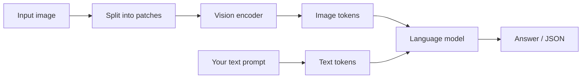
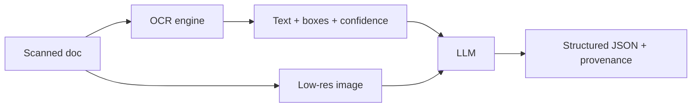

# Vision — models that see

> **In one line:** A vision-language model turns an image into the same kind of "tokens" it already understands for text, so you can hand it a photo, a chart, or a scanned invoice and ask questions — or demand a strict JSON answer — in one call.

:::tip[In plain English]
A text model reads a sentence as a list of little number-chunks called tokens. A **vision-language model (VLM)** does the same trick to pictures: it slices the image into a grid of patches, turns each patch into numbers, and feeds those numbers into the model right alongside your words. From the model's point of view, a photo is just "more tokens." That's why you can put an image and a question in the same message and get one answer back. The catch: images are *big*. A single high-resolution photo can cost as much as a page of text, so a lot of vision engineering is really about *shrinking the picture before you pay for it*.
:::

## How a model "sees": patches → tokens

You met the mechanism in the [foundations multimodal-inputs page](/docs/foundations/multimodal-inputs); here's the working version. A VLM runs the image through a *vision encoder* (historically a Vision Transformer) that chops it into fixed-size patches — say 14×14 pixels each — embeds every patch into a vector, and produces a sequence of **image tokens**. Those tokens are projected into the same space as text tokens and concatenated. The language model then attends over text and image tokens together.



Two consequences fall straight out of this:

1. **More pixels = more tokens = more cost and latency.** Doubling the resolution roughly quadruples the patches.
2. **The model never sees the raw file** — it sees a downsampled, patchified version. If text in your image is smaller than a patch can resolve, the model literally cannot read it. That's the root cause of most "why did it hallucinate the invoice total?" bugs.

## A real vision call

Vision is delivered as a *message with multiple parts*: some text, some image. Here's the canonical shape for a "describe this" call.

```python
# pip install openai
from openai import OpenAI
client = OpenAI()

resp = client.chat.completions.create(
    model="gpt-4o",  # any current vision model
    messages=[{
        "role": "user",
        "content": [
            {"type": "text", "text": "What is happening in this photo? One sentence."},
            {"type": "image_url",
             "image_url": {"url": "https://example.com/street.jpg"}},
        ],
    }],
)
print(resp.choices[0].message.content)
```

For local files you send a **base64 data URL** instead of a public link — most production traffic is base64, because your images aren't on a public CDN.

```python
import base64, mimetypes

def data_url(path: str) -> str:
    mime = mimetypes.guess_type(path)[0] or "image/jpeg"
    with open(path, "rb") as f:
        b64 = base64.b64encode(f.read()).decode()
    return f"data:{mime};base64,{b64}"

# ...then use {"type": "image_url", "image_url": {"url": data_url("invoice.png")}}
```

The TypeScript shape is identical — same multi-part `content` array:

```ts
import OpenAI from "openai";
const client = new OpenAI();

const resp = await client.chat.completions.create({
  model: "gpt-4o",
  messages: [{
    role: "user",
    content: [
      { type: "text", text: "What is happening in this photo? One sentence." },
      { type: "image_url", image_url: { url: "https://example.com/street.jpg" } },
    ],
  }],
});
console.log(resp.choices[0].message.content);
```

:::note[Anthropic's shape differs slightly]
Claude uses `{"type": "image", "source": {"type": "base64", "media_type": "image/png", "data": "<b64>"}}` inside the same kind of multi-part content array. The *idea* — text parts and image parts in one message — is universal across providers; only the JSON keys differ.
:::

## OCR-free document extraction into a schema

This is the single highest-value vision pattern in production: take a messy real-world document — an invoice, a receipt, an ID card, a lab report — and get clean, *typed* JSON out, with **no separate OCR step**. The model reads the pixels and emits structured data in one shot.

The trick is to combine a vision message with **structured output** (the JSON-schema-constrained generation you learned in [structured output](/docs/foundations/structured-output)). You define the shape you want; the model is forced to fill it.

```python
from openai import OpenAI
from pydantic import BaseModel
client = OpenAI()

class LineItem(BaseModel):
    description: str
    quantity: int
    unit_price: float

class Invoice(BaseModel):
    vendor: str
    invoice_number: str
    invoice_date: str          # ISO 8601
    currency: str              # ISO 4217, e.g. "USD"
    line_items: list[LineItem]
    total: float

resp = client.beta.chat.completions.parse(
    model="gpt-4o",
    messages=[{
        "role": "user",
        "content": [
            {"type": "text", "text":
                "Extract this invoice. Use null only if a field is truly absent. "
                "Dates as YYYY-MM-DD. Do not invent values."},
            {"type": "image_url", "image_url": {"url": data_url("invoice.png")}},
        ],
    }],
    response_format=Invoice,          # schema-constrained output
)
invoice = resp.choices[0].message.parsed
print(invoice.total, invoice.currency)
```

Because the output is schema-constrained, you get a guaranteed-shaped object instead of a paragraph you have to parse with regex. Three rules make this reliable:

- **Be explicit about formats** in the prompt (ISO dates, currency codes) — the schema enforces *types*, the prompt enforces *conventions*.
- **Allow `null`** for genuinely-missing fields, and say so, or the model will hallucinate to satisfy a required field.
- **Add a confidence or `needs_review` flag** for fields the model is unsure about, and route low-confidence extractions to a human. This single field turns a demo into a shippable pipeline.

```python
class Field(BaseModel):
    value: str | None
    confidence: float   # 0–1; the model's own estimate

# Wrap each critical field as a Field so you can threshold and route to review.
```

## Cost & the image-token math

You pay for image tokens like text tokens, and the count depends on resolution. Most APIs tile a large image into fixed squares (e.g. 512×512), count tokens per tile, and add a small base cost. The exact constants vary by provider and change often, but the *shape* of the formula is stable and worth internalizing: **tiles scale with area, so cost scales with area, not with the longest side.**

```python
import math

def image_tiles(width: int, height: int, tile: int = 512) -> int:
    """Number of square tiles needed to cover a width x height image."""
    return math.ceil(width / tile) * math.ceil(height / tile)

print(image_tiles(1024, 1024))   # 4 tiles
print(image_tiles(2048, 1024))   # 8 tiles  (doubling width doubles tiles)
```

Try it yourself — this is the exact mental model you'll use to estimate a vision bill:

<CodeChallenge
  id="mm-image-tiles"
  fnName="imageTiles"
  prompt="Write imageTiles(width, height, tile) returning how many square tiles of side `tile` are needed to fully cover a width×height image. A 1024×1024 image with tile 512 needs 4; a 600×500 image with tile 512 needs 2 (you round each axis up: 2 tiles wide × 1 tall)."
  starter={`function imageTiles(width, height, tile) {\n  // ceil(width/tile) * ceil(height/tile)\n}`}
  solution={`function imageTiles(width, height, tile) {\n  return Math.ceil(width / tile) * Math.ceil(height / tile);\n}`}
  tests={[
    {args: [1024, 1024, 512], expected: 4},
    {args: [2048, 1024, 512], expected: 8},
    {args: [600, 500, 512], expected: 2},
    {args: [512, 512, 512], expected: 1},
    {args: [513, 512, 512], expected: 2},
    {args: [100, 100, 512], expected: 1},
  ]}
  hint="Round each axis up independently with Math.ceil, then multiply."
/>

## Resize before you pay

Because cost scales with area, **downscaling is the cheapest optimization you have** — and often it costs you nothing in accuracy, because the model downsamples internally anyway. The skill is finding the smallest size at which your text is still readable.

```python
from PIL import Image

def shrink(path: str, max_side: int = 1568) -> Image.Image:
    """Scale so the longest side <= max_side, preserving aspect ratio."""
    img = Image.open(path)
    img.thumbnail((max_side, max_side))  # in-place, keeps aspect ratio
    return img
```

- For **photos and scenes**, ~1024px on the long side is plenty.
- For **dense documents**, keep more pixels (~1568–2048px) or the small print blurs below patch resolution.
- If a document is huge (a multi-page PDF rendered tall), **split it into per-page images** rather than sending one giant strip — accuracy collapses on extreme aspect ratios.
- "High detail" / "low detail" knobs on some APIs are just presets for this same trade-off.

## When dedicated OCR still wins

VLM extraction is magical but it is not always the right tool. Reach for a **dedicated OCR engine** (the cloud Document AI / Textract / Document Intelligence services, or open-source like Tesseract / PaddleOCR / docTR) when:

- **Volume is huge and the layout is fixed** (millions of identical forms). Classic OCR is far cheaper per page and deterministic.
- **You need exact character fidelity and bounding boxes** — legal redaction, serial numbers, where a single wrong digit is a defect and you must point at *where on the page* a value came from.
- **Auditability matters**: OCR gives you confidence scores and coordinates per token; a VLM gives you a plausible answer with weaker provenance.
- **The text is tiny or low-contrast** at the resolution you can afford to send.

The strong 2026 production pattern is a **hybrid**: run OCR to get high-fidelity text + coordinates, then feed *that text* (cheap, as plain tokens) plus a low-res image to the LLM for reasoning, layout understanding, and schema-filling. You get OCR's fidelity and the LLM's comprehension, often cheaper than sending full-resolution images.



## Common pitfalls

:::caution[Where people trip up]
- **Sending full-resolution images by default.** You pay for area. Downscale to the smallest size your text survives — usually free accuracy *and* a 3–4× cost cut.
- **Required schema fields with no `null` option.** A required field the model can't find forces a hallucination. Allow `null` and tell the model to use it.
- **Trusting the total on an invoice.** VLMs are excellent readers and mediocre arithmetic engines. Extract the line items, then compute the total in code and *compare* — don't trust the model's summed number.
- **Extreme aspect ratios.** A tall multi-page strip or a panorama gets crushed below patch resolution. Split into pages/tiles.
- **No human-review path.** Without a confidence/`needs_review` flag, you ship a pipeline that's wrong silently. Route low-confidence extractions to a person.
- **Using a VLM where OCR is cheaper and more exact** — high-volume fixed forms, character-perfect fields, anything needing bounding-box provenance.
:::

---

→ Next: [Image generation](./03-image-generation.md)
