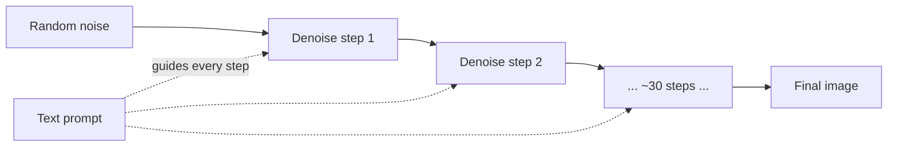

# Image generation

> **In one line:** Modern image generators start from pure random noise and "denoise" it step by step toward a picture that matches your text — and once you understand that one idea, text-to-image, editing, and inpainting are all the same trick with different starting conditions.

:::tip[In plain English]
Imagine a clear photo that someone slowly buries under TV static until it's pure noise. A **diffusion model** is trained to run that process *backwards*: given a noisy mess, predict what to subtract to make it slightly less noisy. Do that 20–50 times and pure static becomes a clean image. To steer *what* appears, you whisper your text prompt into the model at every step so it denoises toward "an astronaut riding a horse" rather than just any image. Editing is the same thing, except you don't start from pure noise — you start from *your* photo with the parts you want changed re-noised. That single mental model — "guided denoising" — covers almost everything in this page.
:::

## Diffusion, intuitively

Training: take real images, add noise in known amounts, and teach a network to predict the noise. Generation (sampling): start from random noise and repeatedly subtract the model's predicted noise, nudged by your text, until an image emerges.



A few terms you'll meet:

- **Steps** — how many denoising iterations. More steps = (usually) cleaner, slower, costlier. ~20–40 is typical.
- **Guidance scale (CFG)** — how hard the model is pushed toward the prompt vs free improvisation. Too low = ignores you; too high = oversaturated, "fried" images.
- **Seed** — the random starting noise. Same seed + same prompt + same settings = same image. *This is how you get reproducibility.* Always log seeds.
- **Latent diffusion** — modern models denoise in a compressed "latent" space (cheaper) and decode to pixels at the end. That's why they're fast enough to be products.

## Text-to-image: a real call

In 2026 most teams call image generation as an API, not a self-hosted model, unless they have a specific reason. The shape is small: a prompt, a size, sometimes a count.

```python
from openai import OpenAI
import base64
client = OpenAI()

resp = client.images.generate(
    model="gpt-image-1",                 # current image model
    prompt=("A cozy reading nook by a rainy window, warm lamplight, "
            "soft focus background, photorealistic, 35mm"),
    size="1024x1024",
    n=1,
)
png = base64.b64decode(resp.data[0].b64_json)
open("nook.png", "wb").write(png)
```

```ts
import OpenAI from "openai";
import { writeFileSync } from "node:fs";
const client = new OpenAI();

const resp = await client.images.generate({
  model: "gpt-image-1",
  prompt: "A cozy reading nook by a rainy window, warm lamplight, photorealistic, 35mm",
  size: "1024x1024",
});
writeFileSync("nook.png", Buffer.from(resp.data[0].b64_json!, "base64"));
```

**Prompting images is its own craft.** A reliable structure: *subject + action + setting + style + lighting + lens/medium*. Be concrete ("golden-hour side lighting" beats "nice lighting"). Many models support a **negative prompt** ("no text, no extra fingers") to steer *away* from failure modes.

## Editing & inpainting

Two related operations, both "start from an image instead of noise":

- **Image-to-image / editing**: feed an existing image + a prompt; the model re-noises and re-denoises so the result resembles the input but follows the new instruction ("make it winter").
- **Inpainting**: supply a **mask** (a black-and-white image marking *which pixels to change*); the model regenerates only the masked region and leaves the rest pixel-perfect. This is how "remove the person", "replace the sky", or "change the shirt color" work.
- **Outpainting**: inpainting beyond the original borders — extend a photo to a wider frame.

```python
# Inpainting: change only the masked region.
resp = client.images.edit(
    model="gpt-image-1",
    image=open("room.png", "rb"),       # original
    mask=open("mask.png", "rb"),        # transparent = "edit here"
    prompt="a large green potted plant in the corner",
    size="1024x1024",
)
```

The mask convention varies by API (transparent-means-edit vs white-means-edit) — read the docs for the one you use, and test with a trivial mask first.

## The 2026 image-model landscape

You don't need to memorize a leaderboard, but you should know the *categories* and pick by job:

- **Frontier API models** (OpenAI `gpt-image-1`, Google's Imagen/Gemini image, Adobe Firefly, Ideogram): best instruction-following and, importantly, **legible text rendering** — historically the hardest thing for diffusion. Use these for product imagery, marketing, anything with words in the picture. Firefly and Ideogram lean toward commercially-safe, indemnified training data, which matters for enterprises.
- **Open-weights models** (the FLUX family, Stable Diffusion lineage): you can self-host, fine-tune (LoRA), and run fully private pipelines. Use when you need control, on-prem, custom styles, or volume economics.
- **Specialized / fast** variants: distilled "turbo" models generate in 1–4 steps for near-realtime UIs at some quality cost.

The 2026 reality: **API frontier models for quality and text; open FLUX/SD for control, privacy, and custom fine-tunes.** Quality differences between top models are now small enough that *prompt-ability, text rendering, latency, licensing, and cost* usually decide, not raw fidelity.

## Product patterns

Real products rarely just expose a prompt box. Common shippable patterns:

- **Avatars / headshots**: fine-tune (LoRA / DreamBooth-style) on ~10–20 photos of a person or brand mascot, then generate them in new scenes. Lightweight, popular, and a clear monetizable feature.
- **Asset pipelines**: generate on-brand marketing images, product backgrounds, or game/UI assets at scale. Pin a **style** (reference images, a fixed seed range, a fine-tuned model) so output stays consistent across thousands of generations.
- **Background replace / product staging**: e-commerce — drop a product photo onto generated lifestyle backgrounds via inpainting.
- **Iterate-then-lock**: let users generate, pick, then refine via editing/inpainting rather than re-rolling from scratch — far better UX and cheaper.

A practical reliability trick: **generate N, auto-rank with a vision model, surface the best.** Diffusion is stochastic; one generation is a gamble, four-pick-best is a product.

```python
candidates = client.images.generate(model="gpt-image-1", prompt=p, n=4)
# Then ask a VLM (see the vision page) to score each for prompt-fit and pick the winner.
```

## Safety & watermarking

Generated images are a real liability surface; treat safety as a feature, not an afterthought.

- **Provenance / watermarking.** Frontier models embed signals so an image can be identified as AI-generated. **C2PA Content Credentials** (cryptographically-signed metadata about how an image was made) is the cross-industry standard; **SynthID** (Google) embeds an *invisible, robust* watermark into the pixels that survives cropping and compression. Preserve these — don't strip metadata in your pipeline — and consider adding your own.
- **Input & output moderation.** Run prompts and results through a moderation classifier; block sexual content involving minors, non-consensual intimate imagery, realistic depictions of real people without consent, and disallowed violence. Most providers enforce this server-side, but you're still responsible for your product.
- **Likeness & IP.** Generating identifiable real people or trademarked/copyrighted characters is a legal minefield. Enterprises increasingly choose models trained on licensed/indemnified data (Firefly, Adobe) for exactly this reason.
- **Disclosure.** Many jurisdictions and platforms now require labeling AI-generated media. Build the label into your UI; don't bolt it on later.

## Common pitfalls

:::caution[Where people trip up]
- **Not logging the seed (and settings).** Without the seed you can never reproduce or A/B a generation. Log seed, model, steps, guidance, and prompt for every image.
- **Cranking guidance scale to force prompt-adherence.** It produces oversaturated, artifact-heavy "fried" images. Fix the prompt instead.
- **Expecting perfect text in images** from weaker models — historically diffusion's worst skill. If you need legible words, pick a model specifically good at text (Ideogram, gpt-image-1, Imagen) or composite the text yourself.
- **Treating one generation as the answer.** It's stochastic. Generate several, rank, and pick.
- **Stripping C2PA / watermark metadata** in your resize/compress step — you destroy provenance you're increasingly legally expected to keep.
- **Ignoring likeness/IP risk** because "the model let me." The model's permissiveness is not your legal defense.
:::

<Quiz id="mm-image-gen-quick-check" variant="micro" title="Quick check">

<Question
  prompt="A user loves an image your app generated last week and wants the exact same one again with a tiny prompt tweak — but you can't reproduce it. What did you fail to log?"
  options={[
    { text: "The model's internal weights at generation time" },
    { text: "The user's session id" },
    { text: "The seed (plus model, steps, and guidance) — same seed, prompt, and settings reproduce the same image; without the seed every generation is unrepeatable" },
    { text: "The C2PA content credentials" }
  ]}
  correct={2}
  explanation="The seed is the random starting noise that determinism hangs on: log seed, model, steps, guidance, and prompt for every image, and you can reproduce or A/B any generation. C2PA is the tempting near-miss since it's also metadata — but it records provenance for verification, not the sampling inputs needed to regenerate."
/>

<Question
  prompt="Generations keep ignoring parts of your prompt, so a teammate cranks the guidance scale (CFG) way up. What does this page predict?"
  options={[
    { text: "Oversaturated, artifact-heavy 'fried' images — guidance trades adherence against quality, and the right fix is a better prompt" },
    { text: "Perfect prompt adherence with no downside" },
    { text: "Slower generation but otherwise identical output" },
    { text: "The model will refuse the prompt as unsafe" }
  ]}
  correct={0}
  explanation="CFG pushes the denoising harder toward the prompt, and past a point the push distorts the image itself — the characteristic fried, oversaturated look. 'More adherence knob = more adherence' is the intuitive read, but the knob has a quality cost; restructuring the prompt (subject + setting + style + lighting) is the fix without the side effect."
/>

<Question
  prompt="Your pipeline resizes and re-compresses every generated image before serving it, and you discover this strips the C2PA metadata and provenance signals. Why does this page treat that as a real problem?"
  options={[
    { text: "Stripped metadata makes files larger and slower to serve" },
    { text: "You're destroying the provenance that identifies the image as AI-generated — which you're increasingly legally expected to preserve and disclose" },
    { text: "Images without metadata can't be displayed in modern browsers" },
    { text: "It's not a problem — invisible watermarks like SynthID always survive processing anyway" }
  ]}
  correct={1}
  explanation="C2PA Content Credentials are signed metadata about how an image was made, and disclosure requirements for AI-generated media are spreading across jurisdictions and platforms. The SynthID answer is the subtle trap: pixel watermarks are designed to be robust, but relying on someone else's watermark while destroying the standard provenance chain in your own pipeline is not a compliance strategy."
/>

</Quiz>

---

→ Next: [Audio & speech](./04-audio-speech.md)
