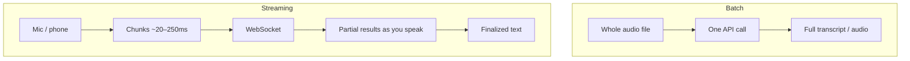

# Audio & speech

> **In one line:** Three primitives cover almost all audio work — turn speech into text (STT), turn text into speech (TTS), and reason directly over sound (audio understanding) — and the single biggest engineering decision is whether you process a whole file at once (batch) or chunk by chunk as it arrives (streaming).

:::tip[In plain English]
Audio is just a wave — a rapidly wiggling line of "how loud, right now." Computers store it as tens of thousands of numbers per second (the **sample rate**). On its own that's meaningless to a language model, so we use specialist models: one that *listens and writes down the words* (speech-to-text), one that *reads words out loud in a chosen voice* (text-to-speech), and increasingly one that can just *answer questions about a sound clip* directly. The only genuinely new idea versus text is **time**: audio happens at a pace, so you either wait for the whole clip and process it (batch) or handle it in little slices as it streams in (streaming) — and that one choice changes everything downstream.
:::

## Speech-to-text (transcription)

STT (also "ASR", automatic speech recognition) converts audio into text. The basic call is tiny:

```python
from openai import OpenAI
client = OpenAI()

with open("call.mp3", "rb") as f:
    tr = client.audio.transcriptions.create(
        model="whisper-1",            # or a newer transcription model
        file=f,
        language="en",                # optional hint; improves accuracy
        prompt="Acme Corp, Q3, SKU-4471",  # bias toward expected jargon/spellings
    )
print(tr.text)
```

Two features turn a raw transcript into something useful:

**Word-level timestamps** — when each word was spoken. Essential for captions/subtitles, for jumping playback to a quote, and for aligning a transcript with the original audio.

```python
tr = client.audio.transcriptions.create(
    model="whisper-1", file=f,
    response_format="verbose_json",
    timestamp_granularities=["word", "segment"],
)
for w in tr.words:
    print(f"[{w.start:.2f}-{w.end:.2f}] {w.word}")
```

**Diarization** — *who* spoke each part ("speaker separation"). This is what produces a readable, labeled meeting transcript:

```
[00:00–00:04] Speaker 0: Thanks for joining the Q3 review.
[00:05–00:09] Speaker 1: Happy to be here — revenue's up 12%.
```

Diarization is a *separate* capability from transcription. Some APIs (e.g. AssemblyAI, Deepgram, and speaker-aware models) do it inline; otherwise you run a diarization model (pyannote is the common open-source one) and merge its speaker turns with the word timestamps. Diarization is hard on overlapping speech and noisy audio — expect to clean it up.

**Accuracy is measured by WER** (Word Error Rate): the fraction of words inserted, deleted, or substituted versus a human reference. WER of 0.05 = 5% of words wrong. Domain jargon, accents, phone-quality audio, and crosstalk all push WER up; the `prompt`/vocabulary-biasing field above is your cheapest lever to push it back down.

## Text-to-speech (TTS)

TTS converts text into spoken audio in a chosen **voice**. Modern neural TTS is close to indistinguishable from a human for short utterances.

```python
resp = client.audio.speech.create(
    model="tts-1",               # "tts-1" fast, "tts-1-hd" higher quality
    voice="alloy",               # one of several built-in voices
    input="Your order has shipped and arrives Thursday.",
    response_format="mp3",       # mp3 for files, pcm/opus for streaming
)
resp.stream_to_file("reply.mp3")
```

Knobs you'll actually use:

- **Voice** — a built-in named voice, or (on some providers) a **cloned** voice from a short sample. Voice cloning is powerful and a consent/legal minefield — only clone voices you have explicit permission to use, and watermark/disclose.
- **Format** — `mp3`/`opus` for storage and download; raw **PCM** when you need to feed a streaming audio pipeline (see the voice page).
- **SSML** (Speech Synthesis Markup Language) — XML tags that control delivery: pauses, emphasis, pronunciation, numbers-as-words. Not every API supports full SSML, but the concept is universal.

```xml
<speak>
  Your code is <say-as interpret-as="characters">A4B9</say-as>.
  <break time="400ms"/>
  Please <emphasis level="strong">do not</emphasis> share it.
</speak>
```

Newer "expressive" / instructable TTS models let you control tone in plain language ("read this calmly and apologetically") instead of SSML — handy for support and narration.

## Audio understanding

The newest primitive: hand a model an audio clip and ask a question *about the sound* — no explicit transcription step. Multimodal models (Gemini, GPT-4o-class audio models) accept audio the same way they accept images: as a part in the message.

```python
import base64
with open("complaint.wav", "rb") as f:
    audio_b64 = base64.b64encode(f.read()).decode()

resp = client.chat.completions.create(
    model="gpt-4o-audio-preview",
    modalities=["text"],
    messages=[{
        "role": "user",
        "content": [
            {"type": "text", "text":
                "Summarize this support call and rate the customer's frustration 1–5."},
            {"type": "input_audio",
             "input_audio": {"data": audio_b64, "format": "wav"}},
        ],
    }],
)
print(resp.choices[0].message.content)
```

This captures things a plain transcript loses — tone, hesitation, laughter, who sounds upset, background sounds. Use STT when you need an exact transcript or timestamps; use audio understanding when you need *judgment about the audio*. They compose well: transcribe for the record, understand for the analysis.

## Batch vs streaming

This is the decision that shapes your whole audio system.



**Batch** — you have the whole file, you send it once, you get the whole result. Simplest to build, highest accuracy (the model sees full context), cheapest per minute. Use for: meeting recordings, podcast transcription, voicemail, any "process this file" job. Latency doesn't matter, throughput does.

**Streaming** — audio arrives live and you process slices as they come, over a WebSocket, emitting **partial (interim) results** that update as more audio confirms them, then a **final** result per utterance. Harder to build, slightly less accurate per word, essential when a human is waiting. Use for: live captions, dictation, and the realtime voice agents in the next page.

| | Batch | Streaming |
|---|---|---|
| Input | Whole file | Live chunks |
| Latency | Seconds–minutes, irrelevant | Sub-second, critical |
| Accuracy | Highest (full context) | Slightly lower |
| Cost | Lowest per minute | Higher |
| Use for | Recordings, archives | Live captions, voice agents |

Rule of thumb: **if no human is waiting on the result, use batch.** Streaming is strictly more complexity; only pay for it when latency is the product.

## Common pitfalls

:::caution[Where people trip up]
- **Ignoring sample rate / format.** Telephony is often 8 kHz mono; feeding the wrong rate or a stereo file where mono is expected silently wrecks accuracy. Resample to what the model wants.
- **Expecting clean diarization on overlapping speech.** Crosstalk is the hardest case; budget for post-processing and don't promise perfect speaker labels on a noisy call.
- **Not biasing vocabulary.** Names, SKUs, drug names, and acronyms are where WER spikes. Feed a hint prompt / custom vocabulary — it's free accuracy.
- **Streaming when batch would do.** People reach for WebSockets out of habit; if no one's waiting, batch is cheaper, simpler, and more accurate.
- **Cloning a voice without consent.** Voice cloning is a legal and trust hazard. Get explicit permission, disclose, and watermark.
- **Treating a transcript as ground truth.** WER is never zero. For high-stakes flows (medical, legal, finance), keep a human in the loop and surface confidence.
:::

<Quiz id="mm-audio-quick-check" variant="micro" title="Quick check">

<Question
  prompt="You're building a feature that transcribes uploaded meeting recordings overnight. A teammate starts wiring up a WebSocket streaming pipeline. What does this page say?"
  options={[
    { text: "Good call — streaming is the modern default for all audio" },
    { text: "Streaming is required because meeting files are too large for one API call" },
    { text: "Either works; the choice is purely stylistic" },
    { text: "Use batch — no human is waiting on the result, and batch is simpler, cheaper per minute, and more accurate because the model sees full context" }
  ]}
  correct={3}
  explanation="The rule of thumb is explicit: if no human is waiting, use batch. Streaming is strictly more complexity and slightly lower accuracy — it earns its cost only when latency is the product (live captions, voice agents). 'Streaming is the modern default' is the habit the page calls out: people reach for WebSockets when a single file upload would do."
/>

<Question
  prompt="Your call-center transcripts keep mangling product SKUs and customer names, spiking the word error rate. What is the cheapest fix this page offers?"
  options={[
    { text: "Vocabulary biasing — feed expected jargon, names, and SKUs via the prompt/custom-vocabulary field; it's free accuracy" },
    { text: "Switch to a much larger transcription model" },
    { text: "Have an LLM post-correct the transcript from context" },
    { text: "Record calls at a higher sample rate" }
  ]}
  correct={0}
  explanation="Domain jargon is exactly where WER spikes, and the hint prompt exists to bias the model toward expected spellings — no extra cost, no new infrastructure. A bigger model or LLM post-correction might help but costs real money and adds a stage; the page's point is that the free lever is the first one to pull."
/>

<Question
  prompt="A product manager wants to know how frustrated each support caller sounded, not just what they said. Which primitive fits, and why?"
  options={[
    { text: "STT with word timestamps, so you can measure speaking speed" },
    { text: "Diarization, which labels emotional state per speaker" },
    { text: "Audio understanding — a multimodal model reasoning directly over the sound captures tone, hesitation, and who sounds upset, which a plain transcript loses" },
    { text: "TTS with an expressive voice to replay the call dramatically" }
  ]}
  correct={2}
  explanation="Frustration lives in tone, pace, and hesitation — information the transcription step throws away — so you hand the audio itself to a multimodal model. Diarization is the tempting distractor because it's also 'about speakers', but it only answers who spoke when, not how they felt; the two compose well (transcribe for the record, understand for the analysis)."
/>

</Quiz>

---

→ Next: [Realtime voice agents](./05-realtime-voice.md)
