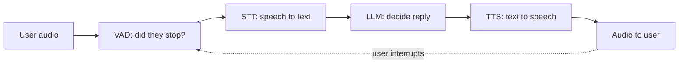

# Realtime voice agents

> **In one line:** A voice agent is a loop that listens, decides, and speaks fast enough to feel like a conversation — and the entire engineering challenge is the *fast enough*: humans notice silence past about a second, so every millisecond in the pipeline is a budget you have to spend wisely.

:::tip[In plain English]
A voice agent is a phone call with a robot that doesn't feel robotic. To pull that off you need to do four things in well under a second: notice the human *stopped talking*, turn their speech into text, think of a reply, and speak it back. There are two ways to build it. The **cascaded** way bolts together four separate parts you already know (a speech detector, speech-to-text, an LLM, text-to-speech) like a relay race — flexible but every handoff adds delay. The **speech-native** way uses one model that takes audio in and emits audio out directly, no text in the middle — much faster and more natural, but you give up some control. Most of this page is about winning the race against that one-second clock.
:::

## The cascaded pipeline

The classic architecture chains four components. Each is something you've already met; the art is gluing them with minimal latency.



- **VAD (Voice Activity Detection)** — detects when the user is speaking and, crucially, when they've *stopped* (end-of-turn). Get this wrong and the agent either interrupts the user mid-sentence or sits there silent. (Silero VAD is the common open-source choice.)
- **STT** — streaming speech-to-text (from the previous page), emitting partials as the user talks so the LLM can start thinking early.
- **LLM** — your agent brain: the system prompt, tools, memory, RAG. Stream tokens out so TTS can start before the full reply is generated.
- **TTS** — streaming text-to-speech, ideally fed sentence-by-sentence so the first words play while later ones are still being synthesized.

**Why cascaded at all, given it's slower?** Control. You can swap any component, inspect the transcript, log every turn, run evals on the text, call tools deterministically, and use your existing LLM stack. For complex agents that do real work (look up an order, book an appointment, follow business logic), the transparency is worth the latency tax — and in 2026, frameworks like Pipecat and LiveKit Agents make a well-tuned cascade fast enough for production.

## Speech-native models

The newer approach: a single **speech-to-speech** model (the "realtime" / "live" APIs from OpenAI, Google Gemini Live, and others) that ingests audio and produces audio directly over a persistent WebSocket. No transcription bottleneck, so it's faster and preserves tone, emotion, and timing the cascade flattens. You configure it once and stream.

```python
# Sketch of a realtime session (OpenAI Realtime-style). Real apps run this
# over a WebSocket with audio frames flowing both directions continuously.
session = {
    "type": "session.update",
    "session": {
        "modalities": ["audio", "text"],
        "voice": "alloy",
        "instructions": "You are a friendly support agent for Acme. Be concise.",
        "input_audio_format": "pcm16",
        "output_audio_format": "pcm16",
        "turn_detection": {"type": "server_vad"},   # model detects end-of-turn
        "tools": [ ... ],                            # yes — tool calls still work
    },
}
# Then: stream microphone PCM frames up; receive audio deltas down and play them.
```

Trade-offs vs cascaded:

| | Cascaded | Speech-native |
|---|---|---|
| Latency | Higher (4 handoffs) | Lower (one model) |
| Naturalness | Flatter (text bottleneck) | Tone/emotion preserved |
| Control & debuggability | High — inspect each stage | Lower — more of a black box |
| Tool use / business logic | Mature, deterministic | Improving, less battle-tested |
| Best for | Complex task agents | Natural chat, simple tasks |

The honest 2026 answer: **speech-native for natural, low-complexity conversation; cascaded when you need tools, auditability, and tight control.** Many production agents are hybrids — speech-native for the conversational surface, with deterministic tool calls and guardrails wrapped around it.

## The latency budget

The number that matters is **turn latency**: from the moment the user stops speaking to the moment they hear the agent's first sound. Humans perceive natural conversation at roughly **&lt;800 ms**; past ~1 s it feels like a bad phone call.

A rough cascaded budget you must fit inside ~800 ms:

```
End-of-speech detection (VAD)      ~100–300 ms   (silence wait before "they're done")
STT finalization                    ~100–200 ms
LLM time-to-first-token             ~200–500 ms   ← usually the biggest chunk
TTS time-to-first-audio             ~100–300 ms
Network / buffering / playback      ~50–150 ms
```

How to actually hit it:

- **Stream everything.** Never wait for a whole stage to finish. STT emits partials → LLM streams tokens → TTS speaks the first sentence while the LLM is still writing the second. This pipelining is the single biggest win.
- **Optimize for *time-to-first-token*, not total tokens.** A fast small model that starts instantly beats a smart slow one for the *opening* of a reply. Some teams use a fast model for the first sentence and a stronger one for follow-up.
- **Tune the VAD silence threshold.** Too short = cuts people off; too long = laggy. ~500 ms of trailing silence is a common start; tune per use case.
- **Co-locate.** Put STT, LLM, and TTS in the same region as the user. A trans-Pacific round trip alone can blow your budget.
- **Keep replies short.** Conversational TTS for three sentences is cheaper and snappier than reading a paragraph — and it's better UX.

## Turn-taking & barge-in

Real conversation is full of interruptions, and a voice agent that can't be interrupted feels broken.

- **Barge-in** — the user starts talking while the agent is speaking; the agent must **stop its own audio immediately**, discard the rest of the planned reply, and listen. Implement by running VAD on the input *even while playing output*, and cancelling TTS playback + the in-flight LLM/TTS the instant user speech is detected.
- **End-of-turn detection** — knowing the user is *done*, not just pausing mid-thought. Pure silence-timeout is crude; newer systems use semantic end-pointing (is this a complete utterance?) to avoid both clipping people and awkward gaps.
- **Backchannels & filler** — humans say "mm-hm" and "let me check". Emitting a short filler ("one moment…") while a slow tool call runs makes the agent feel responsive instead of frozen.
- **Echo cancellation** — so the agent doesn't hear *itself* through the speaker and think the user is talking. Handled by the audio layer (WebRTC), but you must make sure it's on.

## Telephony

Putting an agent on an actual phone number adds a transport layer. The audio is low-quality (8 kHz, narrowband, lossy) and arrives over the phone network via a provider like Twilio, Telnyx, or a SIP trunk — usually bridged into your agent with WebRTC/media streams. Practical realities:

- **8 kHz mono audio** hurts STT accuracy — pick models tuned for telephony and bias your vocabulary harder.
- **DTMF** (touch-tone digits) still matters — capture "press 1" alongside speech.
- **Latency is worse** over the PSTN; your budget is tighter, so streaming and co-location matter even more.
- Stacks like **LiveKit, Pipecat, and Vapi** exist precisely to handle this plumbing (telephony bridge + VAD + STT + LLM + TTS orchestration) so you don't wire raw WebSockets yourself. This is also covered from the infra side in [voice infrastructure](/docs/stack/voice-infra) and [realtime voice engineering](/docs/stack/realtime-voice-engineering).

## Common pitfalls

:::caution[Where people trip up]
- **Optimizing total latency instead of time-to-first-sound.** Users judge responsiveness by when the agent *starts* talking. Stream and pipeline; speak the first sentence early.
- **No barge-in.** An agent you can't interrupt feels broken and infuriating. Run VAD during playback and cancel TTS instantly on user speech.
- **VAD silence threshold mis-tuned.** Too short clips people mid-sentence; too long feels laggy. Tune it, and prefer semantic end-pointing where available.
- **Forgetting echo cancellation**, so the agent transcribes its own voice and talks over itself.
- **Long, paragraph-style replies.** Wrong register for voice — short, conversational turns are faster and more natural.
- **Cross-region hops.** A round trip to a far data center silently eats your whole latency budget. Co-locate the pipeline.
- **Skipping filler during tool calls**, so the agent goes dead-silent for two seconds and the user assumes it crashed.
:::

<Quiz id="mm-voice-quick-check" variant="micro" title="Quick check">

<Question
  prompt="Your voice agent's replies take 2.5 seconds to fully generate, and users say it feels laggy. An engineer proposes switching to a model with faster total generation time. What does this page say to optimize instead?"
  options={[
    { text: "Total tokens per reply — shorter replies are the only lever" },
    { text: "Time-to-first-sound — stream and pipeline every stage so the agent starts speaking the first sentence while the rest is still being generated" },
    { text: "Network bandwidth, since audio is heavy" },
    { text: "The VAD threshold, which dominates all other latency" }
  ]}
  correct={1}
  explanation="Users judge responsiveness by when the agent starts talking, not when it finishes — so STT partials feed the LLM early, the LLM streams tokens, and TTS speaks sentence one while sentence two is still being written. Faster total generation is the intuitive target, but pipelining buys more than any single component swap; short replies help too, but as a complement."
/>

<Question
  prompt="During testing, your agent keeps talking right over users who try to interrupt it. What's the fix this page describes for barge-in?"
  options={[
    { text: "Run VAD on the input even while playing output, and the instant user speech is detected, stop the agent's audio and cancel the in-flight LLM/TTS" },
    { text: "Shorten the agent's replies so interruptions become unnecessary" },
    { text: "Raise the microphone gain so the user's voice overpowers the agent's" },
    { text: "Add a 'press any key to interrupt' fallback" }
  ]}
  correct={0}
  explanation="Barge-in requires listening while speaking: continuous input VAD plus immediate cancellation of playback and the pipeline behind it. Shorter replies reduce how often interruption is needed but don't make it possible — and an agent you can't interrupt 'feels broken and infuriating'. Note this also depends on echo cancellation, so the agent doesn't mistake its own voice for the user."
/>

<Question
  prompt="You're building a voice agent that must look up orders, apply business rules, and log every decision for audits. Speech-native models are faster and more natural. Which architecture does this page recommend here?"
  options={[
    { text: "Speech-native — lower latency always wins in voice" },
    { text: "Neither — voice agents can't reliably call tools yet" },
    { text: "Cascaded (or a hybrid) — you need the transparency: inspectable transcripts, deterministic tool calls, per-stage logging, and text-based evals, which is worth the latency tax" },
    { text: "Two parallel speech-native models that cross-check each other" }
  ]}
  correct={2}
  explanation="The trade is control vs latency: cascaded pipelines let you inspect every stage, run evals on text, and execute business logic deterministically — exactly what auditable task agents need, and modern frameworks make a tuned cascade fast enough. 'Lower latency always wins' is the seductive default, but the page's 2026 answer reserves speech-native for natural, low-complexity conversation, often wrapped in hybrid guardrails."
/>

</Quiz>

---

→ Next: [Video](./06-video.md)
