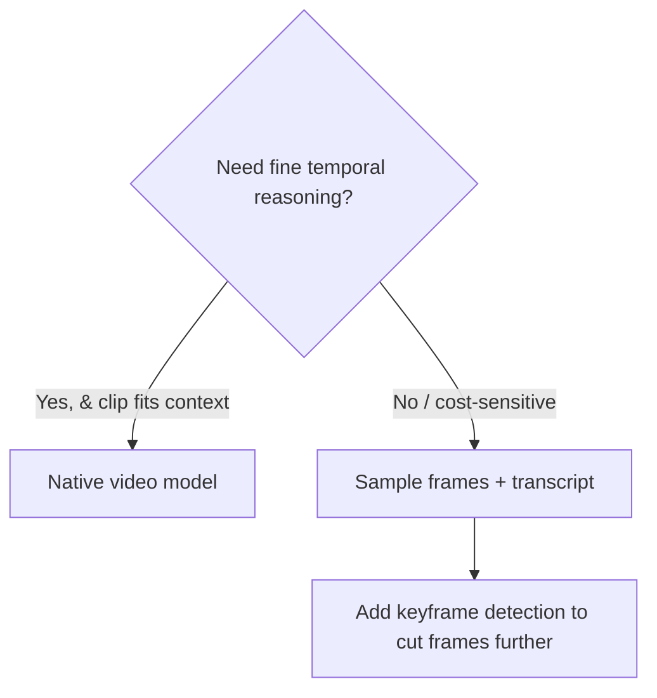

# Video

> **In one line:** A video is just images plus time plus audio, so "video understanding" usually means *sampling a handful of frames and treating them as images* — and "video generation" is diffusion (from the image page) extended to keep things consistent across time, which is why it's still slow and expensive in 2026.

:::tip[In plain English]
There's no magic in video — it's a flipbook. A one-minute clip at 30 frames per second is 1,800 pictures, plus a soundtrack. If you tried to feed every frame to a model you'd pay for 1,800 images, which is absurd. So the trick for *understanding* video is to be clever about which frames you actually send — maybe one per second, or only the frames where something changes — and pair them with the transcript of the audio. For *generating* video, the model has to draw many frames that look like the same world moving smoothly, which is far harder than one image; that's why it costs real money and time. This page is mostly about being smart with frames so you don't go broke.
:::

## Understanding video: sample frames

The workhorse pattern: extract frames at intervals, send them as a sequence of images to a VLM, and add the audio transcript for what the pixels can't show (names, numbers, dialogue).

```python
# pip install opencv-python
import cv2, base64

def sample_frames(path: str, fps: float = 1.0) -> list[str]:
    """Grab `fps` frames per second as base64 JPEGs."""
    cap = cv2.VideoCapture(path)
    src_fps = cap.get(cv2.CAP_PROP_FPS) or 30
    step = max(int(src_fps / fps), 1)
    frames, i = [], 0
    while True:
        ok, frame = cap.read()
        if not ok:
            break
        if i % step == 0:
            ok, buf = cv2.imencode(".jpg", frame)
            frames.append(base64.b64encode(buf).decode())
        i += 1
    cap.release()
    return frames

frames = sample_frames("demo.mp4", fps=1.0)   # 1 frame/sec
```

Then build one multi-part message: the frames as images + the transcript as text + your question. The model reasons over the sequence as a rough sense of motion.

```python
content = [{"type": "text", "text": "Summarize this product demo. List each feature shown."}]
for f in frames:
    content.append({"type": "image_url",
                    "image_url": {"url": f"data:image/jpeg;base64,{f}"}})
content.append({"type": "text", "text": f"Audio transcript:\n{transcript}"})
# send as a single user message to any vision model
```

**How to choose the frame rate** is the whole game, because frames map straight to image tokens and cost:

- **Slow content** (lecture, interview, screen recording): 0.2–1 fps is plenty.
- **Fast action** (sports, gameplay): you need more frames, or you'll miss the moment — but cost climbs fast.
- **Smarter than fixed-rate**: **scene/keyframe detection** — only send frames where the picture changes substantially (a cut, a slide change). This captures the information at a fraction of the frames.
- **Always add the transcript.** Frames are terrible at audio-borne info (who said what, exact numbers). The transcript is cheap text and carries that load.

```python
# Cost intuition: a 10-min video at 1 fps = 600 frames = 600 images.
# At ~1 tile each that's ~hundreds of thousands of image tokens.
# At 0.2 fps with keyframe dedup you might send 30–60 frames for the same job.
```

## Native video models

Frontier multimodal models (Gemini's long-context video, and a growing set of others) can ingest **video directly** — you upload the file and the API handles frame sampling and audio internally, with a true long context that spans long clips. This is more accurate for temporal reasoning ("what happened *before* the crash?") because the model sees real motion, not your hand-picked stills.

Use native video when temporal reasoning matters and the clip fits the model's context; use manual frame sampling when you want **control over cost** (you decide exactly how many frames you pay for), when you're stuck with a non-video-capable model, or when 1 fps is genuinely enough. The decision is almost always **cost vs temporal fidelity**.



## Video generation in 2026

Text-to-video and image-to-video are diffusion (image page) extended over time, with the extra burden of **temporal consistency** — the same character, lighting, and objects from frame to frame, with believable motion. The 2026 landscape has multiple strong models (OpenAI Sora-class, Google Veo, Runway, Kling, and open efforts), generating clips of a few seconds up to tens of seconds, increasingly with synchronized audio.

The shape of the API is **asynchronous**: you submit a job and poll, because generation takes from tens of seconds to minutes.

```python
job = client.videos.create(
    model="video-gen-1",
    prompt="A drone shot over a misty pine forest at dawn, slow push-in, cinematic",
    seconds=8,
    resolution="1080p",
)
# Poll until done — this is long-running, not a synchronous call.
while job.status not in ("completed", "failed"):
    job = client.videos.retrieve(job.id)
url = job.output_url
```

What you must internalize about 2026 video generation:

- **It's expensive and slow** relative to images — orders of magnitude more compute per second of output. Budget accordingly; it is not a "generate on every page load" feature.
- **Clips are short.** Real productions stitch many short generations; consistency across cuts is still an active problem (carry seeds, reference frames, and characters forward).
- **Control is limited.** Precise choreography ("character turns left on beat 3") is hard. Image-to-video and reference images give more control than pure text.
- **Same safety surface as images** — provenance/watermarking (C2PA, SynthID), likeness/consent, deepfake risk — but *higher stakes*, because moving faces are more convincing. Treat disclosure and consent as mandatory.

## Common pitfalls

:::caution[Where people trip up]
- **Sending every frame.** A few minutes at 30 fps is thousands of images and a ruinous bill. Sample at the lowest fps that captures the information, and dedup with keyframe detection.
- **Dropping the audio transcript.** Frames can't tell you names, numbers, or dialogue. The transcript is cheap and carries the half of the content pixels miss.
- **Fixed fps for everything.** A lecture and a soccer match need wildly different sampling. Match fps to motion, or use scene detection.
- **Expecting synchronous video generation.** It's a long-running async job — design your UX around "submit and notify," not a spinner.
- **Promising long, perfectly-consistent generated video.** 2026 models do short clips; long consistent narratives still need stitching and careful seed/reference carry-over.
- **Underbudgeting generation cost/latency.** Video gen is far pricier than image gen; never wire it to a high-traffic, on-demand path without caching and rate limits.
:::

<Quiz id="mm-video-quick-check" variant="micro" title="Quick check">

<Question
  prompt="A teammate's prototype sends every frame of a 5-minute, 30fps video to a vision model and the bill is enormous. What's the page's prescription?"
  options={[
    { text: "Switch to a cheaper vision model and keep sending all frames" },
    { text: "Compress each frame to a smaller JPEG before sending" },
    { text: "Sample at the lowest fps that captures the information (often 0.2-1 fps), use keyframe/scene detection to send only frames where the picture changes, and add the transcript" },
    { text: "Split the video across multiple parallel API calls to spread the cost" }
  ]}
  correct={2}
  explanation="A video is a flipbook, and 9,000 frames is 9,000 images — but a lecture barely changes between frames, so 1 fps or keyframe detection captures the same information at a fraction of the cost. Compressing frames helps marginally, but the dominant cost is frame count; the win is sending fewer, smarter frames, with the cheap transcript carrying the audio-borne half."
/>

<Question
  prompt="You need to answer 'what happened in the seconds before the machine jammed?' from factory footage. Frame sampling at 1 fps keeps missing it. What's the trade this page describes?"
  options={[
    { text: "Frame sampling can answer any temporal question if you add the transcript" },
    { text: "Use a native video model — it sees real motion and handles temporal reasoning better, at the cost of giving up your control over exactly how many frames you pay for" },
    { text: "Increase to 60 fps sampling; more stills always beat native video" },
    { text: "Temporal reasoning is impossible with current models" }
  ]}
  correct={1}
  explanation="The decision is almost always cost vs temporal fidelity: hand-picked stills give you cost control but a choppy view of motion, while native video ingestion lets the model see what actually happened between your samples. The 60fps answer technically adds fidelity but at ruinous cost — at that point the native model is both better and likely cheaper."
/>

<Question
  prompt="You're adding text-to-video generation to your app and wire it up like the image API — a synchronous call with a loading spinner. What's wrong?"
  options={[
    { text: "Video generation is a long-running async job (tens of seconds to minutes) — design the UX around 'submit and notify', with caching and rate limits, never an on-demand spinner" },
    { text: "Nothing — video APIs return as fast as image APIs in 2026" },
    { text: "Spinners are a UX anti-pattern for all AI features" },
    { text: "Synchronous calls produce lower-quality video than async ones" }
  ]}
  correct={0}
  explanation="Generating temporally-consistent frames costs orders of magnitude more compute than one image, so the APIs are submit-and-poll by design. 'It's just like images but moving' is the mental model this page exists to correct: budget for the cost and latency, cache aggressively, and never put generation on a high-traffic on-demand path."
/>

</Quiz>

---

→ Next: [Multimodal retrieval](./07-multimodal-rag.md)
