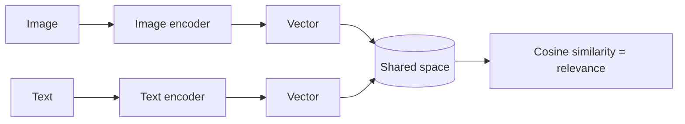
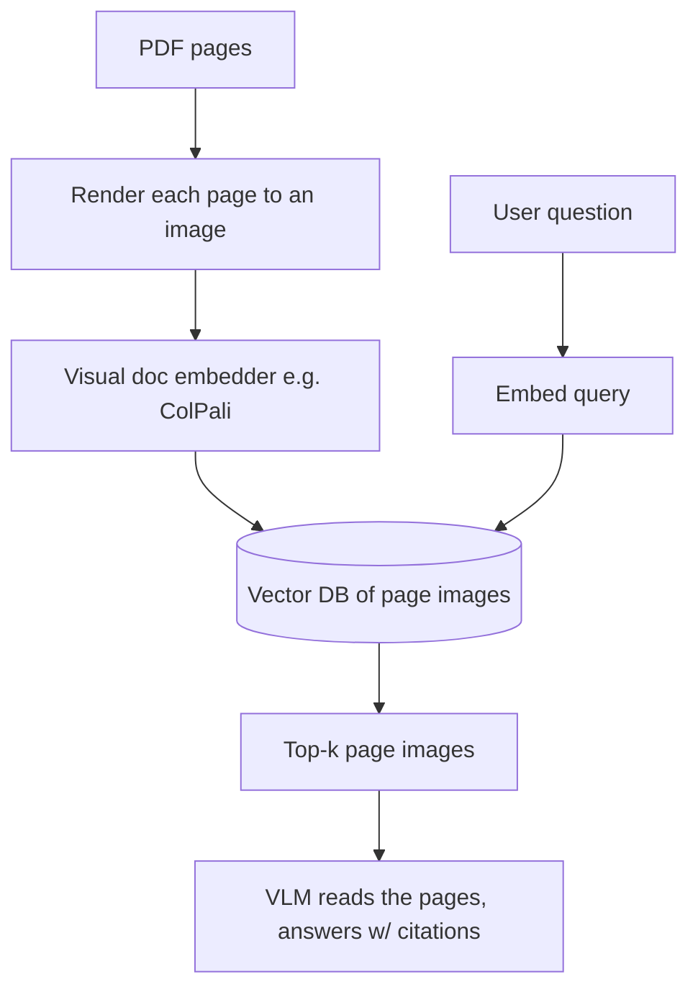

# Multimodal retrieval

> **In one line:** Just as text RAG turns sentences into vectors so you can search by meaning, multimodal retrieval turns *images, audio, and text into the same vector space* — so a text query can find a matching photo, and a screenshot can find related documents, all by nearness in that shared space.

:::tip[In plain English]
You already know embeddings: every piece of text becomes a list of numbers (a vector), and similar meanings land near each other, so search becomes "find the nearest vectors." The multimodal twist is training a model so that a *picture of a dog* and the *words "a dog"* land in nearly the same spot. Once images and text share one map, search stops caring which is which: type "red sneakers," get back photos; drop in a screenshot, get back the docs that explain it. That shared map is the whole idea — everything else is the same vector-search machinery you met in the retrieval chapter, just pointed at pixels and sound.
:::

## CLIP-style shared embedding space

The breakthrough was **contrastive training** (CLIP and its many successors): show the model millions of (image, caption) pairs and train it so a real pair's image vector and text vector are *close*, while mismatched pairs are *far*. The result is one **shared embedding space** where you can compare a text vector and an image vector directly with cosine similarity — the same metric from the [embeddings page](/docs/foundations/embeddings).



Because both modalities produce vectors of the same dimension in the same space, **cross-modal search just works**: embed the query (whatever its type), find nearest neighbors (whatever their type) in your vector DB.

```python
# Conceptual: a multimodal embedding model exposing embed_image / embed_text.
# In 2026 these come from cloud APIs (Cohere, Google, Voyage multimodal) or
# open models (OpenCLIP, SigLIP) you run yourself.
from my_mm_embedder import embed_image, embed_text   # both -> same-dim vectors
import numpy as np

# Index your images once.
index = [(path, embed_image(path)) for path in image_paths]

def search(query_text: str, k: int = 5):
    q = embed_text(query_text)
    scored = [(p, float(np.dot(q, v))) for p, v in index]   # cosine if normalized
    return sorted(scored, key=lambda x: -x[1])[:k]

print(search("a person riding a bicycle in the rain"))  # returns image paths
```

In production you store these vectors in the same vector databases you use for text RAG (pgvector, Pinecone, Qdrant, Weaviate, Milvus) — the index doesn't care that the vectors came from images. See [embedding models](/docs/stack/embedding-models) for the model-selection side.

## Image and audio search

The same recipe covers several product features:

- **Text → image** ("find product photos that look like 'minimalist oak desk'"): embed the query text, search the image index. This is visual product search and asset libraries.
- **Image → image** ("more like this"): embed the query *image*, search the image index. Reverse image search, dedup, near-duplicate detection.
- **Image → text** ("which of our help articles explains this screenshot?"): embed the image, search a *text* index in the same shared space.
- **Audio search**: embed audio clips (audio embedding models, or embed the *transcript* with a text model) and search by sound or by spoken content. Embedding the transcript is the cheap, robust default; true audio embeddings matter when *non-speech sound* is the signal (music, machinery, alarms).

## Retrieving over screenshots, PDFs, and diagrams

This is the highest-leverage multimodal-RAG use case and it has its own subtlety. Documents carry meaning in their **layout** — tables, charts, the position of a figure, a diagram's structure — that's destroyed if you flatten them to plain text via OCR. Two competing strategies, and a hybrid that usually wins:

**1. OCR/caption → text → text-RAG (the classic).** Extract text (and VLM-generated captions for each image/chart), chunk, embed with a text model, retrieve. Simple, cheap, plays with all your existing text-RAG tooling. Loses layout and anything visual the OCR/caption missed.

**2. Visual document retrieval (the 2026 upgrade).** Models in the **ColPali / ColQwen** family embed *page images directly* — they treat each rendered PDF page as an image and produce embeddings that capture layout, tables, and figures without an OCR step. You retrieve whole page-images by similarity to the query, then feed the matching pages to a VLM to answer. This shines on visually-rich PDFs (financial reports, scientific papers, slide decks) where the answer lives in a chart or a table's structure.



**The hybrid that ships:** index both — text chunks *and* page images — and retrieve from both, fusing the results. You get text-RAG's precision on dense prose and visual retrieval's power on charts/tables/diagrams. This builds directly on the [production RAG pattern](/docs/patterns/pattern-rag-prod); multimodal just adds a second index and a fusion step.

```python
def hybrid_retrieve(query, k=5):
    text_hits = text_index.search(embed_text(query), k)        # prose
    page_hits = page_index.search(embed_query_visual(query), k) # layout/charts
    # Fuse (e.g. reciprocal-rank fusion), dedup by source page, return top-k.
    return fuse(text_hits, page_hits)[:k]
```

## Common pitfalls

:::caution[Where people trip up]
- **Mixing embedding spaces.** Image vectors from model A and text vectors from model B are *not* comparable. Both query and corpus must come from the **same** multimodal model, same version. Re-embed everything when you switch models.
- **OCR-flattening visually-rich documents.** Charts, tables, and diagrams lose their meaning as plain text. Add visual page retrieval (ColPali-style) for those, or you'll silently miss the answers that live in figures.
- **Forgetting to normalize vectors** before cosine/dot-product search — un-normalized vectors make "similarity" meaningless. Normalize on the way into the index.
- **No metadata filtering.** Pure vector search returns visually-similar-but-wrong-context hits. Combine with filters (document type, date, source) — same lesson as text RAG.
- **Embedding raw audio when the transcript is the signal.** For spoken content, embedding the transcript with a text model is cheaper and usually better; save audio embeddings for when non-speech sound matters.
- **Skipping the rerank/VLM-read step.** Top-k page images are *candidates*; let a VLM actually read them and cite, rather than returning the raw nearest page as the "answer."
:::

<Quiz id="mm-rag-quick-check" variant="micro" title="Quick check">

<Question
  prompt="Why can a plain text query like 'red sneakers' retrieve matching photos from an image index at all?"
  options={[
    { text: "Contrastive training (CLIP-style) puts image and text vectors in one shared space, so a caption and its matching photo land near each other and cosine similarity works across modalities" },
    { text: "The search engine OCRs every image and matches the extracted text" },
    { text: "The vector database translates text vectors into image vectors at query time" },
    { text: "Image filenames and alt-text are indexed alongside the pixels" }
  ]}
  correct={0}
  explanation="Training on millions of (image, caption) pairs pulls real pairs close and pushes mismatches apart, producing one space where modality stops mattering — the rest is ordinary nearest-neighbor search. The OCR/metadata answers describe older keyword approaches; the breakthrough is that the meaning of the pixels themselves is searchable, no text on or about the image required."
/>

<Question
  prompt="You embed your image corpus with model A, then later embed queries with multimodal model B because it benchmarks better. Search quality collapses. Why?"
  options={[
    { text: "Model B requires higher-resolution input images" },
    { text: "Vectors from different models live in different, incomparable spaces — query and corpus must come from the same model and version, so switching means re-embedding everything" },
    { text: "The vector database needs reindexing after any model release" },
    { text: "Model B produces vectors of a different length, which the database rejects" }
  ]}
  correct={1}
  explanation="There is no universal embedding space: each model learns its own geometry, so distances between vectors from different models are meaningless even when dimensions happen to match. The dimension-mismatch answer is the tempting technicality — sometimes the dims do differ and you get a loud error, but the dangerous case is matching dims with silently garbage similarities."
/>

<Question
  prompt="Your RAG system OCRs financial-report PDFs into text chunks, and users complain it can't answer questions about the charts and table structures. What does this page recommend?"
  options={[
    { text: "Better OCR — modern engines can extract chart data reliably" },
    { text: "Ask users to rephrase questions to target the prose instead" },
    { text: "Larger text chunks so tables stay intact within one chunk" },
    { text: "Add visual document retrieval (ColPali-style) — embed rendered page images directly so layout, tables, and figures are searchable, and fuse with the text index" }
  ]}
  correct={3}
  explanation="Documents carry meaning in their layout, and OCR-flattening destroys it — visual document embedders skip OCR and retrieve whole page images that a VLM then reads. 'Better OCR' is the natural incremental fix, but charts and figure positions resist text extraction in principle; the hybrid of text chunks plus page images is the pattern that ships."
/>

</Quiz>

---

→ Next: [Evaluating multimodal](./08-evaluating-multimodal.md)
