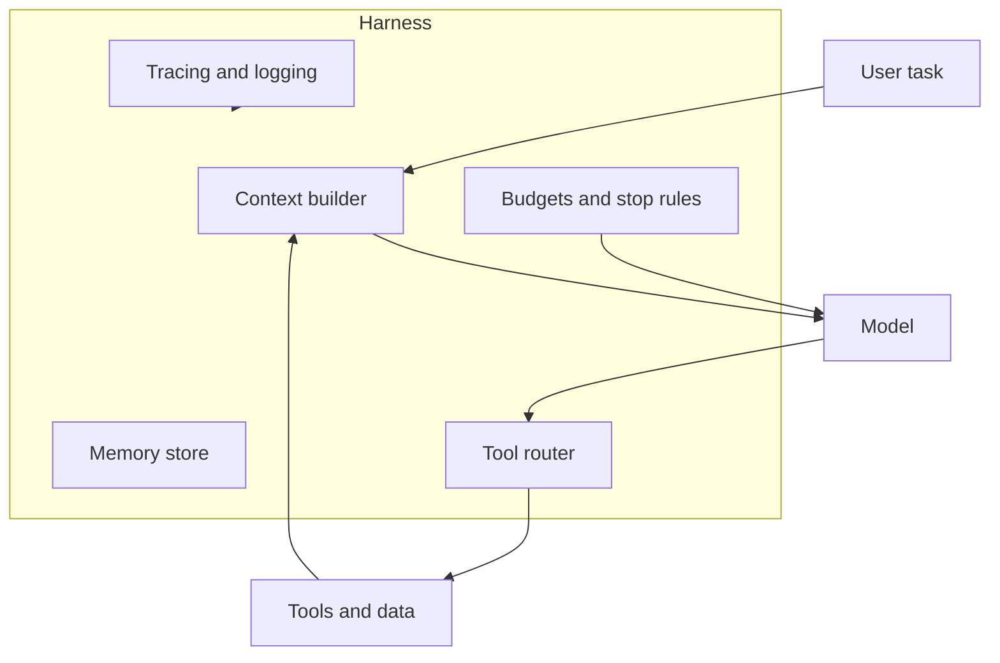

# Agent harness engineering

> **In one line:** An agent is a model plus a **harness** — the code that decides what it sees, what tools it gets, when to stop, and what to remember — and in production the harness often matters more than swapping the base model.

:::tip[In plain English]
Think of the model as the engine and the harness as everything else in the car: steering, brakes, fuel gauge, GPS. Two teams can use the same frontier model; the one with a better harness ships a reliable product while the other chases flaky demos. This page names what belongs in that layer and links back to foundations you already have.
:::

## Model vs. harness

| Layer | Owns | Changes when |
|---|---|---|
| **Model** | Language, reasoning, tool-call formatting | Provider releases a new version |
| **Harness** | Loop control, context assembly, tool allowlists, memory, retries, observability | You ship features and fix failures |

The [agent loop](../01-foundations/agent-loop.md) lives in the harness. So do [MCP](../01-foundations/mcp.md) connections, [planning and reflection](../01-foundations/planning-and-reflection.md) prompts, and the caps that stop runaway loops.

## What a production harness must decide

**1. Context assembly** — What goes in the window this turn? System instructions, retrieved docs, tool results, compressed history. See [context windows](../01-foundations/context-window.md) and [memory](../01-foundations/memory.md). The harness is where **context engineering** happens: not bigger windows alone, but *curating* what fills them.

**2. Tool routing** — Which tools exist, in what order, with what permissions? A coding agent might expose read_file, grep, and run_tests — but not rm -rf. [Function calling](../01-foundations/function-calling-deep.md) defines the interface; the harness defines the **policy**.

**3. Memory tiers** — Short-term (this session's messages), working (summaries and scratchpads), long-term (user prefs, past tasks). Not everything belongs in the prompt every turn. The harness writes and reads memory; the model only sees what the harness injects.

**4. Budgets and stop rules** — Max iterations, max tool calls, max dollars, max wall-clock time. When the budget hits zero, the harness must **degrade gracefully** — partial answer, ask the user, or hand off to a human — not spin forever.

**5. Observability** — Every tool call and model turn is a span in a trace. Without this you cannot debug agent failures or build [trajectory evals](./03-trajectory-evals.md).

## Why harness work compounds

Upgrading from Sonnet to Opus might lift success rate a few points on hard tasks. Fixing the harness — better retrieval injection, tighter tool schemas, a retry when JSON is malformed — often moves **reliability** more than raw IQ. Case studies like [Claude Code](../12-case-studies/claude-code.md) and [Cursor](../12-case-studies/cursor.md) differ less in which frontier model they call than in **how context and tools are orchestrated**.

:::info[Link to the core guide]
If agents are new to you, read [What is an agent loop?](../01-foundations/agent-loop.md) and [Agent frameworks](../04-stack/agent-frameworks.md) first. This page assumes that baseline and focuses on what teams optimize in 2026 production harnesses.
:::

## Common harness mistakes

- **Throwing every tool at the model** — tool choice error rate climbs with catalog size; start minimal, add tools when evals prove need.
- **Unbounded history** — stuffing full chat into context until quality collapses; summarize or retrieve instead.
- **No exit strategy** — agents that loop until the user closes the tab; always define max steps and a fallback message.
- **Evaluating only the final message** — the harness can fail on step 3 while step 10 looks fine; see [trajectory evals](./03-trajectory-evals.md).

## Practical checklist

Before calling an agent production-ready, the harness should answer yes to:

- [ ] Tool allowlist matches least privilege for the task
- [ ] Context builder has a documented recipe (what gets injected when)
- [ ] Memory writes are explicit (nothing implicit in model prose)
- [ ] Budgets enforced in code, not only in the system prompt
- [ ] Full traces exported to your observability stack

---

→ Next: [Agentic RAG & memory](./02-agentic-rag.md)

<Quiz id="cutting-edge-agent-harnesses-quick-check" variant="micro" title="Quick check">

<Question
  prompt="Per this page, what is the harness in an agent system?"
  options={[
    { text: "The frontier model weights downloaded from the provider" },
    { text: "The orchestration layer — loop control, context assembly, tool policy, memory, budgets, and tracing — around the model" },
    { text: "The MCP protocol specification itself" },
    { text: "The user's chat UI" }
  ]}
  correct={1}
  explanation="The model is one component; the harness is everything that decides what the model sees, what it can call, when it stops, and what gets remembered. Confusing the protocol (MCP) or the UI with the harness skips the layer teams actually ship and debug."
/>

<Question
  prompt="Why does this page say harness improvements often beat swapping to a bigger model?"
  options={[
    { text: "Bigger models cannot use tools" },
    { text: "Reliability gains from better context injection, tool schemas, retries, and stop rules often move success rates more than a few IQ points from a model upgrade" },
    { text: "Providers forbid using frontier models inside harnesses" },
    { text: "Harness code runs on GPU and is faster than inference" }
  ]}
  correct={1}
  explanation="Production agents fail on orchestration — wrong context, bad tool choice, no budget — as often as on raw reasoning. Fixing those is harness work; a bigger model does not fix an unbounded loop or a tool catalog the model cannot navigate."
/>

<Question
  prompt="A team exposes twenty tools to the agent so it is never blocked. What failure mode does this page warn about?"
  options={[
    { text: "Tool choice error rate climbs with catalog size — start minimal and add tools when evals prove need" },
    { text: "MCP only supports eight tools per session" },
    { text: "Models refuse to call tools when more than three exist" },
    { text: "Observability breaks when tool count exceeds ten" }
  ]}
  correct={0}
  explanation="More tools is not more capability if the model picks wrong ones. The discipline is minimal allowlists expanded only when measurements show a gap — the opposite of giving the model everything just in case."
/>

</Quiz>
