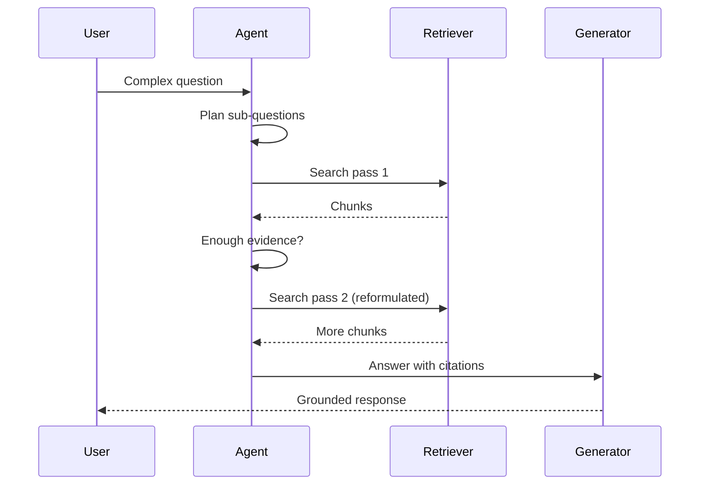

# Agentic RAG & memory

> **In one line:** Classic RAG retrieves once and generates; **agentic RAG** lets the model **decide when to search again**, reformulate queries, and combine sources across steps — closer to how a researcher actually works.

:::tip[In plain English]
One-shot RAG is like googling once and writing the essay. Agentic RAG is like a researcher who searches, reads, realizes the first query missed the point, searches again with better keywords, and only then answers. It costs more latency and tokens, but it wins on hard questions where a single retrieval pass returns the wrong chunks.
:::

## One-shot RAG vs. agentic RAG

| | One-shot RAG | Agentic RAG |
|---|---|---|
| Retrieval | Fixed pipeline: embed query → top-k → generate | Model chooses *when* and *how* to retrieve |
| Query | User question as-is | Model may rewrite, decompose, or multi-query |
| Failure mode | Wrong chunks → confident hallucination | Can retry retrieval before answering |
| Cost / latency | Lower | Higher (multiple search + LLM turns) |
| Best for | FAQ, support with clean docs | Research, legal, multi-hop factual tasks |

Foundations: [RAG basics](../01-foundations/rag-basics.md), [hybrid search](../01-foundations/hybrid-search.md), [reranking](../01-foundations/reranking.md). Agentic RAG **wraps** those primitives in a loop — see [agent loop](../01-foundations/agent-loop.md).

## Patterns that show up in production

**Query decomposition** — Break what is the revenue impact of policy X in region Y? into sub-queries (policy text, regional sales, comparable cases). Each sub-query gets its own retrieval pass; the harness merges results.

**Self-critique before answer** — After retrieval, the model asks: do these passages support a complete answer? If not, search again with a refined query. This is reflection applied to RAG — related to [planning and reflection](../01-foundations/planning-and-reflection.md).

**Tool-shaped retrieval** — Expose search as a **tool** (search_docs, search_web, search_codebase) instead of silently prepending chunks. The model learns *when* retrieval helps vs. when it can answer from context.

**Graph and structured hops** — Some systems combine vector search with knowledge graphs or SQL: retrieve entities, follow edges, then vector-search related passages. The agentic layer decides which hop comes next.

## Memory alongside retrieval

Retrieval pulls **external** knowledge; [memory](../01-foundations/memory.md) holds **session and user** state. Agentic systems combine both:

- **Episodic** — what happened in this task (tool results, prior sub-answers)
- **Semantic** — distilled facts worth reusing (user prefs, project glossary)
- **Working** — scratchpad the harness maintains outside the raw chat log

The harness must decide what to **write** to memory vs. what to **re-retrieve** each turn. Re-fetching docs when they may have changed; caching stable user prefs in memory.

:::caution[When not to use agentic RAG]
If your eval shows one-shot RAG already hits faithfulness targets, adding agent loops adds cost and failure modes (runaway searches, tool spam) without benefit. [Eval types](../13-evaluation/03-eval-types.md) tell you whether retrieval or generation is the bottleneck first.
:::

## Eval implications

Faithfulness metrics on the final answer are not enough. You also want:

- **Retrieval recall** per step — did the right doc appear in any pass?
- **Search efficiency** — how many passes before a correct answer?
- **Citation coverage** — does every factual claim trace to a retrieved chunk?

Harvey and Glean (see [case studies](../12-case-studies/index.md)) differ in domain, but both treat multi-step retrieval and ACL-aware search as core — not optional frosting.

---

→ Next: [Trajectory & process evals](./03-trajectory-evals.md)

<Quiz id="cutting-edge-agentic-rag-quick-check" variant="micro" title="Quick check">

<Question
  prompt="What is the main difference between one-shot RAG and agentic RAG on this page?"
  options={[
    { text: "Agentic RAG uses a larger embedding model" },
    { text: "One-shot runs a fixed retrieve-then-generate pipeline; agentic RAG lets the model decide when and how to search again across steps" },
    { text: "Agentic RAG removes the need for chunking" },
    { text: "One-shot RAG only works on PDFs" }
  ]}
  correct={1}
  explanation="The shift is control flow: fixed pipeline vs. model-driven retrieval loops with reformulated queries. Embedding size and file types are implementation details; the conceptual difference is who decides the next search."
/>

<Question
  prompt="When does this page say agentic RAG is worth the extra cost?"
  options={[
    { text: "Always — every product should use multi-step retrieval" },
    { text: "When one-shot RAG already hits faithfulness targets on your eval set" },
    { text: "When questions need multi-hop evidence — research, legal, complex factual tasks — and component evals show retrieval is the bottleneck" },
    { text: "Only when using open-weight models" }
  ]}
  correct={2}
  explanation="Agent loops add latency and failure modes; the page is explicit that you should not add them when simple RAG already works. The win case is hard multi-hop tasks where a single top-k pass misses critical evidence."
/>

<Question
  prompt="Why expose search as a tool instead of silently prepending retrieved chunks?"
  options={[
    { text: "Tools are required for MCP compliance" },
    { text: "It lets the model decide when retrieval helps vs. when it can answer from existing context — reducing unnecessary searches" },
    { text: "Silent prepending is deprecated by all providers" },
    { text: "Tool-shaped retrieval eliminates hallucination" }
  ]}
  correct={1}
  explanation="Tool-shaped retrieval makes search an explicit decision: the model retrieves when it needs external facts, not on every turn by default. That is both a cost control and a quality control — fewer wrong chunks injected when the answer was already in context."
/>

</Quiz>
