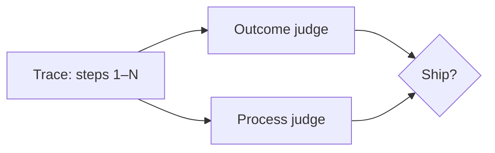

# Trajectory & process evals

> **In one line:** For agents, the **path** matters as much as the destination — trajectory evals score whether the right tools were called in the right order, not only whether the final string looks good.

:::tip[In plain English]
Imagine grading a math student. You can score only the final number (outcome eval) or also whether they showed valid steps (process eval). Agents are the same: a lucky final answer can hide a broken tool chain, wasted searches, or a security violation on step two. Trajectory evals catch what final-answer grading misses.
:::

## Outcome vs. process

| Eval type | Question | Catches |
|---|---|---|
| **Outcome** | Is the final answer correct / helpful / faithful? | Wrong conclusions, hallucinations |
| **Process (trajectory)** | Were the steps reasonable, safe, and efficient? | Wrong tool choice, skipped retrieval, runaway loops, policy violations |

You need **both**. Outcome-only evals let agents **gamble** — delete the wrong file, recover accidentally, and still pass. Process evals align with how [LLM-as-judge](../13-evaluation/06-llm-as-judge.md) and [human eval](../13-evaluation/07-human-eval.md) already work — but the unit of grading becomes a **trace**, not one blob of text.



## What to score on a trajectory

**Tool correctness** — For task X, did the agent call the expected tool family (search before answer, run_tests after edit)? Gold trajectories can be **partially specified** — required steps without micromanaging every argument.

**Efficiency** — Steps to success, tokens spent, wall-clock time. A correct answer in forty tool calls may fail a production SLO even if outcome eval passes.

**Safety** — No forbidden tools, no PII in logs, no exfiltration patterns. Tie to [OWASP LLM Top 10](../10-patterns/ai-security-owasp.md).

**Faithfulness per step** — Did intermediate claims stay supported by retrieved sources before the model synthesized?

**Recovery** — After a tool error, did the agent retry sensibly or spiral?

## How to implement without drowning in work

**1. Start from traces you already log.** If the [harness](./01-agent-harnesses.md) exports spans, eval cases are `(input, trace, expected_outcome, optional_step_constraints)`.

**2. LLM judge on the trace.** Feed the judge a condensed trace (tool name, args summary, result summary — not full payloads) plus a rubric:

```python
TRAJECTORY_RUBRIC = """
Score 1-5 on process quality:
5 = Minimal necessary tools, safe, efficient, grounded at each step
3 = Reached goal but with redundant searches or one minor policy slip
1 = Unsafe tool use, runaway loop, or answer despite missing evidence
"""
```

Calibrate judges against humans the same way as [LLM-as-judge](../13-evaluation/06-llm-as-judge.md) — agreement on ~30–50 cases before gating CI.

**3. Deterministic checks where possible.** Required tool called? Max steps exceeded? Citation present when search ran? Cheap gates before expensive judges.

**4. Pairwise on trajectories.** When comparing harness v1 vs. v2, ask: which trace would you rather debug in production? — often clearer than absolute scores.

## CI and regression

[Eval-driven development](../10-patterns/eval-driven-development.md) applies: trajectory metrics belong in the same regression suite as outcome metrics. Typical gates:

- Outcome win rate ≥ baseline (pairwise or absolute threshold)
- Process score ≥ baseline
- P95 steps and P95 cost ≤ baseline + slack

A release that improves final answers but doubles tool spam should **fail** the process gate even if users occasionally notice.

## Relation to online eval

Production traces feed the eval dataset — missteps users report become trajectory cases with full spans. This closes the loop described in [continuous learning](../11-career/09-continuous-learning.md): the frontier skill is curating **step-level** failures, not only thumbs-down on the last message.

---

→ Next: [Efficient models & test-time compute](./04-efficient-models.md)

<Quiz id="cutting-edge-trajectory-evals-quick-check" variant="micro" title="Quick check">

<Question
  prompt="Why are outcome-only evals insufficient for agents according to this page?"
  options={[
    { text: "Final answers are always random" },
    { text: "A lucky final answer can hide broken tool chains, unsafe steps, or runaway loops that outcome grading never sees" },
    { text: "Providers block outcome metrics on agent APIs" },
    { text: "Human eval is illegal for agent outputs" }
  ]}
  correct={1}
  explanation="Agents are multi-step systems; scoring only the last message is like grading a proof from the final line. Process evals catch wrong tools, skipped retrieval, and policy violations that still produced a plausible answer."
/>

<Question
  prompt="What is a practical first step this page suggests for trajectory evals?"
  options={[
    { text: "Hire a team to manually replay every production trace" },
    { text: "Start from traces the harness already logs — build cases from input, trace, expected outcome, and optional step constraints" },
    { text: "Replace all deterministic tests with LLM judges" },
    { text: "Only evaluate open-weight models" }
  ]}
  correct={1}
  explanation="You already pay for observability in production agents; trajectory eval reuses those spans. Manual replay of everything does not scale; the page pushes structured cases and calibrated judges on condensed traces."
/>

<Question
  prompt="A release improves final-answer quality but doubles average tool calls. What should your eval gates do?"
  options={[
    { text: "Ship immediately — outcome is all that matters" },
    { text: "Fail the process gate — efficiency and step count are part of production quality, not just the last string" },
    { text: "Disable tracing to hide the regression" },
    { text: "Switch to a reasoning model to fix tool spam" }
  ]}
  correct={1}
  explanation="Process metrics exist precisely to block wins that look good on the final message but break cost, latency, or operability. Doubling tool calls is a harness regression even when answers occasionally improve."
/>

</Quiz>
