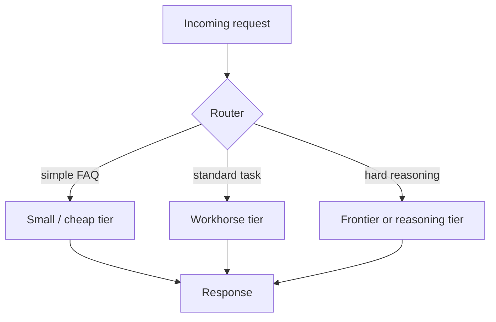

# Efficient models & test-time compute

> **In one line:** Not every call needs the frontier model — **routing**, **hybrid architectures**, and **bounded test-time compute** (reasoning tokens) are how teams afford agents at scale.

:::tip[In plain English]
Test-time compute means spending extra work *at answer time* — more thinking tokens, more search steps, a second model pass — to get a harder question right. The engineering skill is **budgeting** that spend: cheap models for easy turns, reasoning models for gnarly ones, and hard caps so one user request cannot drain your margin.
:::

## The three-lever mental model

| Lever | What you control | Typical use |
|---|---|---|
| **Model tier** | Haiku vs. Sonnet vs. Opus / nano vs. mini vs. flagship | Route by task difficulty |
| **Test-time compute** | Reasoning depth, self-consistency samples, verifier pass | Hard math, code, multi-step planning |
| **Architecture class** | Pure transformer vs. hybrid SSM+attention | Long context, throughput-sensitive serving |

Current names and prices live on the [model snapshot](../model-snapshot.md). The **ratios** (frontier ≈ 4–10× workhorse) survive every price cut.

## Model routing in production

The modern default is a **router** (rules, classifier, or small model) that picks a tier per request:

Patterns from [production patterns](../10-patterns/index.md) and [decision frameworks](../09-decisions/index.md):

- **Cascade** — try cheap first; escalate to expensive only if confidence is low or eval fails on a sample.
- **Parallel verify** — cheap draft + small verifier model (cheaper than one frontier call for some tasks).
- **Per-step routing in agents** — grep might be a tiny model; architecture design might be reasoning tier.

Routing without [evals](../13-evaluation/index.md) is guesswork — measure win rate and cost per tier on your dataset.

## Test-time compute (reasoning budgets)

[Reasoning models](../01-foundations/reasoning-models.md) spend extra tokens *thinking* before answering. That is test-time compute: more inference work, better results on hard problems, higher bill and latency.

Harness responsibilities:

- **Cap thinking tokens** per request and per agent loop iteration
- **Expose a user-visible tradeoff** — fast vs. deep mode
- **Fall back** when budget exhausted — partial answer or ask to narrow the question

:::info[June 2026 snapshot]
Thinking tokens often add 1K–30K tokens and 5–60s latency per answer on frontier reasoning SKUs — see [model snapshot](../model-snapshot.md). Treat numbers as volatile; treat **budgeting discipline** as durable.
:::

## Hybrid and efficient architectures (concept level)

Research and open-weight stacks increasingly mix **State Space Models (SSM)** — e.g. Mamba-class layers — with **transformer** attention for long sequences at lower memory. You rarely pick this as an app engineer today; you **might** choose an inference provider or open model advertising better long-context **$/token** or **tokens/sec**.

What to carry away:

- **Attention** scales poorly with very long contexts; hybrids target cheaper long-range processing.
- **Serving economics** (throughput on [inference servers](../04-stack/inference-servers.md)) matter as much as benchmark scores for high-volume products.
- **Diffusion language models** and other non-autoregressive generators are an active research thread — interesting for latency-shaped workloads, not yet the default app stack.

Do not rewrite your product around a paper; **evaluate on your eval set** when a new architecture ships as a hosted model.

## Agents multiply cost

One user message can become ten model calls plus retrieval. Efficient inference is **mandatory** for agent products:

- Cache stable prefixes ([prompt caching](../01-foundations/prompt-caching.md))
- Batch offline jobs ([batch inference](../04-stack/batch-inference.md))
- Route tool-planning to workhorse, final polish to frontier only when needed
- Enforce [trajectory efficiency metrics](./03-trajectory-evals.md)

[Duolingo Max](../12-case-studies/duolingo-max.md) is a case study in **per-turn cost control** — persona and quality without frontier pricing on every exchange.

---

→ Next: [Research radar (June 2026)](./05-research-radar.md)

<Quiz id="cutting-edge-efficient-models-quick-check" variant="micro" title="Quick check">

<Question
  prompt="What does test-time compute mean on this page?"
  options={[
    { text: "Training the model on more GPUs" },
    { text: "Extra inference work at answer time — reasoning tokens, extra samples, verifier passes — to improve hard answers" },
    { text: "Compressing weights after training" },
    { text: "Running the model on the user's device only" }
  ]}
  correct={1}
  explanation="Test-time compute is spend at inference, not training: thinking longer, sampling multiple drafts, or adding a verifier. The skill is budgeting that spend so hard tasks get depth without every FAQ paying frontier reasoning cost."
/>

<Question
  prompt="Why does this page insist on evals before model routing?"
  options={[
    { text: "Providers require eval certificates" },
    { text: "Routing without measured win rate and cost per tier on your data is guesswork — you might send easy work to Opus and hard work to Haiku" },
    { text: "Routers only work with open-weight models" },
    { text: "Evals replace the need for routing" }
  ]}
  correct={1}
  explanation="A router is a product decision: which errors are acceptable at which price point. Only your eval set answers that — benchmark leaderboard scores do not know your task mix or margin."
/>

<Question
  prompt="How do agents change the efficient-inference picture?"
  options={[
    { text: "Agents always use one model call per user message" },
    { text: "One user message can become many model calls plus retrieval — routing, caching, and step budgets become mandatory, not optional" },
    { text: "Agents eliminate the need for small models" },
    { text: "Agents only run on-device" }
  ]}
  correct={1}
  explanation="Agent loops multiply inference cost by design. Efficiency moves from nice-to-have to survival: tier routing per step, prompt caching, and trajectory efficiency gates keep unit economics viable."
/>

</Quiz>
